# 字符串

> 原文：<https://www.javatpoint.com/sas-string>

在上一个主题中，我们已经学习了 SAS 变量。现在，在这个主题中，我们将学习 SAS 字符串及其各种操作。

Strings in SAS are those values which are enclosed in a pair of single quotes. In SAS, the string variable is declared by adding a space and the $ sign at the end of the variable declaration. There are several powerful functions to analyze and manipulate strings in SAS.

## 声明字符串变量

我们可以声明字符串变量及其值，如下例所示。在代码中，我们声明了一个名为 **String1** 的字符串变量。

### 示例:

```

DATA string_example;
   String1 = 'Hello';
RUN;
PROC print data = string_example;
RUN;

```

**在 SAS 工作室执行上述代码:**

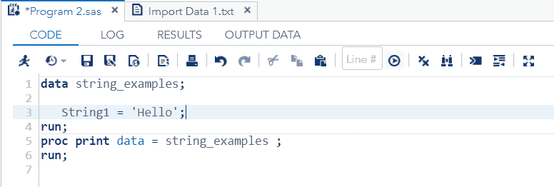

**输出:**

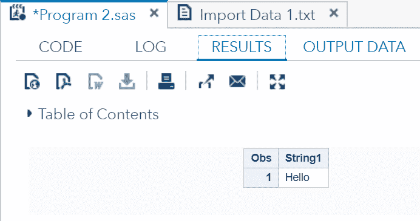

正如您在输出中看到的，“Hello”已经存储在字符串变量 **String1** 中。

## 一个数据集中可以声明多少个字符串变量？

我们可以在一个数据集中声明多个字符串变量。让我们看看下面的例子:

```

data string_examples;
   String1 = 'Ankit';
   String2 = 'Namrita';
   String3 = 'Preeti';
   String4 = 'Vishal';
   String4  = 'Akanksha';
run;
proc print data = string_examples ;
run;	

```

**在 SAS 工作室执行上述代码:**

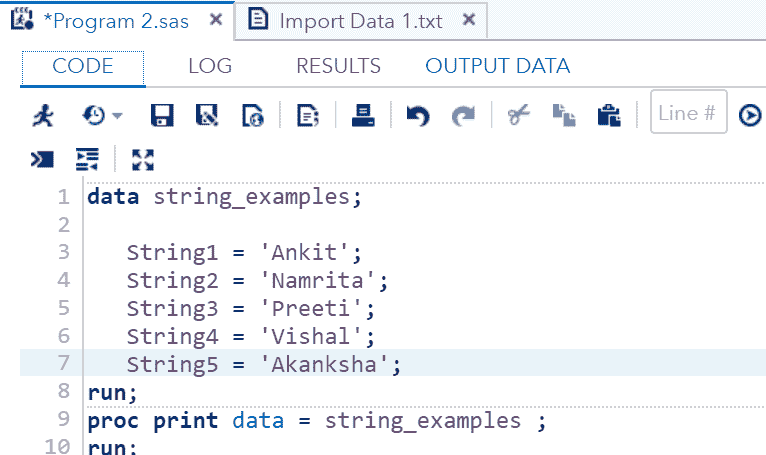

**输出:**

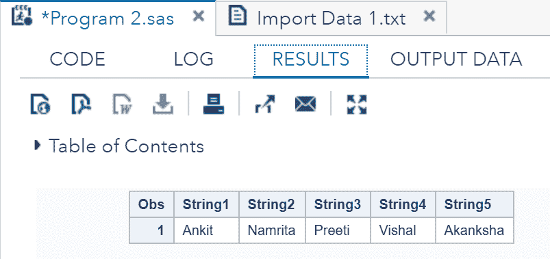

在输出中可以看到，所有的值都存储在字符串变量中，即 **String1** 、 **String2** 、 **String3** 、 **String4** 和 **String5** 。

### 我们能保持字符串变量的长度吗？

我们可以通过使用 length 关键字来维护存储容量或字符串变量的字符数或长度。一旦我们固定了长度，SAS 就不会存储超过固定长度的字符。让我们看看下面的例子:

```

DATA string_examples;
LENGTH string1 $ 6 String2 $ 5 String3 $ 4 String4 $ 6 String5 $ 2;
   String1 = 'Ankit';
   String2 = 'Namrita';
   String3 = 'Preeti';
   String4 = 'Vishal';
   String5 = 'Akanksha';
run;
proc print data = string_examples noobs;
run;

```

**在 SAS 工作室执行上述代码:**

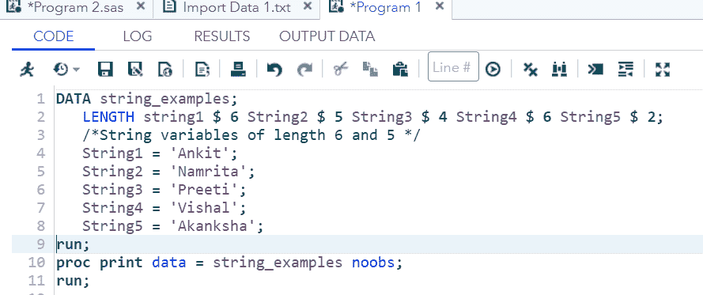

**输出:**

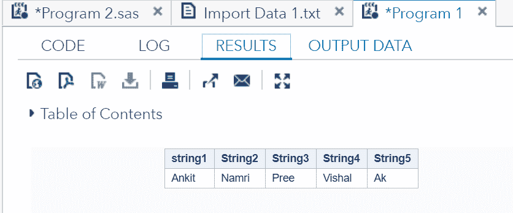

正如您在输出中看到的，所有值都对应于一个固定的长度。超过固定长度的字符已被删除。

### 我们可以连接多个字符串变量吗？

我们可以通过使用 **Joined_strings 语句**来连接多个字符串变量。让我们看看下面的例子:

```

DATA string_examples;
    String1 = 'Hello';
   String2 = 'Namrita';
   String3 = 'How';
   String4 = 'are';
   String5 = 'you';
   Joined_strings = String1 ||String2 ||String3 ||String4 ||String5 ;
run;
proc print data = string_examples noobs;
run;

```

**在 SAS 工作室执行上述代码:**

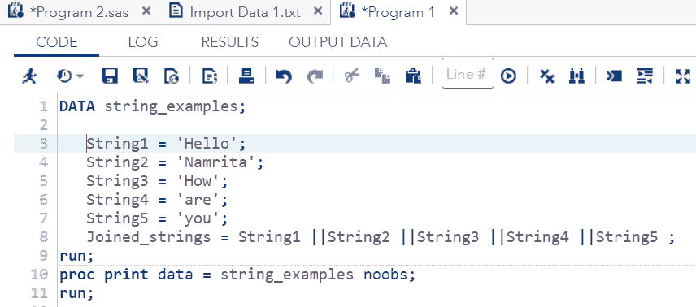

**输出:**

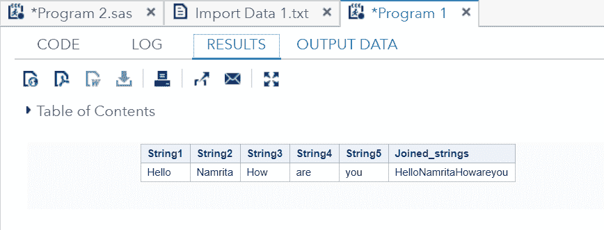

正如您在输出中看到的，所有字符串都被连接在一起。

## 各种字符串函数

以下是执行字符串操作的常用语句。

### SUBSTRING 函数

**SUBSTRN 语句**用于利用开始和结束位置提取一个子串。

**语法:**

```

SUBSTRN ('string value' ,p1,p2)

```

哪里，

*   **SUBSTRN:** 是用于从字符串中提取字符的语句。
*   **字符串值:**是字符串变量的值。
*   **p1:** 是提取的开始位置。
*   **p2** 是提取的结束位置。

**抽取中有两种情况:**

**第一种情况:**当我们提供两个位置，即开始位置和结束位置时。

SAS 使用开始位置元素开始提取，使用结束位置元素识别要提取的元素总数。让我们通过一个例子来理解:

**示例:**

```

data string_examples;
   LENGTH string1 $ 7 ;
   String1 = 'ABCDEFG';
   sub_string1 = substrn(String1,1,4) ;
   /*Extract from position 1, and end when completes total 4 elements */
run;
proc print data = string_examples noobs;
run;

```

**在 SAS 工作室执行上述代码:**

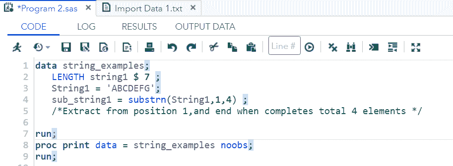

**输出:**

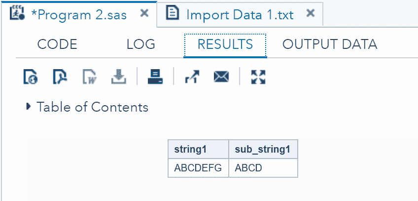

正如您在输出中看到的，提取从位置 1(即 A)开始，当总共提取了 4 个元素(即 ABCD)时结束。

**第二种情况:**当我们只提供一个位置即起始位置时。

在只提供开始位置而不提供结束位置的情况下，它提取字符串末尾的所有字符。让我们通过一个例子来理解:

```

data string_examples;
   LENGTH string1 $ 7 ;
   String1 = 'ABCDEFG';
   sub_string1 = substrn(String1,4) ;
   /*Extract from position 4 onwards */
run;
proc print data = string_examples noobs;
run;

```

**在 SAS 工作室执行上述代码:**

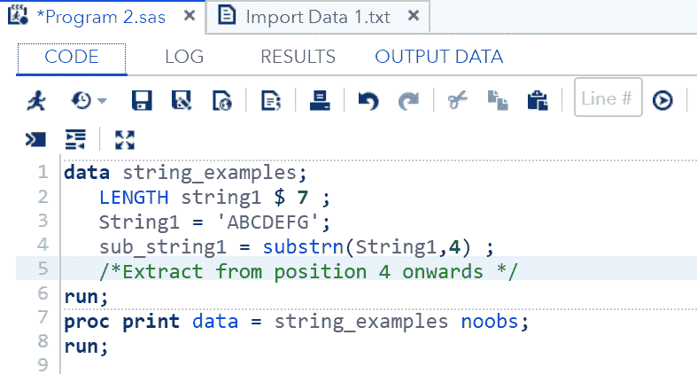

**输出:**

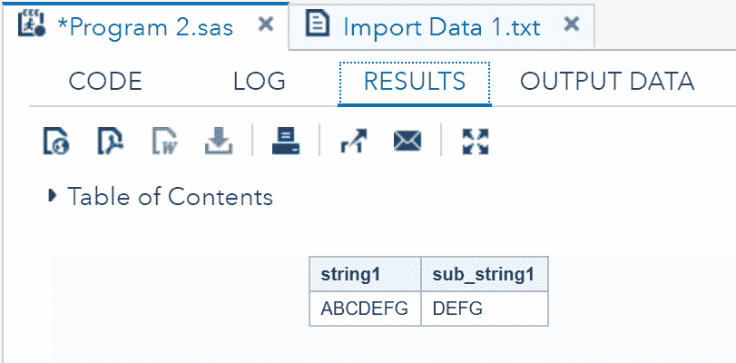

正如您在输出中看到的，提取从位置 4(即 D)开始，当所有剩余元素(即 DEFG)的提取完成时结束。

### 整齐

TRIMN 语句用于从字符串中删除尾随空格。

**语法:**

```

TRIM('string value');

```

哪里，

*   **TRIM:** 是用来从字符串中修剪空格的语句。
*   **字符串值:**是需要修剪的字符串变量的值。

让我们通过一个例子来理解:

```

data string_examples;
   LENGTH string1 $ 6  ;
   String1='ABCD  ';
   length_string1 = lengthc(String1);
   length_trimmed_string = lengthc(TRIM(String1)); 
run;
proc print data = string_examples noobs;
run;

```

当我们在 SAS Studio 中运行上述代码时，我们将获得显示 TRIM 函数结果的输出。

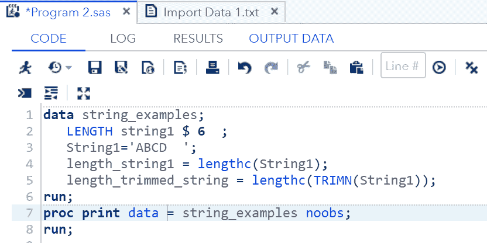

**输出:**

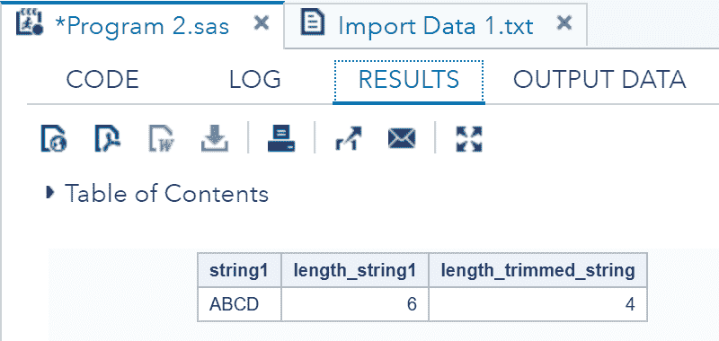

正如您在输出中看到的，字符串的长度已经从 6 修剪到 4。

* * *