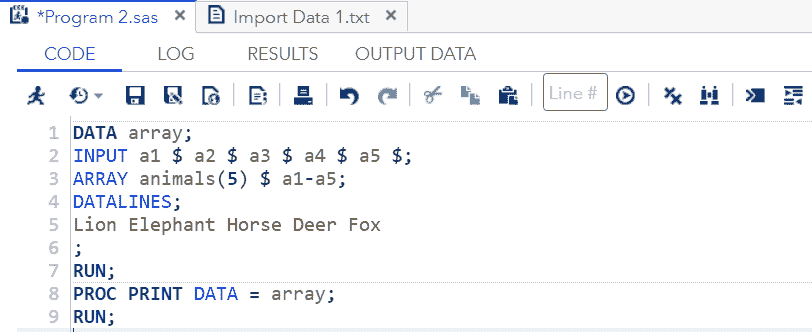
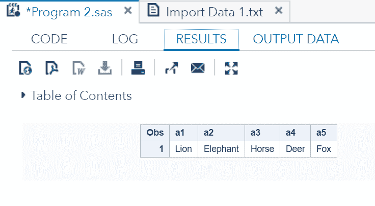
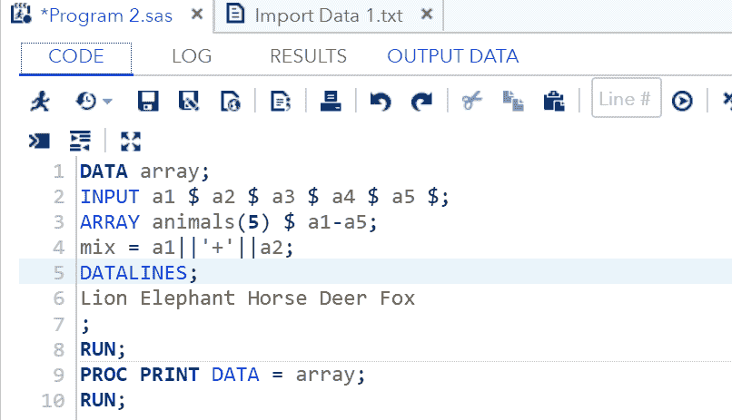
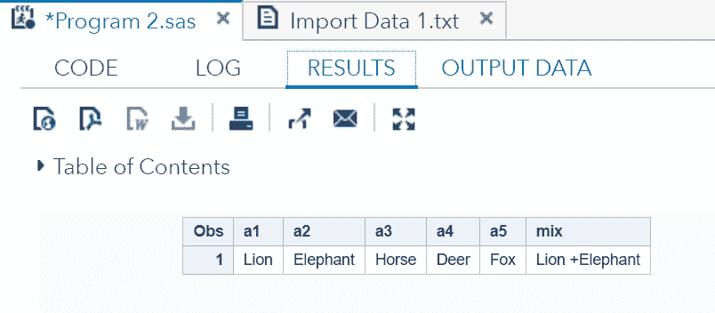
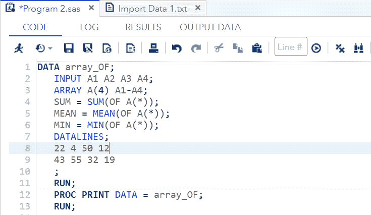
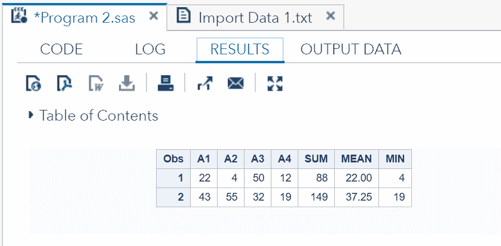
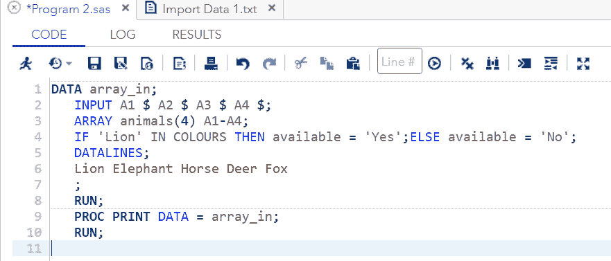
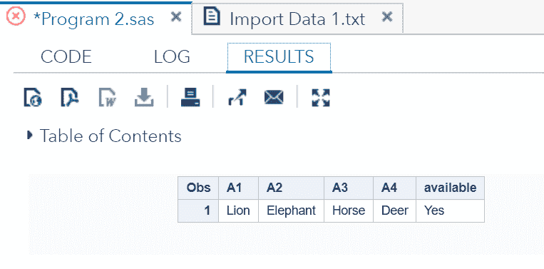

# SAS-阵列

> 原文：<https://www.javatpoint.com/sas-array>

## 关于运算符| In 运算符

数组是一种数据结构，用于存储固定大小的元素集合。数组只能存储相同数据类型的元素。

它可以存储数据集合，但通常用于存储相同数据类型的变量集合。

数组使用索引来存储元素。它减少了代码的行数。

在 SAS 中，阵列执行与上述相同的任务。这意味着它用于通过使用索引值来存储和检索一系列值。索引表示元素在保留内存区域中的位置。

### 语法:

```

ARRAY ARRAY_NAME(SUBSCRIPT) ($) VARIABLE-LIST ARRAY-VALUES

```

哪里，

*   **ARRAY:** 是**关键字**来声明一个 ARRAY。
*   **ARRAY_NAME:** 是数组的名称。它遵循与变量相同的名称约定。
*   **下标:**是我们存储在数组中的值的数量。
*   **($):** 仅在数组存储字符值时使用。
*   **VARIABLE-LIST:** 是可选的变量列表，这些变量是 Array 值的占位符。
*   **数组-值:**这些是将存储在数组中的实际值。我们可以声明这些值，也可以从文件或数据行中读取。

## 数组声明

我们可以使用上面的语法以几种方式声明 Array。以下是数组声明的示例。

*   名称 NUMBER 声明了一个数组。它的长度为 5，值为 42、88、67、62、44。

```

ARRAYNUMBER[5] (42 88 67 62 44);

```

*   名字 ALPHABET 声明了一个数组。它的长度为 8，值为 A、B、C、D、E、F、G、H，从索引 0 开始。

```

ARRAYALPHABET(0:8) A B C D E F G H ;

```

*   名称 SEARCH 声明一个长度为 5 的数组，包含的值是字符。

```

ARRAY SEARCH(1:5) $ Q1-Q5;

```

*   “反馈”这个名称声明了一个数组。在这个数组中，我们可以根据自己的需要来取长度。

```

ARRAYFEEDBACK(*) A1-A100;

```

## 访问数组值

声明之后，我们可以使用**dataline 语句**在数组中提供数据值，并且我们可以使用 **PRINT** 过程访问这些存储的值。

在下面的示例中，我们将存储和访问数组的值。

```

DATA Array;
INPUT a1 $ a2 $ a3 $ a4 $ a5 $;
ARRAY animals(5) $ a1-a5;
DATALINES; 
Lion Elephant Horse Deer Fox 
;
RUN;
PROC PRINT DATA = Array;
RUN;

```

**在 SAS 工作室执行上述代码:**



**输出:**



正如我们在输出中看到的，数组的所有值都已被存储和访问。

**连接数组的多个值**

我们可以通过声明一个新变量来连接数组的多个值。

**示例:**

```

DATA Array;
INPUT a1 $ a2 $ a3 $ a4 $ a5 $;
ARRAY animals(5) $ a1-a5;
mix = a1||'+'||a2;
DATALINES; 
Lion Elephant Horse Deer Fox 
;
RUN;
PROC PRINT DATA = Array;
RUN;
Using the OF operator

```



**输出:**



正如我们在输出中看到的，两个值，即 a1 和 a2，已经连接到变量 **mix** 中。

## 运算符的

运算符的**用于分析数组的数据格式，以计算数组的整行。在下面的示例中，我们将计算每行中值的总和和平均值。**

```

DATA Array_OF;
   INPUT A1 A2 A3 A4;
ARRAY A(4) A1-A4;
   SUM = SUM(OF A(*));
   MEAN = MEAN(OF A(*));
   MIN = MIN(OF A(*));
   DATALINES;
   22 4 50 12
   43 55 32 19
   ;
   RUN;
   PROC PRINT DATA = Array_OF;
   RUN;

```

**在 SAS 工作室执行上述代码:**



**输出:**



正如我们在输出中看到的，已经计算了整行。

## 输入运算符

在数组中，我们可以通过使用 **IN 运算符**来访问特定的值。**输入运算符**检查数组行中特定值的存在或不存在状态。在下面的例子中，我们将检查数据集中动物“老虎”的可用性。该值区分大小写。

```

DATA Array_in;
   INPUT A1 $ A2 $ A3 $ A4 $;
ARRAY animals(4) A1-A4;
   IF 'Lion' IN COLOURS THEN available = 'Yes';ELSE available = 'No';
   DATALINES;
   Lion Elephant Horse Deer Fox 
   ;
   RUN;
   PROC PRINT DATA = Array_in;
   RUN;

```

**在 SAS 工作室执行上述代码:**



**输出:**



正如我们在输出中看到的，狮子出现在数据集中，这就是为什么它在“可用”列中显示“是”。

* * *