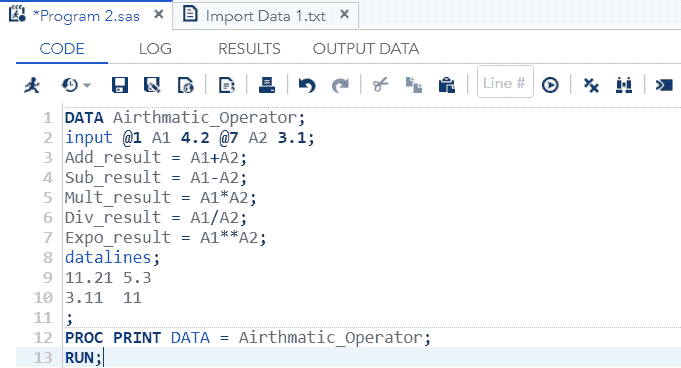
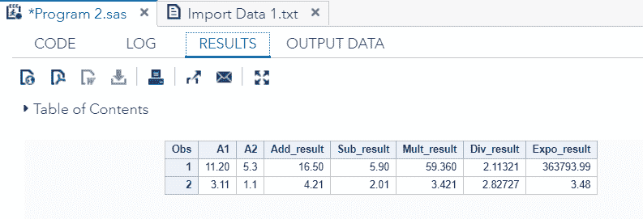
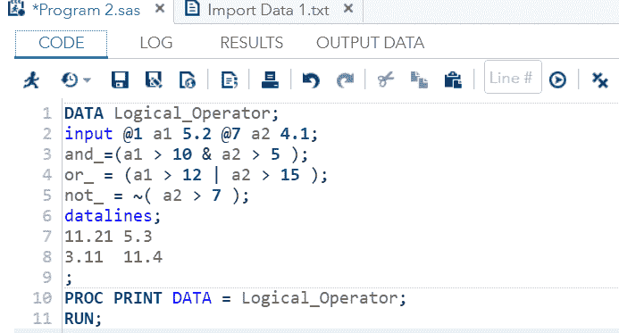
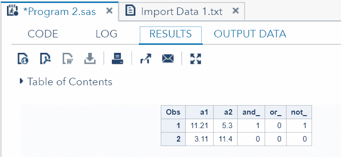
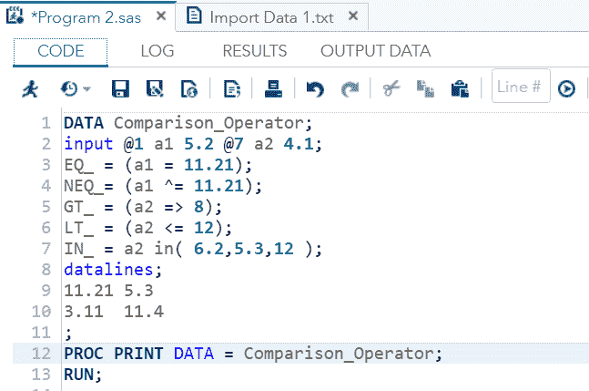
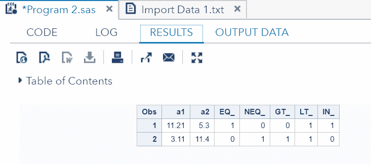
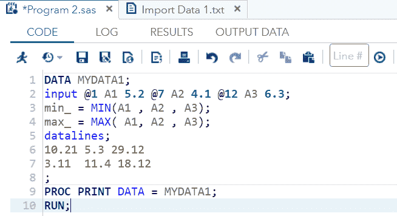
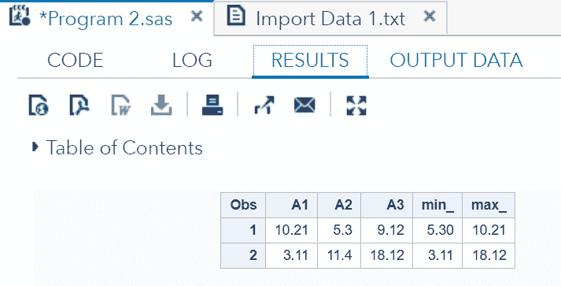
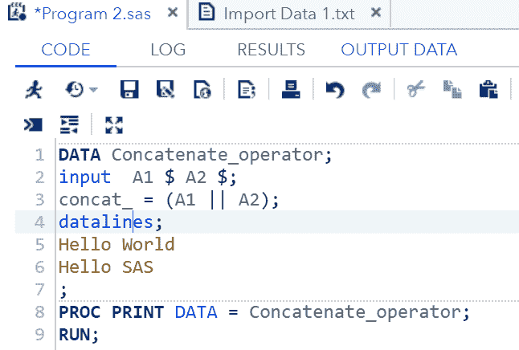
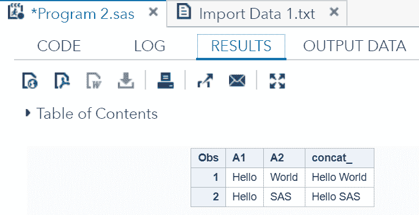

# 特种空勤人员

> 原文：<https://www.javatpoint.com/sas-operators>

在 SAS 中，运算符是用于执行加法、乘法、减法、除法、比较等计算的符号。这些符号是 SAS 编程语言的内置部分，因此我们可以将这些符号组合在一个表达式中，以获得所需的输出。

SAS 中有五种类型的操作员:

*   **算术运算符**
*   **逻辑运算符**
*   **比较运算符**
*   **最小/最大操作符**
*   **优先操作符**

## 算术运算符:

算术运算符用于执行数学计算，如加法、乘法、减法、除法等。下表描述了算术运算符及其运算。

| 操作员 | 描述 | 例子 |
| + | 添加 | 12+2=14 |
| - | 减法 | 24-4=10 |
| * | 增加 | 6*3=32 |
| / | 分开 | 46/23=2 |
| ** | 幂运算 | 2**3=8 |

让我们通过一个例子来了解如何在 SAS 编程中使用算术运算符。

```
DATA Airthmatic_Operator;
input @1 A1 4.2@7 A2 3.1; 
Add_result = A1+A2;
Sub_result = A1-A2;
Mult_result = A1*A2;
Div_result = A1/A2;
Expo_result = A1**A2;
datalines;
11.21 5.3
3.11  11
;
PROC PRINT DATA = Airthmatic_Operator;
RUN;

```

**在 SAS 工作室执行上述代码:**



**输出:**



正如我们在输出中看到的，所有值都是根据算术运算符计算的。

## 逻辑运算符

逻辑运算符用于计算表达式的真值或假值。逻辑运算符的结果总是布尔值，即 1 或 0。下表描述了逻辑运算符及其操作。

| 操作员 | 描述 | 例子 |
| & | 这个符号叫做“与”运算符。如果两个数据值都为真，则结果为 1，否则为 0。 | (5>2 & 2> 3)给出 0 或假。 |
| &#124; | 这个符号被称为或运算符。如果任何一个数据值的计算结果为真，则结果为 1，否则为 0。 | (10>9 & 5> 3)给出 1 或真。 |
| ~ | 这个符号叫做非运算符。如果值评估为假，则结果为 1，否则为 0。 | NOT(8> 3)为 1 或真。 |

让我们通过一个例子来理解，我们如何在 SAS 编程中使用逻辑运算符。

```
DATA Logical_Operator;
input @1 a1 5.2	@7 a2 4.1; 
and_=(a1 > 10 & a2 > 5 );
or_ = (a1 > 12 | a2 > 15 );
not_ = ~( a2 > 7 );
datalines;
11.21 5.3
3.11  11.4
;
PROC PRINT DATA = Logical_Operator;
RUN;

```

**在 SAS 工作室执行上述代码:**



**输出:**



正如我们在输出中看到的，所有的值都根据逻辑运算符的求值产生布尔结果。

## 比较运算符

比较运算符用于在相等的基础上比较值。比较运算符的结果总是布尔值，即 1(表示真)或 0(表示假)。下表描述了 comparisonoperators 及其操作。

| 操作员 | 描述 | 例子 |
| = | 这个符号被称为相等运算符。如果两个值相等，则结果为 1，否则为 0。 | (8 =8)给出 1。(4=8)给出 0。 |
| = | 这个符号被称为不相等运算符。如果两个值不相等，那么结果是 1，否则是 0。 | (3 ^= 5)给出 1。(5^= 5)给出 0。 |
| < | 这个符号叫做比运算符。 | (2 < 9)给出 1。(12 < 9)给出 0。 |
| <= | 这个符号叫做小于或等于运算符。 | (3<= 4)给出 1。(4 <= 4)给出 1。(7 <= 4)给出 0。 |
| > | 这个符号叫做“比运算符更伟大”。 | (22 > 20)给出 1。(10 > 20)给出 0。 |
| >= | 这个符号叫做大于或等于运算符。 | (10 >=5)给出 1。(5 >=5)给出 1。(3 >=5)给出 0。 |
| 在…里 | 如果该值等于给定列表中的任何值，则返回 1，否则返回 0。 | (5，7，9，8)中的 9 给出 1。2 在(5，7，9，8)中给出 0。 |

让我们通过一个例子来理解，在 SAS 编程中如何使用比较运算符。

```
DATA Comparison_Operator;
input @1 a1 5.2	@7 a2 4.1; 
EQ_ = (a1 = 11.21);
NEQ_= (a1 ^= 11.21);
GT_ = (a2 => 8);
LT_ = (a2 <= 12);
IN_ = a2 in( 6.2,5.3,12 );
datalines;
11.21 5.3
3.11  11.4
;
PROC PRINT DATA = Comparison_Operator;
RUN;

```

**在 SAS 工作室执行上述代码:**



**输出:**



正如我们在输出中看到的，所有的值都根据比较运算符的求值产生布尔结果。

## 最小/最大运算符

这些运算符用于比较该行中变量的值，以从该行的值列表中返回最大值或最小值。下表描述了最小/最大运算符及其操作。

| 操作员 | 描述 | 例子 |
| 部 | 这组字母被称为字母运算符。它返回整行的最小值。 | 最小值(45.2，11.6，15.41)给出 11.6 |
| 部 | 这组字母被称为 theMAX 运算符。它返回整行的最大值。 | MAX(46.3，11.6，15.41)给出 46.3 |

```
DATA MYDATA1;
input @1 A1 5.2	@7 A2 4.1 @12 A3 6.3; 
min_ = MIN(A1 , A2 , A3);
max_ = MAX( A1, A2 , A3);
datalines;
10.21 5.3 29.12
3.11  11.4 18.12
;
PROC PRINT DATA = MYDATA1;
RUN;

```

**在 SAS 工作室执行上述代码:**



**输出:**



正如我们在输出中看到的，最小值和最大值运算符从两行的值列表中返回了最小值和最大值。

## 并置算符

连接运算符用于连接两个或多个字符串值。下表描述了串联运算符及其操作。

| 操作员 | 描述 | 例子 |
| &#124;&#124; | 这种符号称为联系运算符。它连接两个或多个字符串值。 | 你好&#124;&#124;' SAS 给你好 SAS |

```
DATA Concatenate_operator;
input  A1 $	A2 $; 
concat_ = (A1 || A2);
datalines;
Hello World
Hello SAS
;
PROC PRINT DATA = Concatenate_operator;
RUN;

```

**在 SAS 工作室执行上述代码:**



**输出:**



正如我们在输出中看到的，这两个字符串变量已经连接在一起。

## 优先运算符:

优先运算符是一组运算符，当多个运算符出现在一个复杂表达式中时，它指示求值的顺序。下表描述了优先操作符及其操作。

| 组 | 命令 | 标志 |
| 第一组 | 从右向左 | ** + -不是最小值或最大值 |
| 第二组 | 从左到右 | * / |
| 第三组 | 从左到右 | + - |
| 第四组 | 从左到右 | &#124;&#124; |
| 第五组 | 从左到右 | <<= = > = > |

* * *