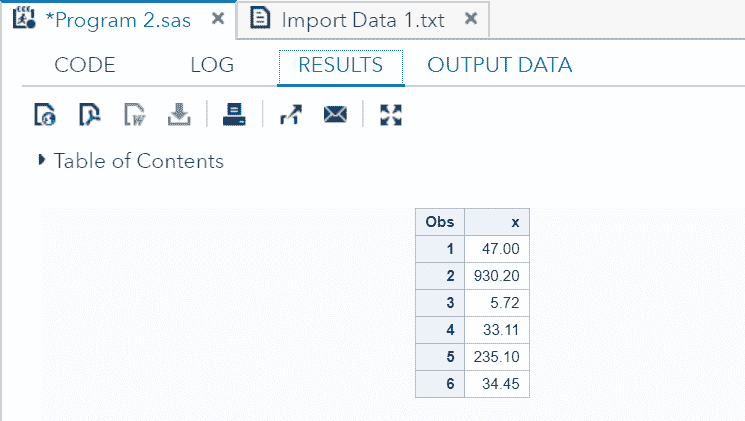
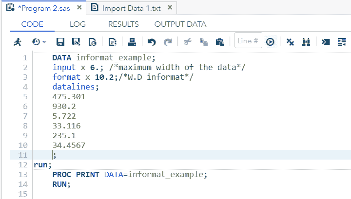
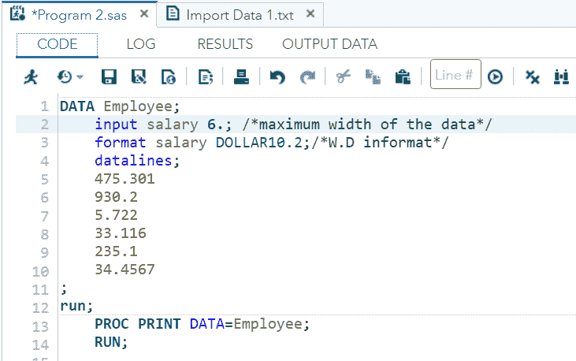
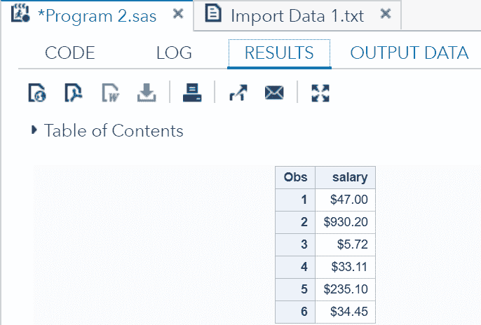
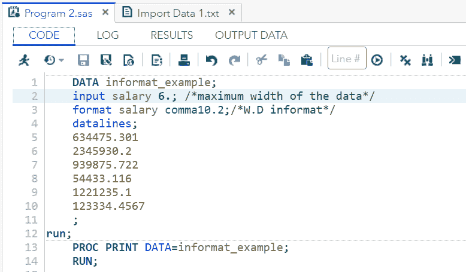
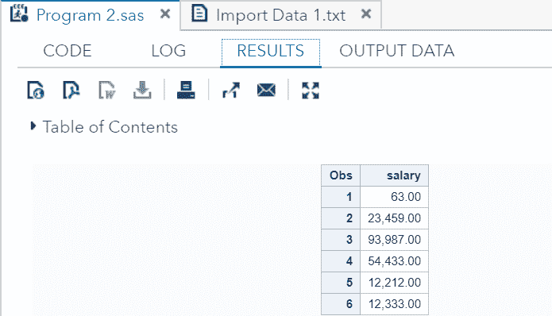

# 数字数据格式

> 原文：<https://www.javatpoint.com/sas-numeric-data-format>

SAS 可以处理不同类型的数字数据格式。这些格式用在变量名的末尾，以对数据应用特定的数字格式。

SAS 使用两种类型的数字格式，一种是**信息**，另一种是**输出格式**。其中，信息是 SAS 应该如何读取数据的规范，而**输出格式**是变量应该如何在输出中显示的布局规范。

SAS 中有许多内部信息和输出格式。或者可以使用 **PROC FORMAT** 创建用户定义的信息和输出格式。所有内部信息和输出格式的列表可以通过在命令行中键入“**帮助格式**，然后在结果窗口中单击“ **SAS 格式和信息**”来查看。

让我们详细了解以下数字格式术语:

*   报告
*   **SAS 如何读取数字信息**
*   **输出格式**

## 信息

SAS 信息是 SAS 数字格式的一部分，指定 SAS 如何读取特定数据。这些在 INPUT 语句中指定。始终放置一个小数(。)放在信息的末尾，因为 SAS 使用这个十进制数(。)将信息与其他变量分开。

该信息指示 SAS 如何将数据读入 SAS 变量。

以下是用于将数据读入 SAS 的信息列表。

**输入数字信息**

| 信息 | 使用 |
| **W.** | 它表示没有小数位的最大“W”列数。 |
| **西 D** | 它表示带“D”小数位的最大“W”列数。 |

## SAS 如何读取数字信息？

SAS **数字信息**由两部分组成，一个是输出的列数，另一个是**小数位数**。

SAS 系统是基于浮点表示法(称为 W.D)来读取数字信息。在 W.D 中，W 是列数，D 是小数点右边的位数。

例如，如果 W.D 的值是 7.2，那么它将为输出总共分配 7 个空间。**小数的**左侧数字**将分配四个**空格，**小数的一个**空格**和剩余的两个**空格**用于小数的**右侧数字**。**

 **在下表中，数字数据 2789.93 通过使用 7.2 information 进行演示。它演示了如何使用 W.D .信息在 SAS 系统中进行数字分配。

| Two | seven | eight | nine | 。 | nine | three |

我们可以通过使用以下语法在 SAS 程序中使用磁盘数据信息:

```

Varname FormatnameW.D

```

哪里，

*   **Varname:** 是声明变量的名称。
*   **Formatname:** 是应用于变量的数字格式的名称。
*   **W:** 是最大数据列数(包括小数点本身和小数点后的位数)。
*   **D:** 是小数点右边的最大位数。

### 示例:

```

DATA informat_example;
 input x 6.; /*maximum number of columns*/ 
	format x 10.2;/*W.D informat*/
	datalines;
    475.301
	930.2
	5.722
	33.116
	235.1
	34.4567
;
run;
	PROC PRINT DATA=informat_example;
	RUN;

```

**在 SAS Studio 中执行上述代码:**


**输出:**



正如我们在输出中看到的，SAS 正在遵循 W.D 信息来存储数值。这里 W.D 的值是 10.2，这意味着 SAS 总共读取 10 个空格。它为小数左侧的数字分配 7 个空格，为小数分配 1 个空格，为小数右侧的数字分配剩余的 2 个空格。

## 输出格式

**SAS 输出格式**用于指示 SAS 在输出中以所需的格式显示数据。它是 SAS 数字格式的另一部分。

我们可以用三种格式显示数值:

*   **简单的 W.D 格式**
*   **通信。d 格式〔t1〕**
*   **美元。d 格式〔t1〕**

### 简单的三维格式

它是基本的读数，也是 SAS 的一种输出格式，其中 W 是列数，D 是小数点右边的位数。

让我们通过一个例子来理解，如何使用 W.D 格式显示数据。

**示例:**

```

DATA informat_example;
 input x 6.; /*maximum number of columns*/ 
	format x 10.2;/*W.D informat*/
	datalines;
    475.301
	930.2
	5.722
	33.116
	235.1
	34.4567
;
run;
PROC PRINT DATA=informat_example;
	RUN;

```

**在 SAS Studio 中执行上述代码:**



**输出:**


正如我们在输出中看到的，SAS 正在使用 W.D .信息来存储数值。这里 W.D 的值是 10.2，这意味着 SAS 总共读取 10 个空格。它为小数的左侧数字分配 7 个空格，为小数分配 1 个空格，为小数的右侧数字分配剩余的 2 个空格。

### -美元。d 格式:

当我们需要添加带有数字数据的美元符号时，会使用这种格式。让我们通过一个例子来了解一下，我们如何使用 **DollarW。d 格式**。

**示例:**

如果数据集中有一个名为 salary 的数字变量，那么由于它的数字数据类型，这个变量就有可能出现小数位。那么，让我们考虑一个没有货币符号的组织的员工的工资，例如 475.301。现在，员工希望看到以美元计算的工资。为此，我们需要在上面放一个美元符号。

为了做到这一点，我们需要指示 SAS 使用 **DollarW。d 格式**。

```

DATA Employee;
	input salary 6.; /*maximum width of the data*/
	format salary DOLLAR10.2;/*W.D informat*/
	datalines;
    475.301
	930.2
	5.722
	33.116
	235.1
	34.4567
;
run;
	PROC PRINT DATA=Employee;
	RUN;

```

**在 SAS Studio 中执行上述代码:**



**输出:**



正如我们在输出中看到的，工资已经用美元符号显示了。

### -你好。d 格式

当我们需要添加逗号来分隔数字数据的数字以获得更好的理解时，会使用这种格式。让我们通过一个例子来了解一下，如何使用 **CommaW。d 格式**。

```

DATA informat_example;
	input salary 6.; /*maximum width of the data*/
	format salary comma10.2;/*W.D informat*/
	datalines;
    634475.301
	2345930.2
	939875.722
	54433.116
	1221235.1
	123334.4567
    ;
run;
	PROC PRINT DATA=informat_example;
	RUN;

```

**在 SAS Studio 中执行上述代码:**



**输出:**



正如我们在输出中看到的，可变工资已经用逗号显示了。

* * ***