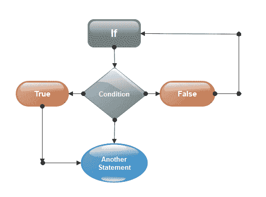
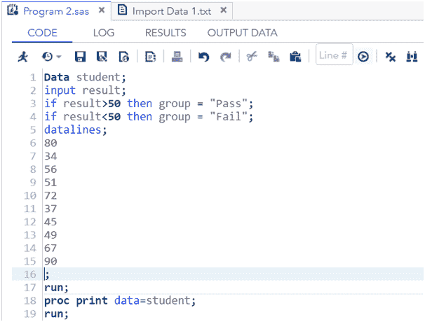
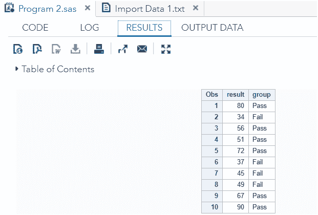
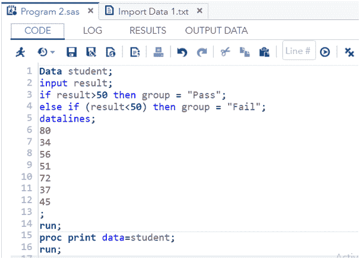
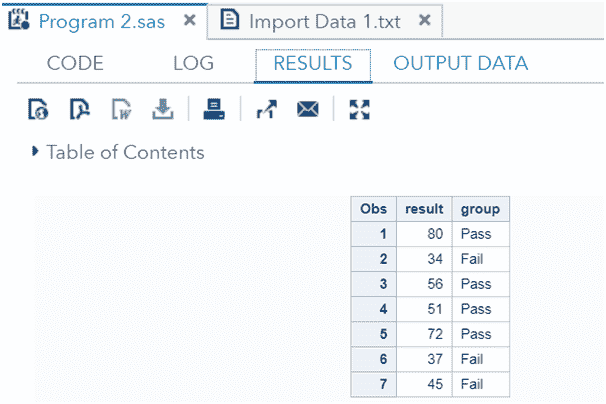
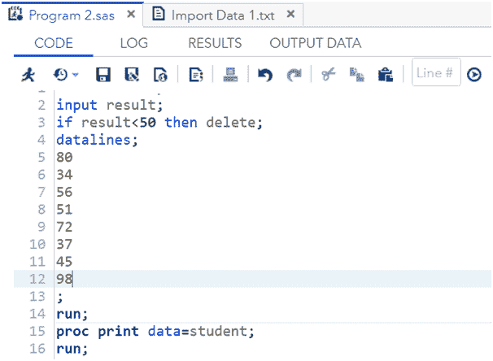
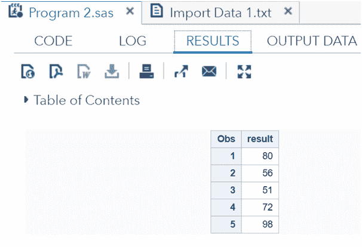

# 决策支持系统

> 原文：<https://www.javatpoint.com/sas-decision-making>

决策是从可用选项中选择一个逻辑选项的想法。在 SAS 中，决策有助于程序员在单个语句或一组语句上应用特定条件。

The decision is dependent on the condition, i.e., if the conditionis true, then the program falls on another set of conditions or another statement, but if the condition is false, then it goes back on the beginning statement of the code.

考虑以下图像:



SAS 中有三种类型的决策陈述:

*   **如果-那么声明**
*   **If-Then-Else - If 语句**
*   **If-Then-Delete 语句**

## 如果？然后声明

如果指定条件为真，If-Then 语句指示 SAS 执行一条语句。让我们通过一个例子来理解它。

### 示例:

在下面的代码中，我们提供了两个条件。第一个条件是，如果一个学生的成绩超过 50，那么将该学生添加到“及格”组。

第二个条件是，如果一个学生的成绩低于 50，那么将该学生加入“不及格”组。

```

Data student;
input result;
if result>50 then group = "Pass";
if result<50 then group = "Fail";
datalines;
80
34
56
51
72
37
45
49
67
90 
;
run;	
proc print data=student;
run;

```

**在 SAS Studio 中执行上述代码:**



**输出:**



根据以上输出，当条件“**结果> 50** 为真或结果大于 50 时，则被添加到“通过”组。而当条件“**结果< 50** 为真或结果小于 50 时，则被加入“失败”组。

## 如果-那么-否则-如果语句

如果指定条件为真，则 **If-Then-Else-If 语句**指示 SAS 执行一条语句，如果条件为假，则执行语句的 Else 部分。

在其他部分，我们可以用 If 给出另一个条件。因此，我们可以使用 **If-Then-Else-If 语句**给出多个条件。让我们通过一个例子来理解它。

### 示例:

在下面的代码中，我们提供了两个条件。如果第一个条件为真，那么它将在部分执行**，但是如果条件为假，那么它将执行代码的**或**部分。**

```

Data student;
input result;
if result>50 then group = "Pass";
else if (result<50) then group = "Fail";
datalines;
80
34
56
51
72
37
45
;
run;
proc print data=student;
run;

```

**在 SAS Studio 中执行上述代码:**



**输出:**



根据上面的输出，大于 50 的结果根据第一个条件被添加到“通过”组，小于 50 的结果根据第二个条件被添加到“失败”组。

## 如果-那么-删除语句

**IF-THEN-DELETE 语句**指示 SAS 在指定条件为真时执行一条语句，如果条件为假，则在条件为假后删除所有观察值。让我们通过一个例子来理解它。

### 示例:

在下面的代码中，我们提供了一个条件。如果条件为真，则执行**如果**部分，如果为假，则删除条件为假后的所有观察。

```

Data student;
input result;
if result<50 then delete;
datalines;
80
34
56
51
72
37
45
98
;
run;
proc print data=student;
run;

```

**在 SAS Studio 中执行上述代码:**



**输出:**



根据上述输出，SAS 仅显示大于 50 的结果。所有小于 50 的结果都已被删除。

* * *