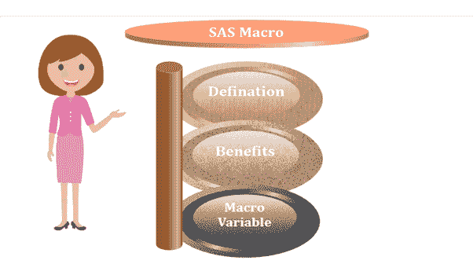
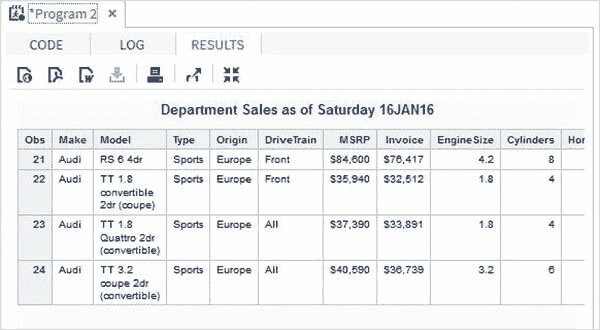
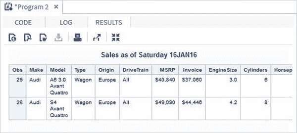
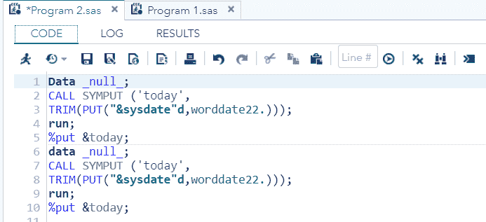
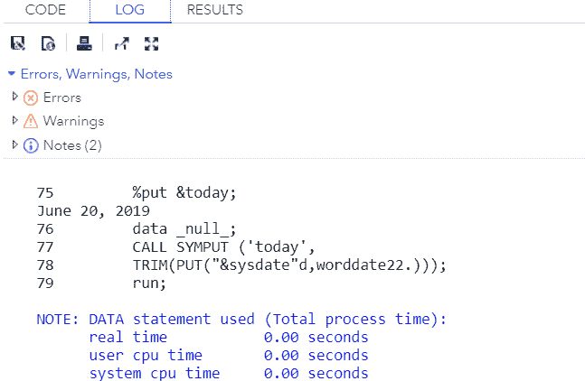
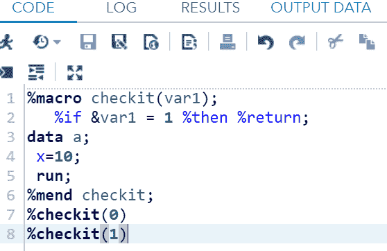
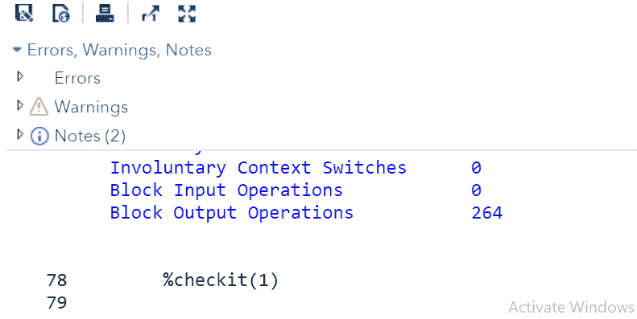
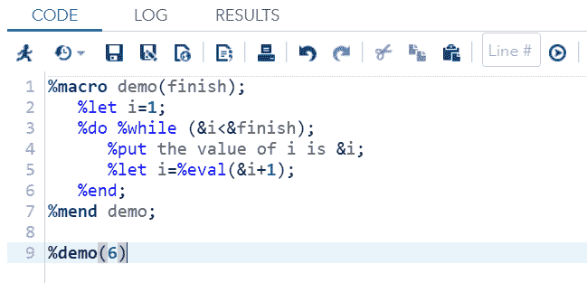
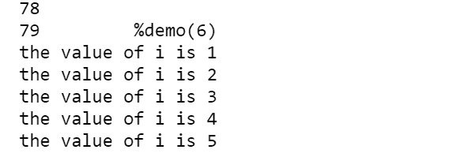

# 什么是 SAS 宏？

> 原文：<https://www.javatpoint.com/sas-macro>

SAS 提供了一个强大的编程功能，称为**宏**。宏基本上有助于在不同的地方多次重用代码，这样我们就不需要重复键入整个代码。它不仅减少了时间，而且生成了无错误的代码。

宏由一组 SAS 语句组成，由一个特定的名称指定，这样它就可以通过使用该名称在程序中的任何地方使用。其语法以 **%Macro** 语句开始，以 **%MEND** 语句结束。

宏也可以在代码块中声明，以便代码块可以多次重用到宏变量中。



**创建宏的语法:**

```

%MACRO (Param1, Param2,....Paramn);
Macro Statements;
%MEND; 
```

**调用宏的语法:**

```

%MacroName (Value1, Value2,....,Valu en);

```

哪里，

*   **%MACRO:** 是用来创建 MACRO 的语句。
*   **宏名:**是给宏起的名字。我们可以用这个名字在任何地方调用宏。
*   **参数:**这些是给宏执行操作的参数。
*   **宏语句:**这些是可以直接使用的 SAS 内置宏语句。
*   **%MEND:** 是用来关闭宏的语句。
*   **值:**这些是变量的值，给宏执行操作。

让我们通过一个例子来理解宏:

这里我们创建了两个数据集。一个是**样品**，另一个是**演示**。为了运行这些数据集，我们需要在两个数据集中使用**proc print**语句。这个 **proc print** 语句将在同一个程序中被写入两次，因为代码的长度会不必要地增加。为了减少这种不必要的长度，我们使用宏。

在下面的代码中，我们将为 **proc print** 语句创建一个由 **pri** 指定的宏。

### 示例:

**这是一个没有宏的常规代码:**

```

Data sample;
Set sashelp.airline;
Run;
proc print;
run;
Data Demo;
setsashelp.cars;
Run;
proc print;
run

```

通过使用宏，我们可以重用这个 **proc print** 语句。在下面的代码中，我们正在为 **proc print** 语句创建**宏 pri** ，以便我们可以在需要的地方使用它。

```

Data sample;
Set sashelp.airline;
run;
%pri;
Data Demo;
setsashelp.cars;
run;
%pri;

%Macro pri;
proc print;
run;
%mend;	

```

## SAS 宏的优势

*   它通过定义代码并多次重用来简化我们的工作。
*   我们可以在一个地方改变一个变量，它会在多个地方反映出来。
*   程序的数据是驱动的，即 SAS 根据实际数据值决定做什么。
*   它减少了代码的时间。
*   它降低了代码的复杂性。

## 宏观变量

这些变量包含一个被 SAS 程序重复使用的值。我们可以在 SAS 程序的开头声明一个宏变量，然后在程序的主体中调用它们。

宏观变量的范围可以是**全局**或**局部**。这些定义如下:

### 全局宏观变量

SAS 环境中的任何 SAS 程序都可以访问全局宏变量。通常，这些是系统分配的变量，可以由几个程序访问。全局宏变量的一个典型例子是系统日期。

**例**

在下面的例子中，我们将使用全局 SAS 变量 **SYSDATE** ，它代表系统日期。

考虑一个场景，在生成报告时，我们需要每天在 SAS 报告的标题中打印系统日期。

标题将显示当前日期和日期，而不在代码中为它们提供任何值。这里我们使用的是 SASHELP 库中名为 CARS 的 SAS 内置数据集。

```

proc print data = sashelp.cars;
where make = 'Audi' and type = 'Sports' ;
 TITLE "Sales as of &SYSDAY &SYSDATE";
run;

```

当我们在 SAS studio 中执行上述代码时，我们会得到以下输出。



### 局部宏变量

局部变量只能在声明它们的 SAS 程序中访问。它们通常用于在同一个 SAS 语句中提供不同的变量，以处理数据集的不同观察值。

**语法:**

```

% LET (Macro Variable Name) = Value;

```

哪里，

*   **% LET:** 它创建一个宏变量，并为其赋值。
*   **宏变量名称:**是赋予局部宏变量的名称。
*   **值:**是一个值字段，可以根据程序的要求取任意数值、文本或日期值。

**示例:**

宏变量可以通过变量名开头附加的字符 **&** 来声明。在下面的例子中，我们将声明两个局部变量一个是 **make_name** ，另一个是 **type_name** 来从 CARS 数据集中获取值。

考虑以下代码:

```

%LET make_name = 'Audi'; /*Defining Macro Variable*/
%LET type_name = 'Wagon';
proc print data = sashelp.cars;
where make = &make_name and type = &type_name ;/*referencing Macro Variable*/
TITLE "Sales as of &SYSDAY &SYSDATE";
run;

```

当我们在 SAS studio 中执行上述代码时，我们会得到以下输出。



## 常用宏

SAS 有许多内置的宏语句，可以在任何 SAS 程序中使用，而无需显式声明它们。以下是最常用的宏:

*   **宏%PUT**
*   **宏观百分比回报**
*   **宏%结束**

### 宏%PUT

此宏语句用于将文本或宏变量信息写入 SAS 日志。在下面的例子中，我们将把变量“today”的值写入程序日志。

```

Data _null_;
CALL SYMPUT ('today',
TRIM(PUT("&sysdate"d,worddate22.)));
run;
%put &today;
data _null_;
CALL SYMPUT ('today',
TRIM(PUT("&sysdate"d,worddate22.)));
run;
%put &today;

```

**在 SAS Studio 中执行上述代码:**



**输出:**



根据上述代码，值**“&系统日期”d，文字日期 22。”**的变量“今日”已经写入程序日志。

### 宏%RETURN

当某个条件被评估为真时，此宏语句用于终止当前正在执行的宏。在下面的例子中，如果值 1 被分配给变量 var1，那么宏将停止执行，并且数据步骤将不执行。

```

%macro checkit(var1);
   %if &var1 = 1 %then %return;
data a;
 x=10;
run;  
%mend checkit;  
%checkit(0)  
%checkit(1)

```

**在 SAS Studio 中执行上述代码:**



**输出:**



根据上面的代码，条件已经被评估为真，因此执行宏被终止，并且数据步骤没有被执行。

### 宏%END

该宏语句用于按照要求结束一个 **%DO %WHILE** 循环。我们可以用%END 语句来使用它。在下面的示例中，名为 demo 的宏接受输入 1，并使用该输入值运行 DO 循环。DO 循环以%End 语句结束，而宏语句以%mend 语句结束。

```

%macro demo(finish);
   %let i=1;
   %do %while (&i
```

**在 SAS Studio 中执行上述代码:**



**输出:**



按照上面的代码， **i** 的值已经打印了 5 次，完成 5 次后，%End 语句结束了 **%Do %While** 循环。

* * *