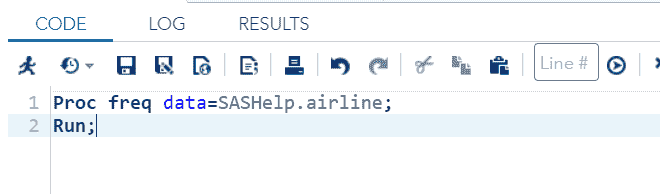
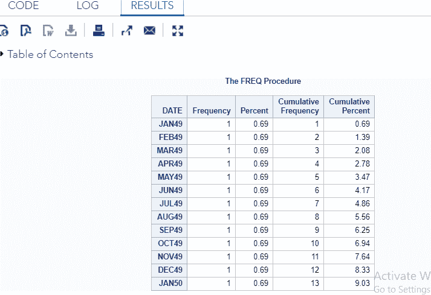
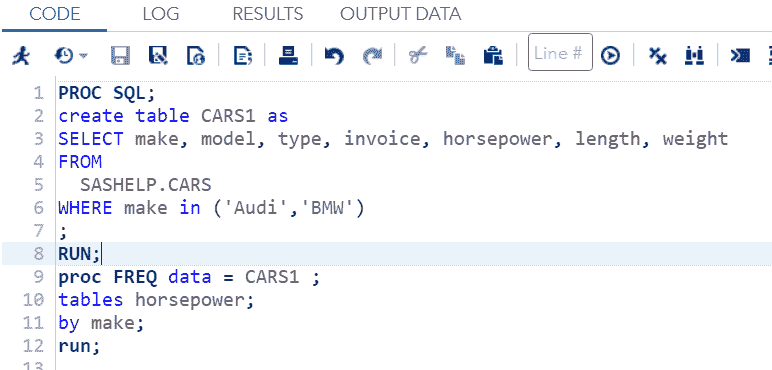
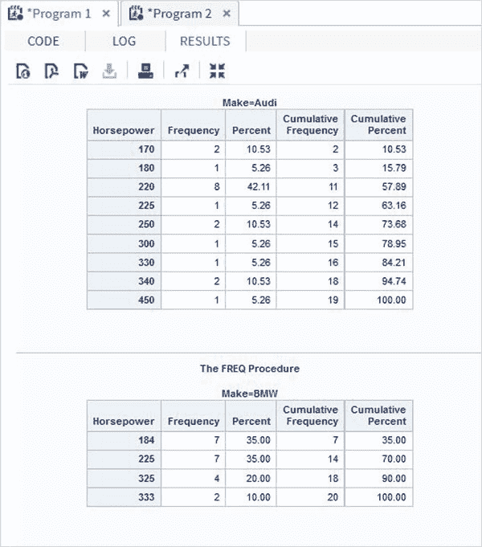
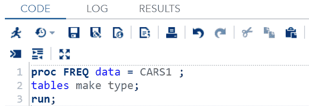
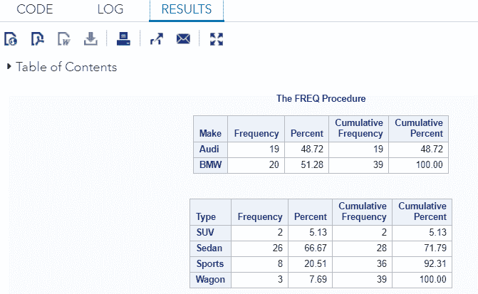
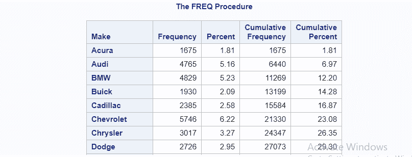
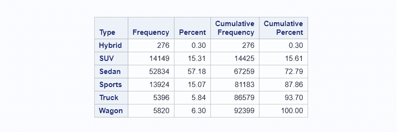

# 频率分布

> 原文：<https://www.javatpoint.com/sas-frequency-distribution>

SAS 频率分布是 SAS 编程中最常用的统计程序。

**连续变量**可以使用均值、标准差等描述性统计来汇总数据，但在**分类变量**的情况下，描述性统计不合适。

我们可以使用频率表来总结分类变量，但是在继续之前，让我们先了解分类变量。

## 分类变量:

纯分类变量是那些允许我们分配类别，但不让我们按特定顺序排列它们的变量。换句话说，一个分类变量有两个或更多的类别，但是没有这些类别的顺序。

例如，性别是一个分类变量，它包含两个类别，即男性和女性，但这两个类别没有顺序。另一个例子是头发颜色，它也被认为是一个分类变量，因为它包含几个类别，即黑色、棕色、深色、红色等。同样，没有我们可以安排的顺序。

## 频率表:

频率表显示每个变量类别观察到的病例数和百分比。

频率表中的每个条目都包含特定时间间隔内出现的值的计数。

现在，让我们来看看如何用 SAS 编程语言实现频率分布操作。

### 频数分析

我们可以通过使用**FREQ**程序来计算变量观测值的频率分布。

**语法:**

```

PROC FREQ DATA = Dataset;
TABLES Variable1;
BY Variable2;

```

哪里，

*   **数据集:**是将用于频率分布的数据集的名称。
*   **变量 1:** 是需要计算频率分布的变量的名称。
*   **变量 2:** 是声明对频率分布结果进行分类的变量。

### FREQ 的使用

PROC FREQ 的主要目的是，我们可以计算任何用户定义的或已经可用的或 SAS 内置帮助库数据集的频率。为了计算频率分布，我们只需要指定数据集的名称。

**例**

```

Proc freq data=SASHelp.airline;
Run;

```

**在 SAS Studio 中执行以下代码:**



**输出:**



## 单变量频率分布

单个变量的频率分布可以通过使用 PROC FREQ 程序来确定。执行 **PROC FREQ** 程序后，结果将显示变量的每个包含观察的频率。它还将显示**百分比分布、累计频率和累计百分比**。

### 示例:

在本例中，我们将计算数据集 CARS1 的可变“马力”的频率分布，该数据集是从 SAS 帮助库中已经可用的数据集 CARS 创建的。

```

PROC SQL;
create table CARS1 as
SELECT model, make, type, invoice, horsepower, length, weight
   FROM 
   SASHELP.CARS
   WHERE make in ('Audi','BMW')
;
RUN;

proc FREQ data = CARS1 ;
tables horsepower; 
by make;
run;

```

**在 SAS Studio 中执行以下代码:**



**输出:**



## 多重变频分配

多个变量的频率分布可以通过使用 PROC FREQ 程序来确定。执行 **PROC FREQ** 程序后，结果将显示所有变量的每个包含观察的频率。它还将显示所有变量的**百分比分布、累计频率和累计百分比**。让我们通过一个例子来理解这个过程的实现。

### 示例:

在这个例子中，我们要计算两个变量的频率分布，第一个变量是 **make** ，另一个是 **type** 。这两个变量都属于数据集 CARS1，该数据集是从 SAS 帮助库中已经可用的数据集 CARS 创建的。

```

proc FREQ data = CARS1 ;
tables make type; 
run;

```

**在 SAS Studio 中执行以下代码:**



**输出:**



## 带权重的频率分布

在频率分布中，**权重**选项用于计算带有变量权重的偏频分布。

### 例子

在下面的例子中，我们将计算变量**的频率分布，使**和**类型**具有以马力分配的权重。让我们通过代码来理解:

```

proc FREQ data = SASHELP.cars;
tables make type; 
weight horsepower;
run;

```

当我们在 SAS Studio 中执行上述代码时，我们将获得以下输出:




* * *