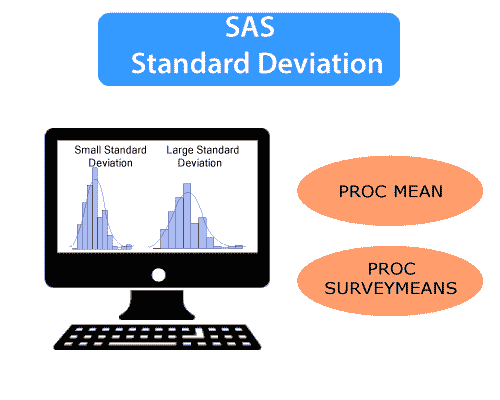
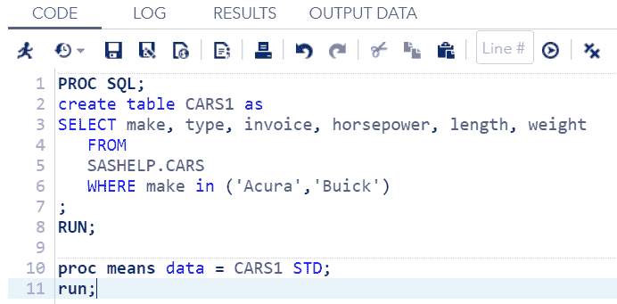
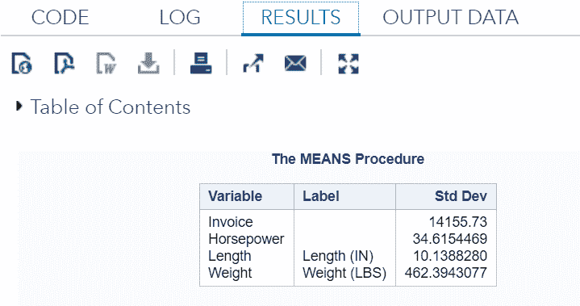
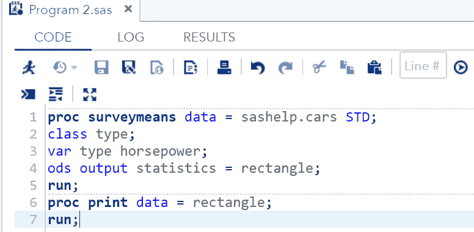
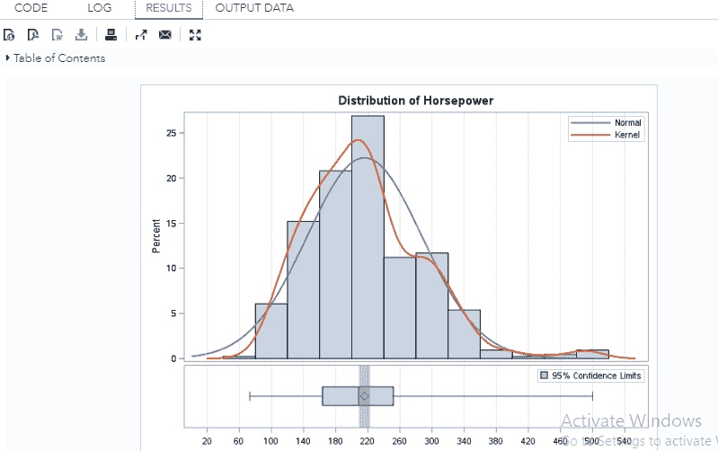
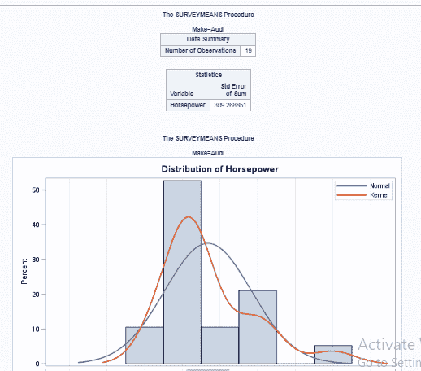
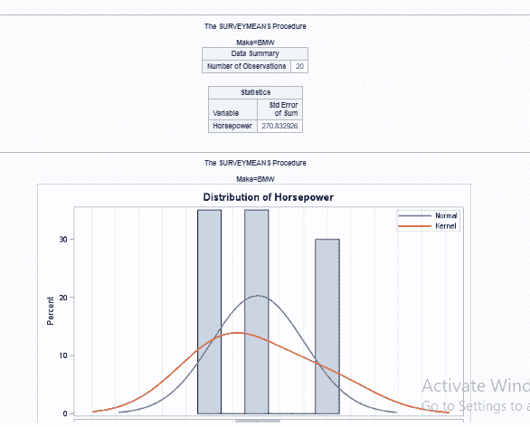
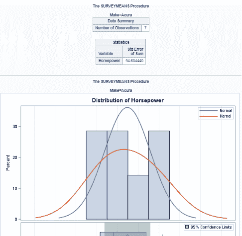

# 什么是标准差？

> 原文：<https://www.javatpoint.com/sas-standard-deviation>

在一般数学中，**一个标准差**是由特定公式计算出来的数字。它用来说明一个集合的数学值如何不同于同一个集合的平均值。

标准差的低值表示这些数字非常接近平均值。标准偏差的高值表明这些数字与平均值相差甚远。

## 什么是标准偏差？

在 SAS 中，标准差是一个基本的统计过程，它衡量数据在数据集中的变化。



数学上，它通过计算数据集的平均值或平均值的远近来衡量数据集的每个值。

*   如果标准差的值接近 0，则表明数据点非常接近数据集的平均值。
*   如果标准偏差值较高，则表明数据点分布在很宽的值范围内，远离平均值。

现在，我们将学习将标准差应用于数据的程序类型。此外，我们还将看到测量 SAS 标准偏差的不同方法。

在 SAS 中，标准偏差值通过两种方法测量，如下所示:

*   **过程意味着**
*   **PROC survey 指**

### 过程方法

我们可以用 **PROC 的意思是**来测量标准差，但为此，我们还需要在 PROC 步骤中选择 STD(标准差)语句。STD 语句从每个数值变量的数据集中得出所有的标准偏差值。

**语法:**

```

PROC means DATA = dataset STD; 

```

哪里，

*   **数据集:**是数据集的名称。

**示例:**

在下面的例子中，我们将从 SAS 帮助库中已经可用的数据集 CARS 创建数据集 CARS1，并将在 **PROC 的意思是**步骤中选择 STD 语句。

```

PROC SQL; 
create table CARS1 as 
SELECT make, type, invoice, horsepower, length, weight 
   FROM  
   SASHELP.CARS 
   WHERE make in ('Acura','Buick') 
; 
RUN; 

proc means data = CARS1 STD; 
run; 

```

**在 SAS 工作室执行上述代码:**



**输出:**



从上面的输出中我们可以看到，讴歌和别克的所有标准差值都已经显示在表格中了。这些值用于高级数据分析。

### PROC SURVEYMEANS

该程序还用于计算标准偏差以及一些高级功能，如测量分类变量的标准偏差。它还提供数据集方差的估计值。

```

PROC SURVEYMEANS statements statistic-keywords; 
BY variables;  
CLASS variables;  
VAR variables;  

```

哪里，

*   **BY:** 这些变量用于创建观察组。
*   **CLASS:** 这些变量用于分类变量。
*   **VAR:** 这些是将要计算 SD 的变量。

现在，让我们来看看 PROC SURVEYMEANS 的高级特性:

程序 **PROC SURVEYMEANS** 使用两个语句来提供高级功能:

*   **班级陈述**
*   **通过声明**

### 类别声明

Class 语句为类变量中的每个值创建统计信息。

**示例:**

下面的代码描述了类语句的使用。

```

proc surveymeans data = sashelp.cars STD;   
class type; 
var type horsepower; 
ods output statistics = rectangle; 
run; 
proc print data = rectangle; 
run;

```

**在 SAS 工作室执行上述代码:**



**输出:**



### 按声明

By 语句用于根据 **By** 语句下声明的变量创建一个组。

**示例:**

下面的代码描述了 By 语句的使用:

```

proc surveymeans data = sashelp.cars STD; 
var horsepower; 
BY make; 
ods output statistics = rectangle; 
run; 
proc print data = rectangle; 
run; 

```

当我们在 SAS Studio 中执行上述代码时，它将产生以下输出:

【make =“奥迪”的结果



【make =“宝马”的结果



【make =“讴歌”结果



* * *