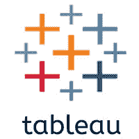

# 教学课程表格

> 哎哎哎:# t0]https://www . javatppoint . com/table

Tableau 教程提供了 Tableau 的基本和高级概念。我们的 Tableau 教程是为初学者和专业人士设计的。

Tableau 是一种数据可视化工具或商业智能工具，可以快速分析和显示图表或报告中的数据。它非常容易使用，因为它不需要任何编程技能。

我们的 tableau 教程包括 Tableau 的所有主题，如什么是 Tableau、简介、历史、应用、优缺点、工具、工作、架构、版本、桌面工作空间、导航、数据排序、数据排序、替换数据源、与数据库的数据连接、替代方案、可视化、过滤 Tableau 中的数据等。

## 先决条件

要学习 Tableau，必须具备 HTML 和 CSS 的基础知识。

## 观众

我们的 Tableau 教程旨在帮助初学者和专业人士。

## 问题

我们保证您在这个 Tableau 教程中不会发现任何问题。但是如果有任何错误，请在联系表格中发布问题。

* * *