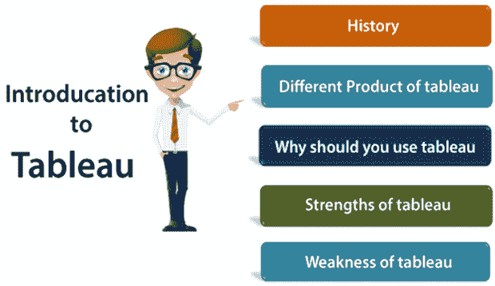

# Tableau 是什么？

> 哎哎哎:# t0]https://www . javatppoint . com/table-introduction

Tableau 是增长迅速且功能强大的数据可视化工具。Tableau 是一个商业智能工具，帮助我们以可视化的方式分析原始数据；它可以是图表、报告等。

**示例:** -如果您有像**大数据、Hadoop、SQL、**或任何云数据这样的数据，并且您想要以数据的图形表示形式分析该给定数据，则可以使用 Tableau。

使用 Tableau 进行数据分析非常快，创建的可视化是以工作表和仪表板的形式。任何专业人员都可以理解使用 Tableau 创建的数据。

Tableau 软件不需要任何技术或编程技能来操作。Tableau 创建可视化仪表板既简单又快速。

## 为什么要用 Tableau？

以下是使用 Tableau 的一些原因:

*   数据科学的终极技能
*   用户友好的
*   适用于任何企业
*   快速简单
*   你不需要做任何编码
*   社区是巨大的
*   掌握数据的力量
*   它使理解和解释数据报告变得更加容易

## Tableau 的特点

*   **数据融合:**数据融合是 Tableau 最重要的特征。当我们组合来自多个数据源的相关数据时，使用它，您希望在单个视图中一起分析这些数据，并以图形的形式表示这些数据。

**示例:**假设我们在关系数据库中有销售数据，在 Excel 表中有销售目标数据。现在，我们必须将实际销售额与目标销售额进行比较，并基于公共维度混合数据以获得访问权限。数据混合中涉及的两个源称为主数据源和辅助数据源。将在主数据源和辅助数据源之间创建一个左连接，主数据源中的所有数据行和辅助数据源中的匹配数据行混合在一起。

*   **实时分析:**实时分析使用户能够快速理解和分析动态数据，尤其是在 Velocity 较高，数据实时分析复杂的情况下。Tableau 可以通过交互式分析帮助从快速移动的数据中提取有价值的信息。
*   **数据的协同:**数据分析不是隔离任务。这就是为什么 Tableau 是为协作而构建的。团队成员可以共享数据，进行后续查询，并将易于消化的可视化结果转发给其他可以从数据中获得价值的人。确保每个人都了解数据，并能够做出明智的决策，这是成功的关键。

* * *