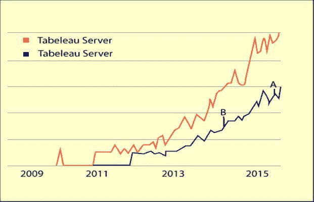
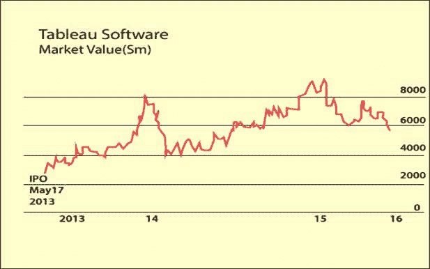

# Tableau 的历史

> 原文：<https://www.javatpoint.com/history-of-tableau>

直到 21 世纪初，数据库还被用来产生数字和数据。分析数据和创建报告是信息技术专业人员的工作。

2003 年，斯坦福大学的帕特·汉拉汉、克里斯蒂安·查博特和克里斯·斯托尔特创立了 Tableau。其创建背后的主要思想是使数据库行业互动和全面。

Tableau 出现在已经有 Cognos、微软 Excel、Business Objects 等老牌公司的时代。它以 38 亿美元的当前市值成功登顶成功排行榜。

此后，公司日益壮大。

2016 年 8 月，Tableau 宣布并任命 Adam Selipsky 为公司总裁兼首席执行官。

## 是什么让 Tableau 如此受欢迎？

创建此工具的主要逻辑是开发一个简单且用户友好的工具，可以帮助您创建图形、图表、地图、报告，并帮助您理解下一代概念，如预测性和规定性分析。

全球业务分析市场从 2013 年的 377 亿美元增长到 2018 年的 592 亿美元，相当于预测期内 9.4%的复合年增长率。

**导致 Tableau 软件取得成功的主要特征是-**

*   由 VizQL 语言提供支持，这使得从任何来源提取数据变得更加灵活。
*   为用户提供 n 个可视化工具来定制 Tableau 报告。
*   所有复杂的图形和地图都可以用拖放的方法来制作。
*   Tableau 数据可视化可以插入多个平台。
*   它可以实时分析和显示数据。

**最近推出的一些 Tableau 版本有以下特点:**

表 9.0

*   智能地图
*   即时视觉反馈
*   缓存和整合
*   可扩展且更快的 tableau 服务器

表 10.0

*   聚类分析
*   跨数据库连接
*   大规模自助服务
*   多设备支持

**Tableau 过去 7 年的年销售额从 2009 年的 1800 万美元增长到 2015 年的 6.54 亿美元**，实现了 82%的可观增长，使其获得了排行榜的最高位置。这家公司现在位列商业智能工具前 10 名，与其他老工具如 IBM、微软、Qlik、甲骨文等竞争。

**福布斯 2016 年的一份报告**显示，Tableau 第一季度总收入增长 32%，达到 1.72 亿美元，其中国外收入高达 52%。该公司完成了 268 笔超过 10 万美元的交易，每年增长 8%。如果 Tableau 继续以同样的速度表现，其净资产将达到 30 亿美元，被列为全球三大商业智能公司之一。

* * *