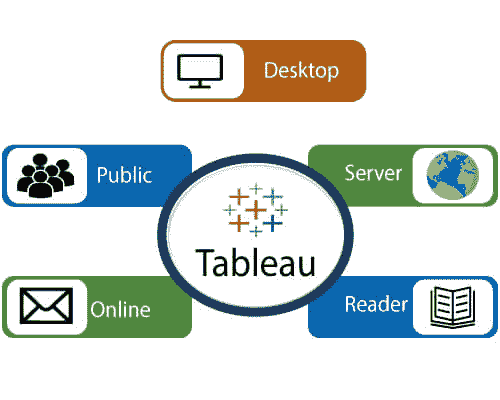

# Tableau 的工具

> 原文：<https://www.javatpoint.com/tableau-tools>

Tableau 工具列表:

*   桌上型电脑表格
*   公共表
*   在线表格
*   伺服器表格
*   Reader 表

**Tableau 中的数据分析分为两部分:-**

1.  **开发人员工具:-** 用于开发的 Tableau 工具，如创建图表、仪表板、报告生成和可视化，被称为开发人员工具。Tableau 桌面和 Tableau 公共就是这种类型的例子。
2.  **共享工具:-** 这些工具的作用是共享使用开发人员工具创建的报告、可视化和仪表板。属于这一类别的 Tableau 工具有 Tableau 服务器、Tableau 在线和 Tableau 阅读器。

**让我们一个一个看所有的工具:**

## 桌上型电脑表格

Tableau Desktop 具有丰富的功能集，允许我们对报告进行编码和定制。从创建报告、图表到将它们混合在一起形成仪表板，所有必要的工作都在 Tableau Desktop 中创建。

对于实时数据分析，Tableau Desktop 在数据仓库和其他各种类型的文件之间建立连接。此处创建的仪表板和工作簿既可以本地共享，也可以公开共享。

基于与发布选项和数据源的连接，Tableau Desktop 也分为两个部分-

*   **Tableau 桌面个人版:-**Tableau 桌面个人版保持工作簿私密，访问受限。工作簿无法在线发布。因此，它应该离线分发或在 Tableau 公共中分发。
*   **Tableau 桌面专业版:-** 类似于 Tableau 桌面。主要区别是在 Tableau 桌面中创建的工作簿可以在线发布，也可以在 Tableau 服务器中发布。在专业版中，可以完全访问各种数据类型。它最适合那些想在 Tableau 服务器上发布工作簿的人。

## 公共表

这个 Tableau 版本是专门为高性价比用户打造的。单词“ **Public** ”表示创建的工作簿不能保存在本地。它们应该保存在 Tableau 的公共云上，任何人都可以访问和查看。

保存在云上的文件没有隐私，因此任何人都可以访问和下载相同的数据。这个版本最适合那些想和大众分享数据的人，也最适合那些想学习 Tableau 的人。

## 在线表格

它的功能类似于 tableau 服务器，但是数据存储在托管在云上的服务器上，云由 Tableau 组维护。

在线表格中发布的数据没有存储限制。Tableau Online 创建了 40 多个数据源的直接链接，这些数据源托管在云中，如**蜂巢、MySQL、Spark SQL、亚马逊极光**等。

要发布，Tableau 服务器和联机 Tableau 都需要 Tableau 桌面创建的工作簿。来自网络应用程序的数据称，Tableau 服务器和 Tableau Online 也支持**谷歌分析**和**Salesforce.com**。

## 伺服器表格

该软件被正确地用于在组织内共享在 Tableau 桌面应用程序中创建的工作簿和可视化。要在 Tableau 服务器中共享仪表板，您应该首先在 Tableau 桌面中发布工作簿。工作簿上传到服务器后，只有授权用户才能访问。

授权用户没有必要在他们的机器上安装 Tableau 服务器。他们只需要登录凭证就可以通过网络浏览器检查报告。Tableau 服务器的安全性很高，有利于数据的快速有效共享。

组织的管理员对服务器有完全的控制权。组织维护硬件和软件。

## Reader 表

Tableau Reader 是一个免费工具，允许我们查看可视化和工作簿，它是使用 Tableau 桌面或 Tableau Public 创建的。可以过滤数据，但修改和编辑受到限制。Tableau Reader 中没有安全性，因为任何人都可以使用 Tableau Reader 查看工作簿。

如果您想共享您创建的仪表板，接收者应该有 Tableau Reader 来查看文档。

* * *