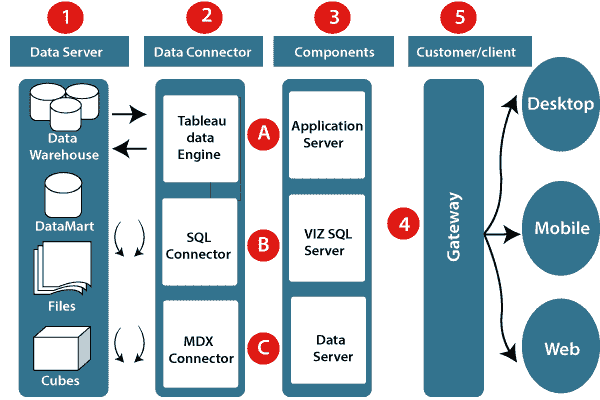

# 体系结构表

> 哎哎哎:# t0]https://www . javatppoint . com/table-architecture

Tableau 服务器旨在连接多个数据层。它可以连接移动、网络和桌面客户端。Tableau Desktop 是一个强大的数据可视化工具。它非常安全且高度可用。

它可以在物理机和虚拟机上运行。是一个**多进程**、**多用户**、**多线程**系统。

提供如此强大的功能需要独特的架构。

Tableau 服务器中使用的不同层在以下架构图中给出:-

**我们来研究一下 Tableau 架构的不同组成部分:**

**1。数据服务器:-**Tableau 架构的主要组件是可以连接到它的数据源。

Tableau 可以连接多个数据源。它可以混合来自不同数据源的数据。它可以同时连接到一个 **excel 文件、数据库**和一个 **web 应用程序**。它还可以使不同类型的数据源之间的关系。

**2。数据连接器:-** 数据连接器提供了一个接口，用于连接外部数据源和 Tableau 数据服务器。

Tableau 内置了 SQL/ODBC 连接器。该 ODBC 连接器可以与任何数据库连接，而无需使用它们的本机连接器。Tableau 桌面可以选择提取和实时数据。在使用的基础上，可以很容易地在实时数据和提取数据之间切换。

*   **实时数据或直播连接:** Tableau 可以通过直接链接到外部数据库与真实数据连接。它通过发送动态**多维表达式(MDX)** 和 SQL 语句来使用基础设施现有数据库。此功能可用作实时数据和 Tableau 之间的链接，而不是导入数据。它使优化和快速的数据库系统。大多在其他企业，数据库的规模很大，而且是定期更新的。在这些情况下，Tableau 通过连接实时数据作为前端可视化工具。
*   **提取或内存数据:** Tableau 是一个从外部数据源提取数据的选项。我们以 Tableau 提取文件的形式制作一个本地副本。只需单击一下，它就可以删除 Tableau 数据引擎中的数百万条记录。Tableau 的数据引擎使用 **ROM、RAM** 和**缓存**内存等存储来处理和存储数据。使用过滤器，Tableau 可以从大型数据集中提取一些记录。这提高了性能，尤其是当我们处理大规模数据集时。提取的数据允许用户离线可视化数据，而无需连接到数据源。

**3。Tableau 服务器的组件:**Tableau 服务器不同类型的组件有:

*   应用服务器
*   VizQL 服务器
*   数据服务器

**A .应用服务器:**应用服务器用于提供授权和认证。它处理移动和 web 界面的权限和管理。它通过在 Tableau 服务器上记录每个会话 id 来保证安全性。管理员正在服务器中配置会话的默认超时。

**B. VizQL 服务器:** VizQL 服务器用于将来自数据源的查询转换为可视化。一旦客户端请求被转发到 VizQL 进程，它就将查询直接发送到数据源，并以图像的形式检索信息。该可视化或图像被呈现给用户。Tableau 服务器创建可视化缓存来减少加载时间。该缓存可以在许多有权查看可视化的用户之间共享。

**C .数据服务器:**数据服务器用于存储和管理来自外部数据源的数据。这是一个中央数据管理系统。它提供**数据安全、元数据管理、数据连接、驱动需求**和数据存储。它存储数据集的相关细节，如**计算字段、元数据、组、集**和**参数**。数据源可以提取数据，也可以与外部数据源进行实时连接。

**4。网关:**网关将用户的请求定向到 Tableau 组件。当客户端发送请求时，它会被转发到外部负载平衡器进行处理。网关充当不同组件的进程的分发器。在没有外部负载平衡器的情况下，网关也充当负载平衡器。对于单服务器配置，一个网关或主服务器管理所有进程。对于多服务器配置，一个物理系统用作主服务器，其他系统用作工作服务器。在 Tableau 服务器环境中，只有一台机器用作主服务器。

**5。客户端:**可以使用不同的客户端编辑和查看 Tableau 服务器中的可视化和仪表板。客户端是网络浏览器**，移动应用程序**，以及**桌面平台**。

*   **网络浏览器:**像**谷歌 Chrome、Safari** 和**火狐**这样的网络浏览器都支持 Tableau 服务器。仪表板中的可视化和内容可以通过使用这些网络浏览器进行编辑。
*   **移动应用:**可以使用移动应用和浏览器交互可视化来自服务器的仪表盘。它用于编辑和查看工作簿中的内容。
*   **Tableau 桌面:** Tableau 桌面是一款商业分析工具。用于在 Tableau 服务器中**查看、创建**、**发布**仪表盘。用户可以访问各种数据源，并在 Tableau 桌面中构建可视化。

* * *