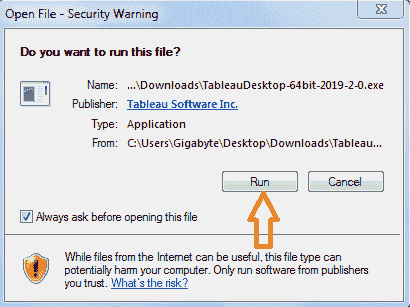
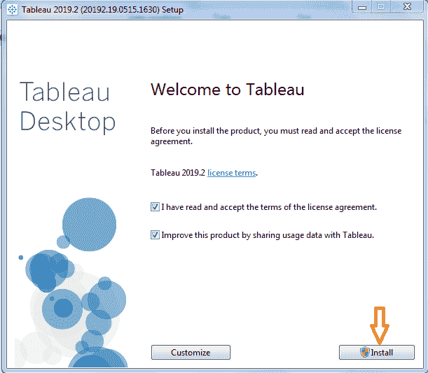
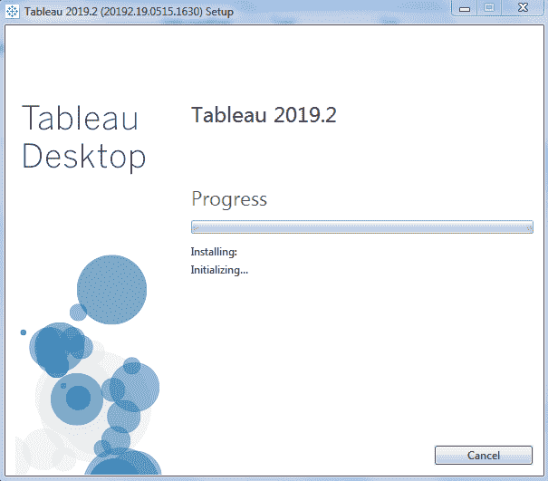
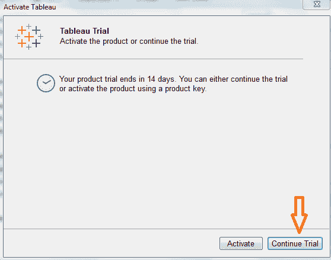
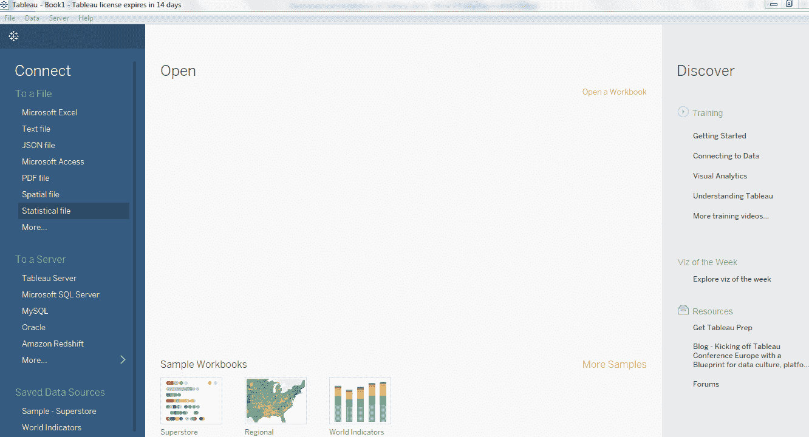

# Tableau 的下载和安装

> 原文：<https://www.javatpoint.com/download-and-installation-tableau>

**Tableau 有两种可用方式:-**

*   公共表(Free)
*   桌面(商用)

下面是 Tableau 公共桌面和 Tableau 桌面之间的比较

## 公共表

*   Tableau Public 是一个免费的开源软件。
*   Tableau 公共数据源可以连接到 Excel 和文本文件。
*   Tableau 公共可以安装在 Window 和 Mac 操作系统上。
*   数据和可视化在 Tableau 公共中不安全，因为它在公共中可用。
*   在 Tableau public 中，无法从不同的数据源获取数据，因为它仅限于连接 Excel 和 Text 文件。
*   Tableau 公共使用个人级别的详细信息。

## 桌上型电脑表格

*   Tableau Desktop 是付费来源，个人版每月 35 美元，专业版每月 70 美元。
*   Tableau 桌面数据源可以连接到任何数据源文件，包括数据库、web 应用程序等。
*   Tableau 桌面也可以安装在 Window 和 Mac 操作系统上。
*   数据和可视化在 Tableau 桌面中是安全的。
*   在 Tableau 桌面中，数据可以从各种数据源中提取，并存储为 Tableau 提取文件。
*   Tableau 桌面使用专业和企业级别的详细信息。

**让我们把 Tableau 桌面安装到 Window 机器上，一步一步来:-**

**步骤 1:-** 在你的网络浏览器上转到[https://www.tableau.com/products/desktop](https://www.tableau.com/products/desktop)。

**步骤 2:-** 点击**“立即尝试”**按钮。

**步骤 3:-** 现在，输入您的**电子邮件 id** 并点击**“下载免费试用”**按钮。

**步骤 4:-** 这将开始下载。默认情况下，窗口机器的文件。

**步骤 5:-** 打开下载文件，点击**【运行】**按钮。

**步骤 6:-** 接受条款和条件，点击**‘安装’**按钮。

**步骤 7:-** 屏幕上将显示一条弹出消息，请求管理员批准安装 Tableau 软件。点击**【是】**进行审批，安装开始。

**步骤 8:-** 安装完成后，打开 Tableau 桌面软件。

**步骤 9:-** 在注册窗口中

1.  点击激活表格，填写完整的详细信息。
2.  点击立即开始试用。

**步骤 10:-** 等待完成注册。

**步骤 11:-**Tableau 桌面的开始屏幕。

现在，您已经准备好在窗口机器上使用 Tableau 桌面了。

* * *