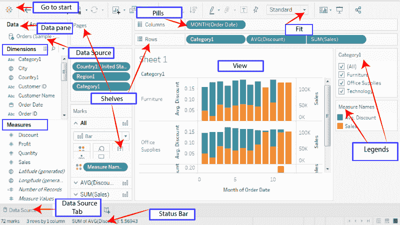

# 表格数据术语

> 原文：<https://www.javatpoint.com/tableau-data-terminology>

Tableau 是一个强大的数据可视化工具；这就是为什么 Tableau 有许多独特的术语和定义。在开始在 Tableau 中使用这些功能之前，您应该知道它们的含义。

**最常用的 Tableau 术语如下:**

1.  **别名:**别名是可以分配给尺寸成员、测量零件或字段的替代项。
2.  **Bin:** Bin 是数据源中用户自定义的一组度量。
3.  **书签:**Tableau 存储库中书签文件夹中包含单个工作表的. tbm 文档。它有助于改进数据分析。不像，网页浏览器书签，。tbm 文件是快速显示各种病历报告的兼容方式。
4.  **计算字段:**计算字段是用户通过使用公式修改数据源中的现有字段来创建派生文件的新字段。它被用来使你的工作变得简单和容易。
5.  **交叉表:**交叉表用于文本表格视图。它使用各种文本表格来显示与维度成员相关联的数字。
6.  **仪表板:**仪表板是排列在单个页面上的多个视图的组合。在 Tableau 中，仪表板用于一起观察和比较各种数据，它还允许与其他工作表交互。
7.  **数据窗格:**数据窗格位于工作簿的左侧，显示 Tableau 所连接的数据源的字段。字段进一步分为度量和维度。数据窗格还反映自定义字段，如组、入库字段、计算等。您可以通过将字段从数据窗格拖到不同的架子上来构建数据视图，架子是每个工作表的一部分。
8.  **数据源页面:**数据源是可以设置数据源的页面。该数据源页面通常由四个主要区域组成？连接区域、左窗格、预览区域和元数据区域。
9.  **维度:**维度通常被称为分类数据的字段。维度保存离散数据，如无法聚合的成员和层次结构。它还包含日期、姓名和地理数据等特征值。用于揭示信息细节的维度。
10.  **摘录:**摘录是保存的数据源子集，用于提高性能和离线学习。用户可以通过定义包含提取所需数据的限制和过滤器来创建提取。
11.  **过滤器架:**过滤器架位于工作簿的左侧。过滤器架用于通过使用维度和度量对数据进行过滤来从视图中排除数据。
12.  **格式窗格:**格式窗格位于工作簿左侧，包含各种格式设置。它控制工作表的整个视图，以及视图中的各个字段。
13.  **详细程度表达式(LOD):** 详细程度表达式是一种支持视图级别以外的各种维度组合的语法。在详细表达式的帮助下，可以用聚合表达式附加多个维度。
14.  **标记:**标记是视图的一部分，直观地表示数据源中的一行或多行。它可以是直线、正方形或条形。您可以控制和更改标记的大小、类型和颜色。
15.  **标记卡:**标记卡在工作表的左侧。用户可以将字段拖动到控件标记属性，如颜色、类型、形状、大小、标签、细节和工具提示。
16.  **页面架:**页面架在视图左侧。借助页面架，您可以根据连续或离散字段中的值和成员将视图拆分为一系列页面。使用 pages 盘架添加字段类似于在行盘架中添加字段。对于每一个新行，都会创建一个新页面。
17.  **行架子:**行架子在工作簿的顶部。它用于创建数据表的行。行搁板提供任意数量的度量和尺寸。当您将维度放在“行”架上时，Tableau 会为该维度的成员创建标题。当您将度量放在“行”架上时，Tableau 会为该特定度量创建量化轴。
18.  **货架:**货架是位于视图顶部和左侧的命名区域。您可以通过将字段放在架子上来构建视图。某些货架仅在您选择特定标记类型时可用。例如，仅当您选择特定的形状标记类型时，形状架才会打开。
19.  **工作簿:**工作簿是一个带有。保存一个或多个工作表以及仪表板和故事的 twb 扩展。
20.  **工作表:**工作表是工作表的集合。在这里，您可以通过将各种字段拖到货架上来构建数据视图。

* * *