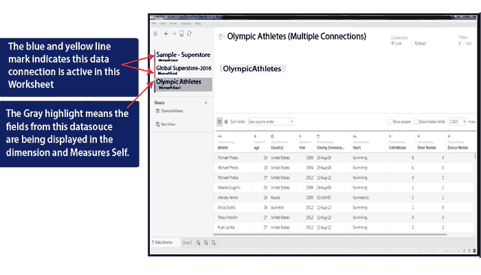
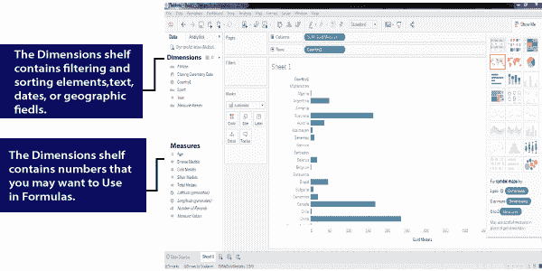
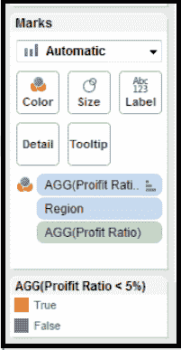

# 数据窗口，表中的数据类型

> 原文：<https://www.javatpoint.com/data-types-in-tableau>

## 表格中的数据窗口

数据窗口是显示 Tableau 和数据源之间连接的一种方式。您可以在单个工作簿中连接到多个不同的数据源。与数据连接相关联的小图标提供了关于连接性质的附加细节。

这里，工作簿显示了下面给出的三种不同的数据连接:

全局超级商店数据连接旁边的绿线表示它是工作表中的活动连接。因此，电子表格中的条形图是使用该数据源中的“**维度和度量值**”创建的。因此，条形图是使用数据源中的维度和度量值创建的。

**奥林匹克运动员**数据连接是直接连接，也用灰色高亮显示。这些数据源字段当前显示在度量和维度盘架上。数据窗口顶部的剪贴板数据源被拖放到 Tableau 中。

当您创建数据连接时，Tableau 将自动评估字段，并将它们放在度量和维度架上。

通常，Tableau 会正确放置大部分字段。如果某些内容放置不正确，请将字段拖到正确的位置。当用数字来说明尺寸时，有时会出现错误。

**例如**，如果你想连接一个包含奥运会运动员详细信息的电子表格，并且你想知道不同国家在过去几年中获得了多少枚金牌，该字段被放入测量货架。将金牌字段从测量架拖到工作表中会导致该字段被求和。适当地放置在维度架子上，运动员国家将表现得像一个维度，并以列或行表示。同样，金牌和国家在上图中表示。

## 表中的数据类型

Tableau 表示字段并自动分配数据类型。如果数据源指定了数据类型，Tableau 将使用该数据类型。如果数据源没有单独分配数据类型，Tableau 将分配一个。Tableau 由以下数据类型组成:

*   日期值
*   文本值
*   数值
*   日期和时间值
*   布尔值(真或假条件)
*   地理值(用于地图的经度和纬度)

在上图中，重点关注度量和维度盘架中字段旁边的图标。这些图标表示特定的数据类型。带时钟的日历是日期或时间字段。数值有磅符号，“abc”图标表示文本字段。布尔字段具有“真或假”值。

* * *