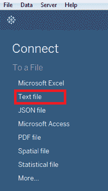
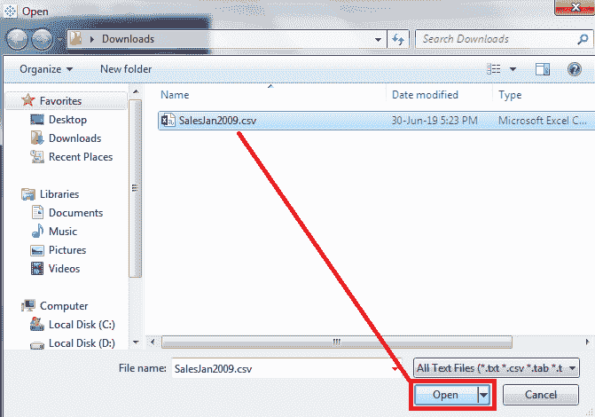
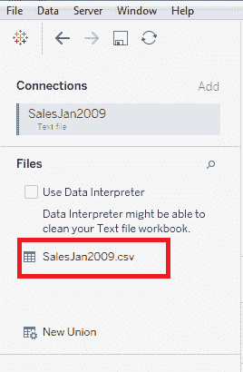
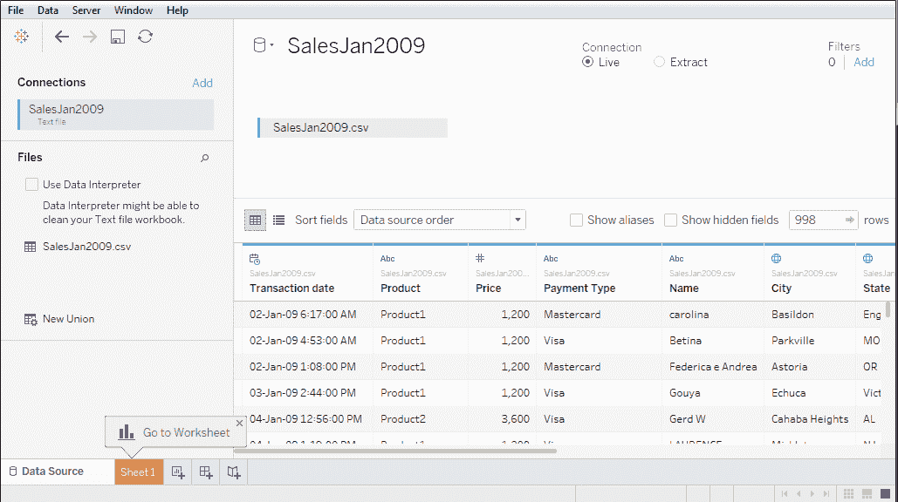
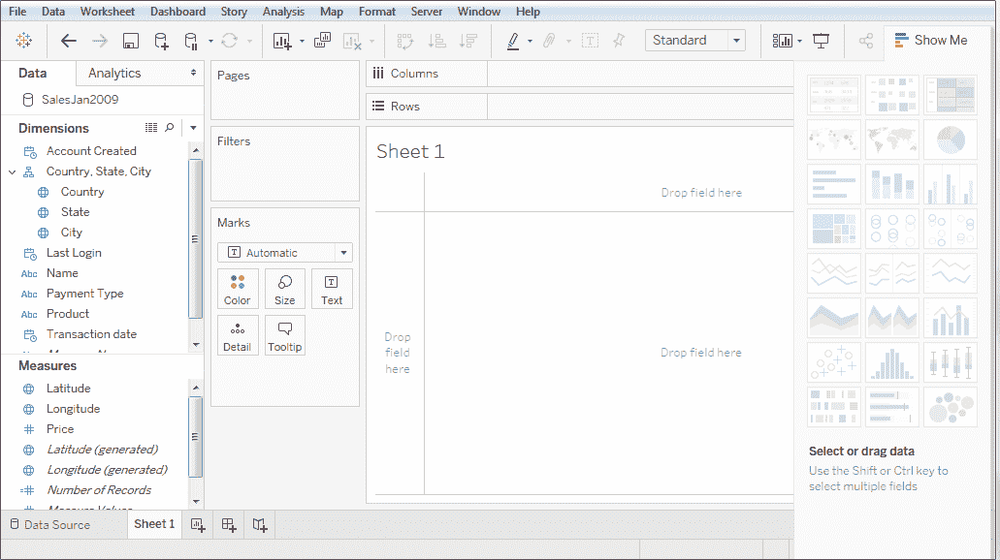

# 文本文件的数据连接

> 原文：<https://www.javatpoint.com/tableau-data-connection-with-text-file>

Tableau 可以连接到文本文件数据并设置数据源。Tableau 连接到以下文本文件(*。csv，*。txt，*。tsv，*。tab)。

## 如何建立连接和设置数据源

**步骤 1:** 打开黑板。

**第二步:**在**下方连接**，点击**文本文件**。

**步骤 3:** 进入下一屏，

*   选择要连接的文件，如 **SalesJan2009。CSV**
*   点击**打开**选项。

*   在数据源的左侧，你会看到 **CSV 文件**。

* * *

## 文本文件的数据连接示例

这里有一个例子，显示了文本文件的数据连接。

工作表看起来像

* * *