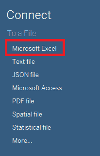
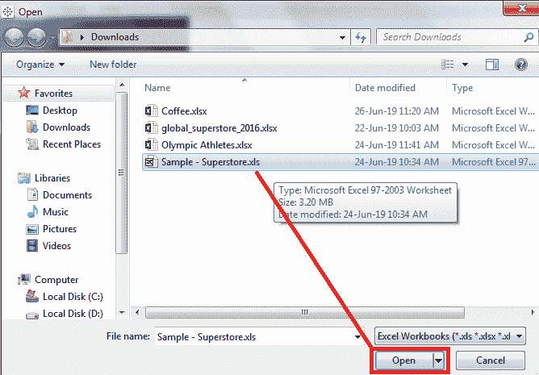
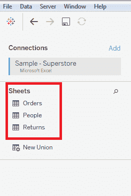
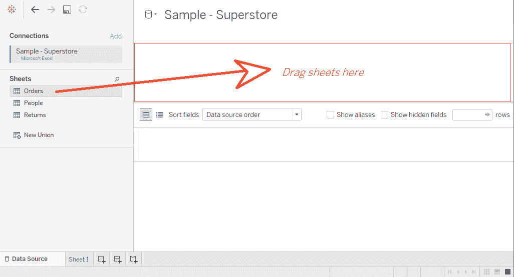
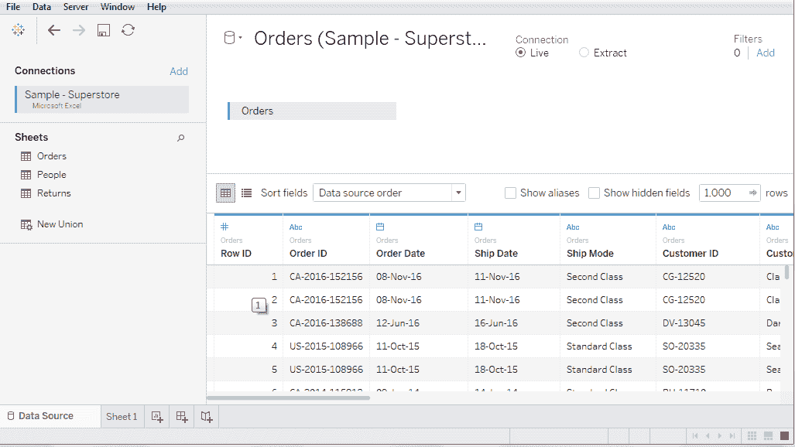
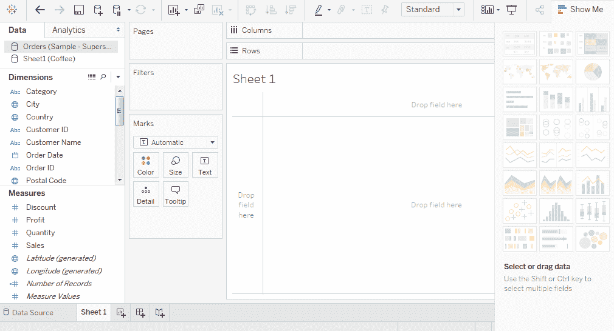

# 与微软 Excel 的数据连接

> 原文：<https://www.javatpoint.com/tableau-data-connection-with-microsoft-excel>

**步骤 1:** 点击数据选项卡中给出的**微软 Excel** 选项。

**步骤 2:** 在下一个屏幕中，

1.  选择要连接的微软 Excel 文件，如**示例-superstore.xls** 。
2.  点击**打开**选项。

**步骤 3:** 它将微软 Excel 文件连接到 Tableau。微软 Excel 文件中的工作表显示在窗口的左侧。

**步骤 4:** 您可以从图纸数据选项卡中拖动一张或多张图纸，如**订单**。

然后数据源如下图所示:

**工作表看起来像:**

* * *