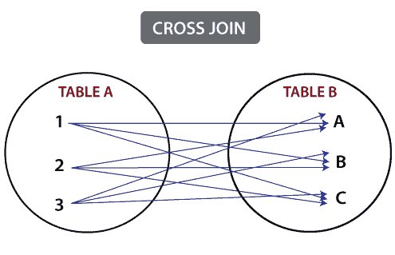
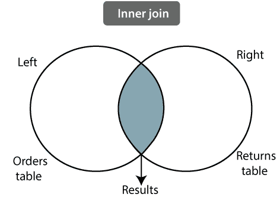
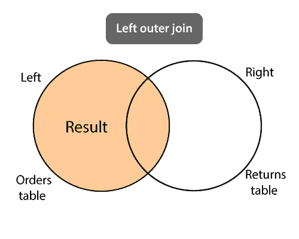
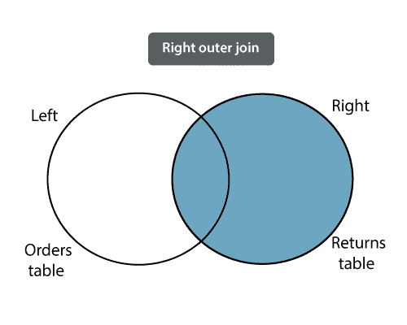
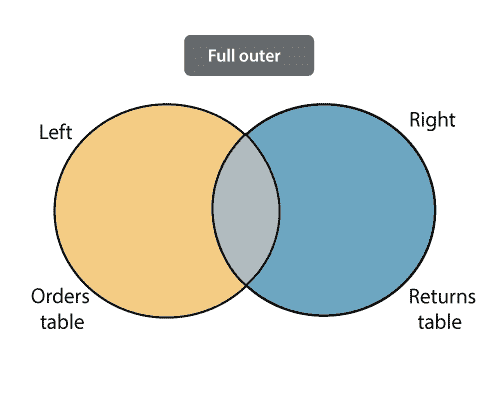
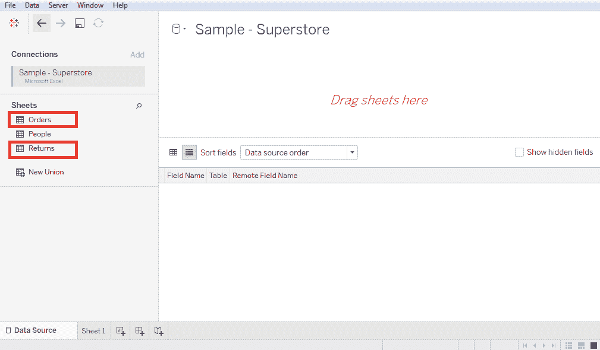
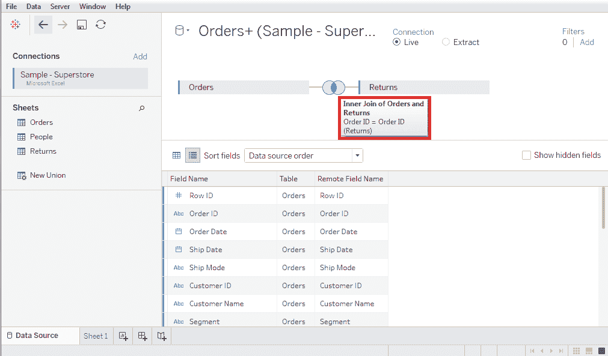
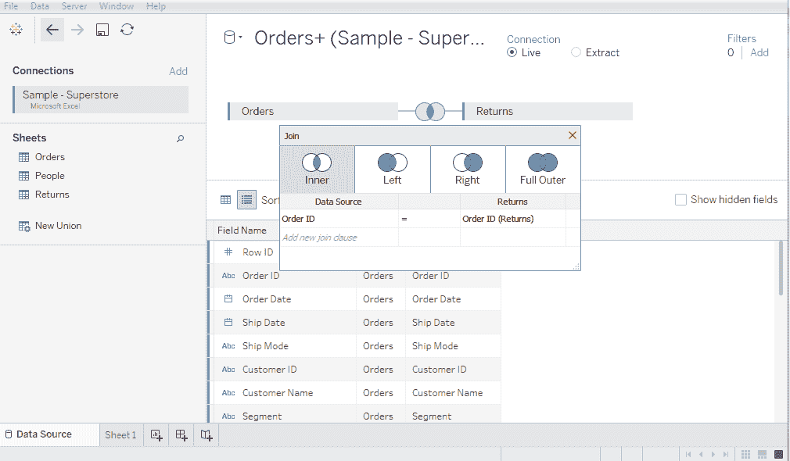
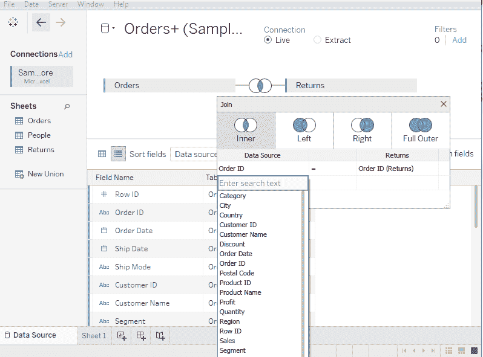

# 表格数据连接

> 原文：<https://www.javatpoint.com/tableau-data-joining>

数据连接是任何数据分析中的常见要求。您可能需要将不同表中的数据连接到一个源中，或者连接多个源中的数据。

Tableau 提供了通过使用“数据”菜单中的数据窗格来连接表的功能。

联接意味着将关系数据库中一个或多个表中的列组合在一起。它还创建了一个集合，可以保存为表格，也可以按原样使用。

**连接被指定为五种类型:**

1.  交叉连接。
2.  内部连接。
3.  自然加入。
4.  外部连接。
    1.  左外连接。
    2.  右外连接。
    3.  完全外部连接。
5.  自我加入。

## 联接类型概述

联接节用于根据两个或多个表之间的相关列组合它们的行。

**1。交叉连接:**交叉连接生成的行将第一个表中的每一行与第二个表中的每一行组合在一起。

**2。内部联接:**内部联接从正在联接的表中返回匹配的行。

**3。自然连接:**自然连接不使用任何比较运算符。它不串联方式。

只有当两个关系之间至少存在一个公共属性时，我们才能执行自然连接。此外，属性必须具有相同的**名称**和**域**。

自然连接适用于两个关系中属性值相同的匹配属性。

**4。外部连接:**外部连接是内部连接的扩展形式。

它返回正在联接的表的匹配行和不匹配行。

**外部连接的类型如下:**

**i)左外连接:**左外连接返回正在连接的表中的匹配行，以及结果中左表中的不匹配行，并将**空值**放置在来自右表的属性中。

**二。右外连接:**右外连接操作返回正在连接的表中的匹配行，以及结果中右表中的不匹配行，并将**空值**放置在来自左表的属性中。

**三。完全外部联接:**完全外部联接用于组合表。因此，它包含两个表中的所有值。

当一个表中的值与另一个表不匹配时，它会在数据网格中返回一个**空值**。

**5。自连接:**自连接用于将表与其自身连接。这意味着表中的每一行都与它自己以及表中的每一行相结合。

## 在 Tableau 中创建连接

让我们假设一个数据源**样本-超级存储**来创建两个表之间的连接，例如**订单**和**返回**。

*   进入数据菜单，选择**下方的微软 Excel 选项连接**。
*   然后选择**样本-超市**作为数据源，点击**打开**按钮。
*   将**订单**和**表从数据源的**表**拖动到**数据窗格**中。之后 Tableau 会自动在**订单**和**返回**表之间创建一个连接，以后可以根据需要的连接进行更改。**

*   下面的截图显示了使用**订单 id** 字段在订单和退货表之间建立**内部连接**。

## 在表格中编辑连接类型

Tableau 会自动在两个表之间创建一种连接类型，但可以根据需要进行更改。

*   单击显示自动创建的连接的两个圆圈的中间。
*   单击后，会出现一个弹出窗口，显示所有四种类型的连接。
*   在下面的截图中，可以看到所有的连接，如**内连接**、**左外连接**、**右外连接**、**全外连接**。

## 如何在表格中编辑连接字段

*   此外，您可以通过单击“数据源”选项来更改字段，以添加一个在联接弹出窗口中可用的新联接子句。
*   选择字段时，您可以使用搜索文本框搜索该字段。

* * *