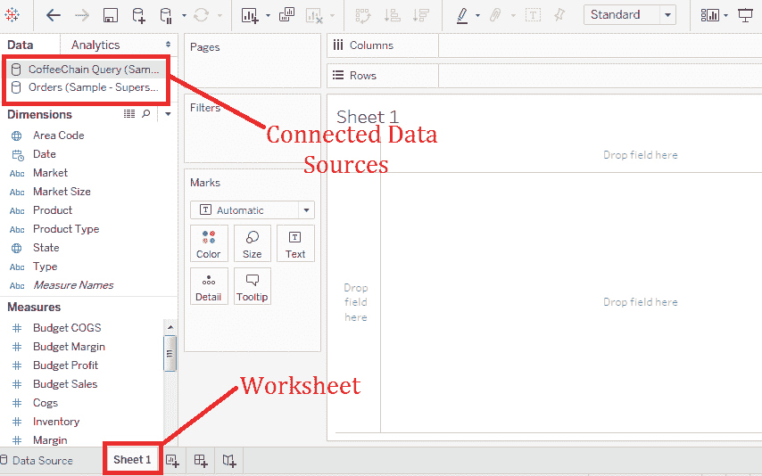
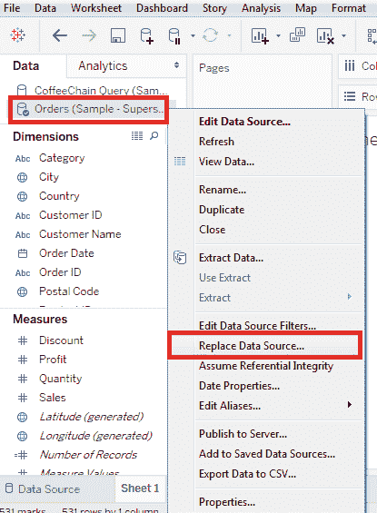
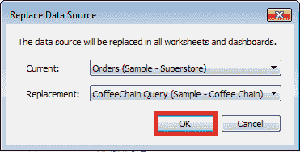

# 表替换数据源

> 原文：<https://www.javatpoint.com/tableau-replacing-data-source>

Tableau 可以在一个工作簿中连接多个数据源。不同的数据源可用于在 Tableau 中创建各种仪表板和工作表。在某些情况下，需要用更新的文件替换数据源。

Tableau 具有数据源替换功能，可以替换数据源。此功能不影响已经使用旧数据源构建的可视化效果。在替换数据源时，保留或替换所有使用的维度和度量值非常重要。

Tableau 中连接的数据源可以用另一个数据源替换。替换数据源的过程如下图所示:

**步骤 1:** 转到 Tableau 中已连接的数据源或多连接。

**第二步:**然后，

*   选择要替换的数据源。
*   右键单击数据源。
*   选择“**替换数据源**”选项。

**步骤 3:** 打开“**数据源替换**窗口。

*   填写**当前**选项。
*   然后填写**数据源替换**选项。
*   点击**确定**按钮，替换数据源。

* * *