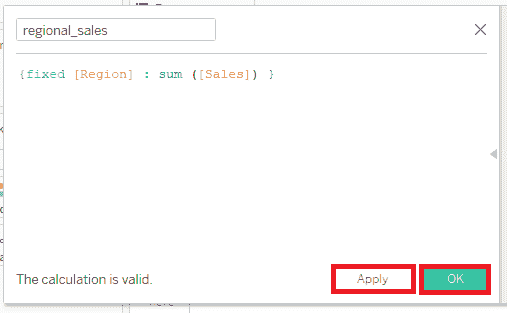
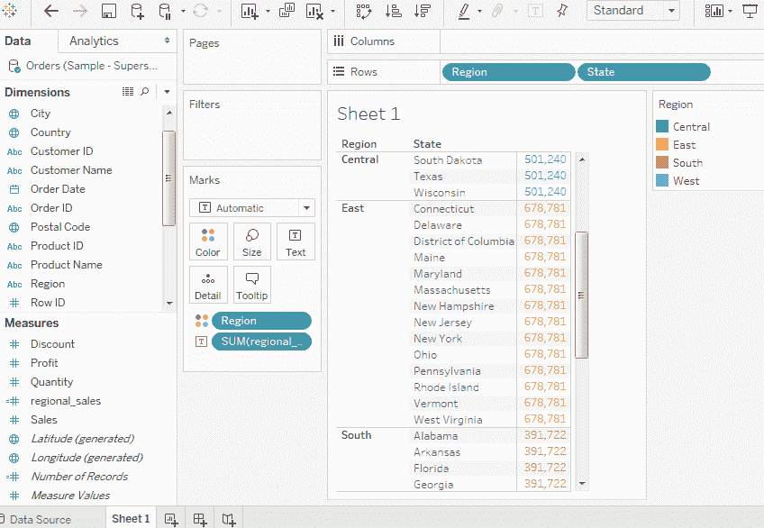
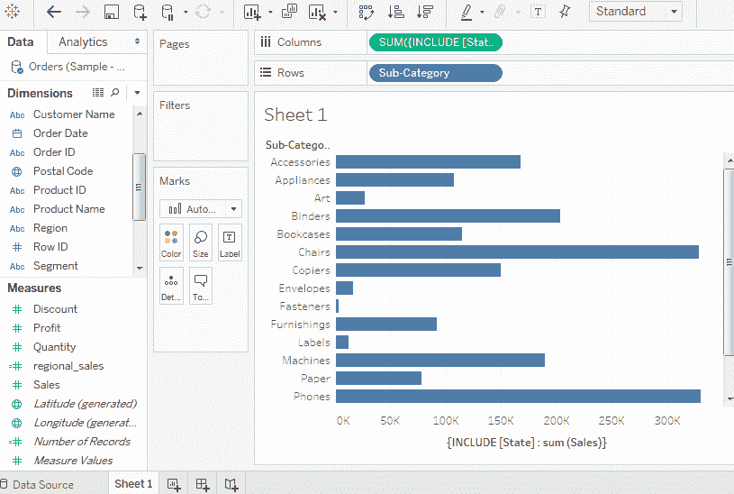
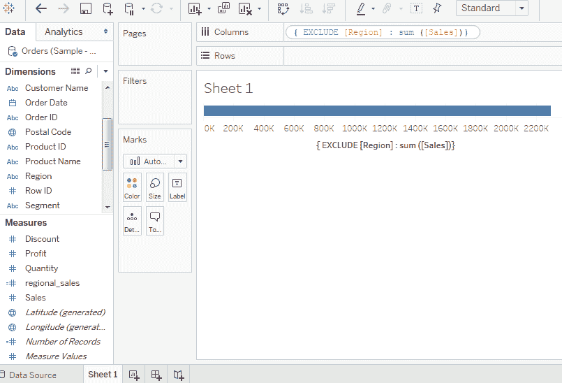
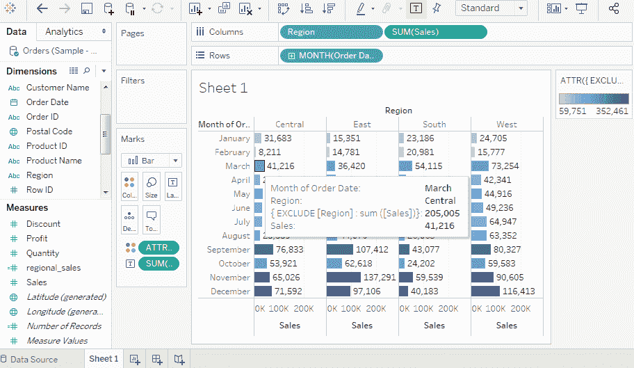

# LOD 表达式表

> 哎哎哎:# t0]https://www . javatppoint . com/table-LOD-expression 中

LOD(细节级别)表达式用于在数据源运行涉及多个维度的复杂查询，而不是将所有数据带到 Tableau 接口。

## 细节层次表达的类型

Tableau 中有三种类型的细节层次表达式:

*   **固定细节层次:**此细节层次表达式使用指定的尺寸计算值，而不参考视图中的任何其他尺寸。
*   **包含细节层次:**该细节层次表达式使用指定的尺寸和视图中的任何其他尺寸来计算值。
*   **排除细节层次:**这些细节层次表达式从视图细节层次中减去尺寸。

### 固定详细程度表达式

**例如**，如果要计算每个地区每个州的销售额。然后，

首先，使用如下截图所示的公式创建名为 **regional_sales** 的公式字段。

*   然后，将**区域**和**状态**字段拖至“行”栏，将计算字段(**区域 _ 销售额**)拖至“标记”卡片下的“文本”栏。
*   此外，将**区域**字段拖到颜色框中。
*   这将创建下面的视图，显示不同状态的固定值，因为我们将维度固定为计算销售值的区域。

### 包括详细程度表达式

包括详细级别表达式使用指定的维度计算值，无论视图中的维度是什么。

**例如**，如果要计算每个子品类产品每个状态的销售额之和。然后，

*   将**子类别**字段拖至行架。
*   并且，在 Columns 架子上写下表达式“**{ INCLUDE[State]:SUM(Sales)}**”。
*   它创建的视图包括计算中的两个维度，如下图所示。

### 排除详细程度表达式

“排除详细程度”表达式描述要从视图详细程度中排除的尺寸。

**例如**，从每月计算的**销售额**数字中排除**地区**。首先，

*   创建公式“**{ EXCLUDE[Region]:SUM([Sales])}**”，如下图截图所示。

*   将相关字段拖动到相应的盘架上，您将获得 EXCLUDE 详细程度表达式的最终视图，如下图所示。

* * *