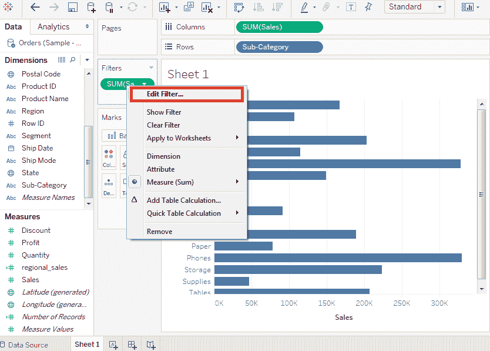
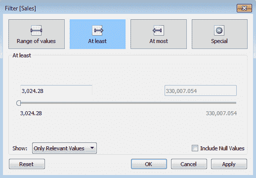
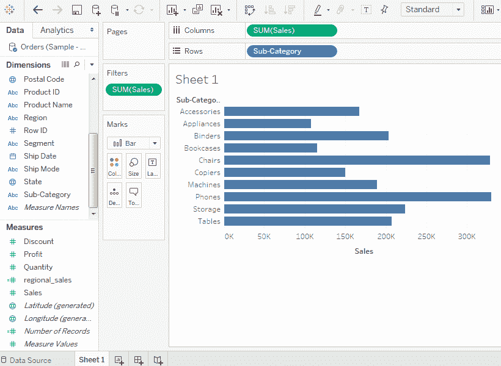
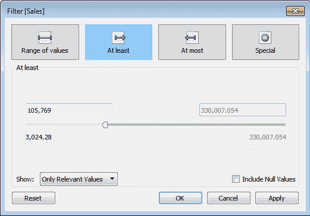
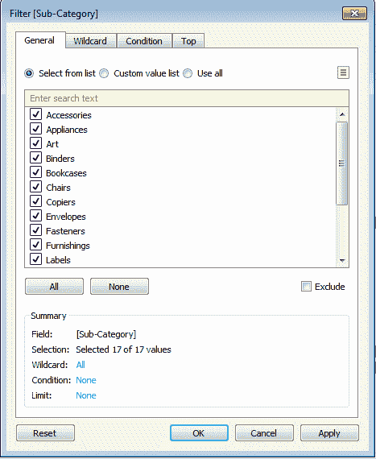
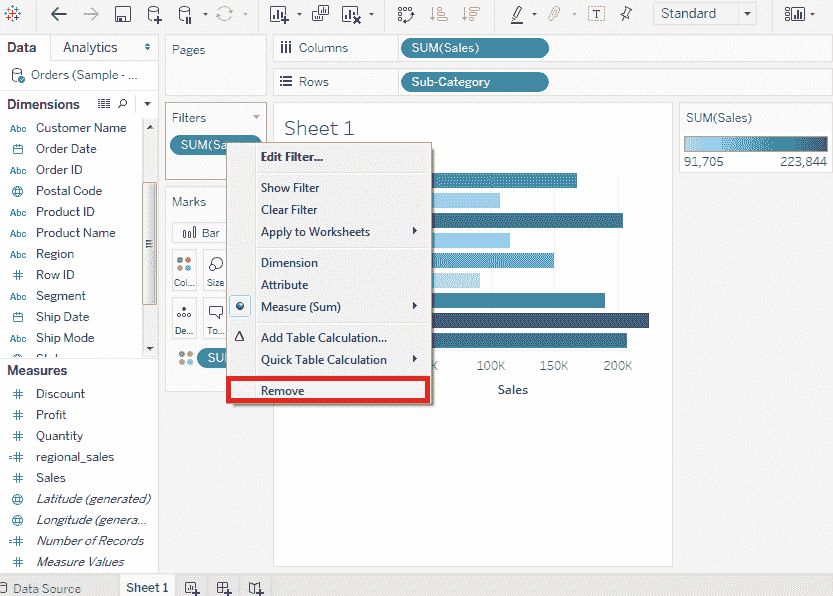

# 表过滤操作

> 原文：<https://www.javatpoint.com/tableau-filter-operations>

任何数据分析和可视化工作都需要使用大量的数据过滤。Tableau 有多种过滤来满足这些需求。

Tableau 有许多内置函数，可以使用度量和维度对数据应用过滤器。

对于度量，筛选选项提供数值计算。维度的筛选选项提供使用自定义值列表或从菜单中选择字符串值。

## 创建过滤器

*   通过将所需字段拖到“过滤器”架来设计过滤器。
*   然后，通过将维度(**子类别**)拖到“行”架，将度量(**销售额**)拖到“列”架，创建一个水平条形图。
*   再次将 **Sales** 拖至 Filters 货架，在所有选项中选择 **sum** 选项，点击**下一步**按钮。
*   创建此过滤器后，右键单击并从弹出菜单中选择**编辑过滤器**选项。

*   在这些选项中选择一个选项，点击**确定**按钮应用过滤器，如下图截图所示。

*   应用过滤器后的最终视图如下截图所示:

## 为度量创建筛选器

度量值是数字字段。因此，这些字段的筛选选项包括选择值。Tableau 中有以下类型的度量过滤器:

*   **值范围:**它指定要包含在视图中的范围的最小值和最大值。
*   **至少:**包括大于或等于指定最小值的所有值。
*   **最多:**包括小于或等于指定最大值的所有值。
*   **特殊:**帮助你过滤空值。它包括空值、非空值或所有值。

下面的截图显示了测量的所有过滤器:

## 为尺寸创建过滤器

维度是具有字符串值的描述性字段。Tableau 中有以下类型的维度筛选器:

*   **通用过滤器:**允许从列表中选择特定值。
*   **通配符过滤器:**它允许使用像 **cha*** 这样的通配符来过滤所有以 **cha** 开头的字符串值。
*   **条件过滤:**应用销售总和等条件。
*   **顶部过滤器:**它选择代表高值范围的记录。

下面的截图显示了维度的所有这些过滤器:

## 如何清除过滤器

选择滤镜**移除**选项后，可以轻松移除滤镜，如下图截图所示。

* * *