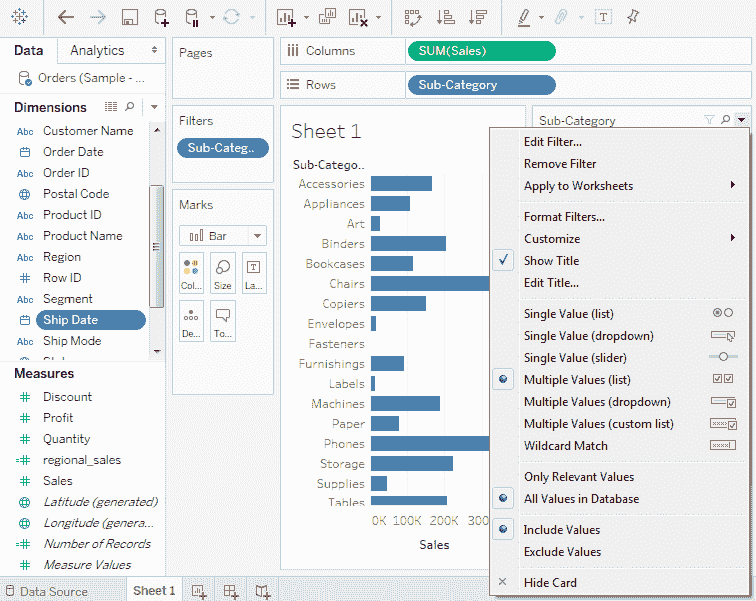
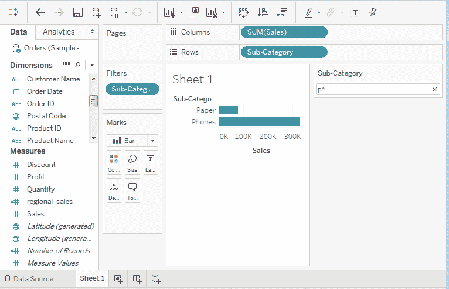
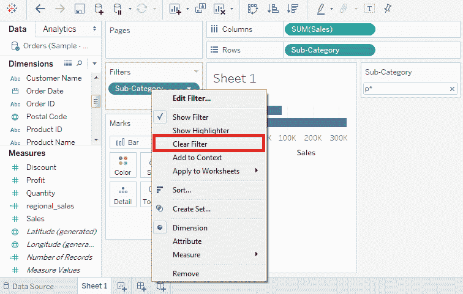
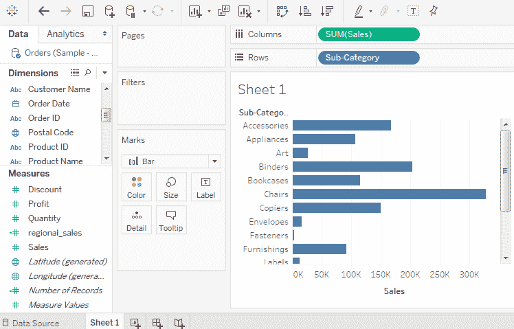

# 表格快速过滤器

> 原文：<https://www.javatpoint.com/tableau-quick-filters>

在 Tableau 中，使用度量和维度上的右键单击选项可以快速获得许多过滤器类型。这些过滤器有足够的功能来解决大多数日常过滤需求。这些过滤器被称为快速过滤器。

下面的截图显示了如何访问快速过滤器:

下表列出了各种快速过滤器及其在 Tableau 中的使用。

| 过滤器名称 | 目的 |
| 单一值(列表) | 它一次只选择列表中的一个值。 |
| 单值(下拉列表) | 它在下拉列表中选择一个值。 |
| 多个值(列表) | 它可以在列表中选择一个或多个值。 |
| 多个值(下拉列表) | 它在下拉列表中选择一个或多个值。 |
| 多个值(自定义列表) | 它选择并搜索一个或多个值。 |
| 单一值(滑块) | 它拖动水平滑块来选择单个值。 |
| 通配符匹配 | 它选择包含指定字符的值。 |

**例如**，考虑一个数据源如**样本-超级商场**，应用一些快速过滤器。首先，

*   选择子类别字段作为生成水平条形图的行架，选择销售作为列架。
*   将子类别字段拖到筛选器窗格中。使用表达式 **p*** 应用通配符过滤，选择所有以“ **p** 开头的子类别名称。

下面的截图显示了应用此过滤器后的结果，其中仅显示了以“ **p** ”开头的子类别:

## 如何清除过滤器

通过应用过滤器完成分析后，可以使用清除过滤器选项将其删除。

*   首先，转到过滤器窗格。
*   右键单击该字段，然后选择清除过滤器选项，如下图所示。

从筛选器窗格中清除筛选器后，工作表如下图所示:

* * *