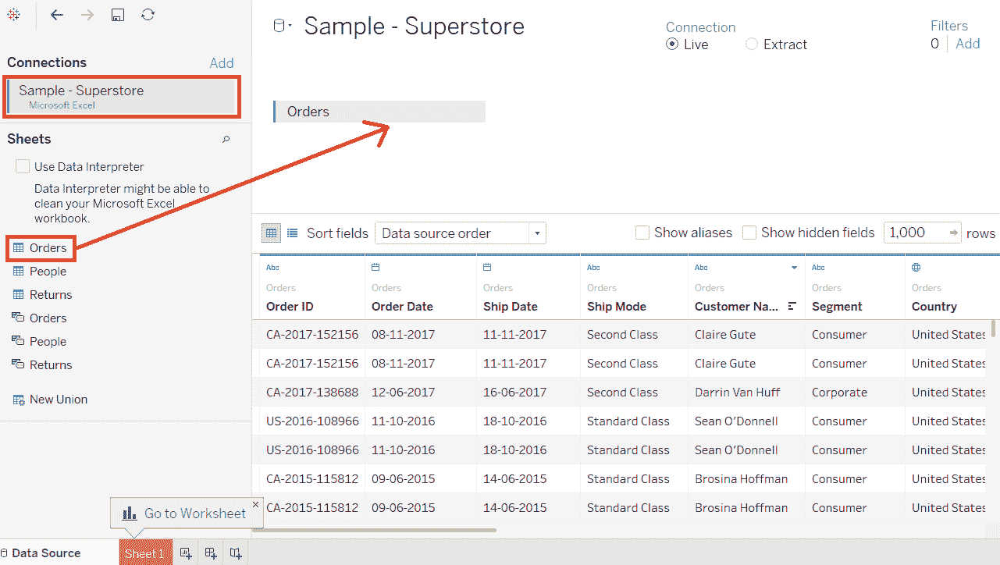
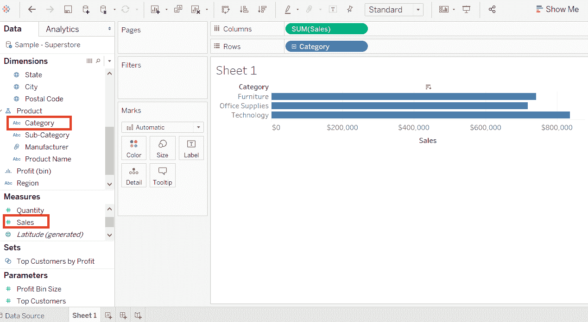
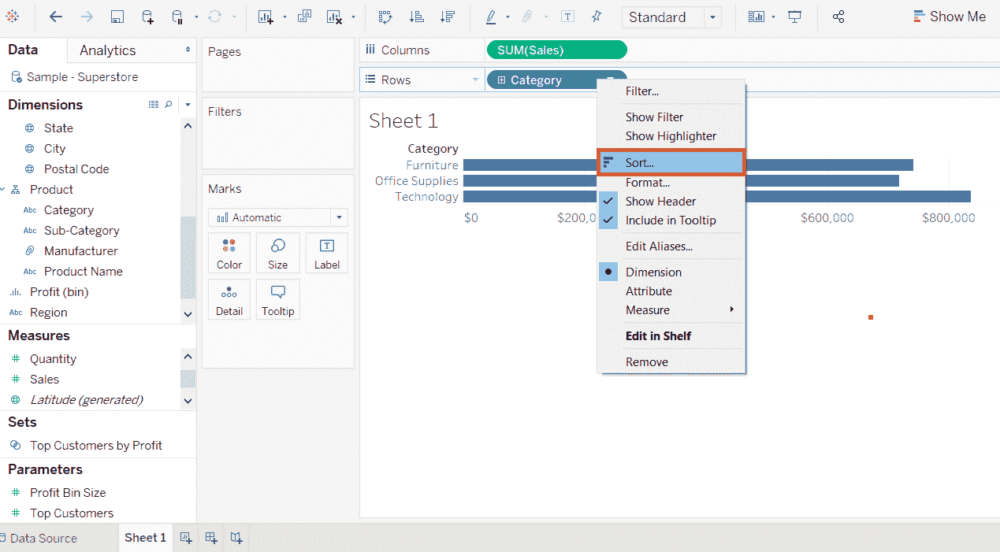
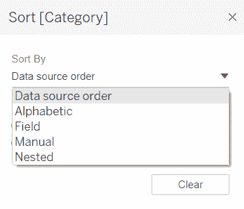
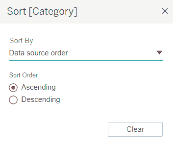
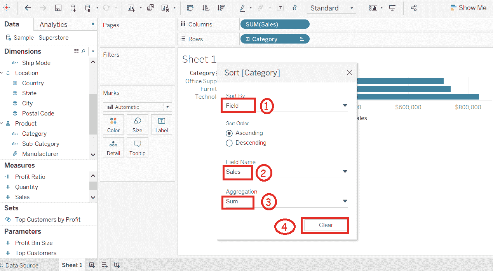
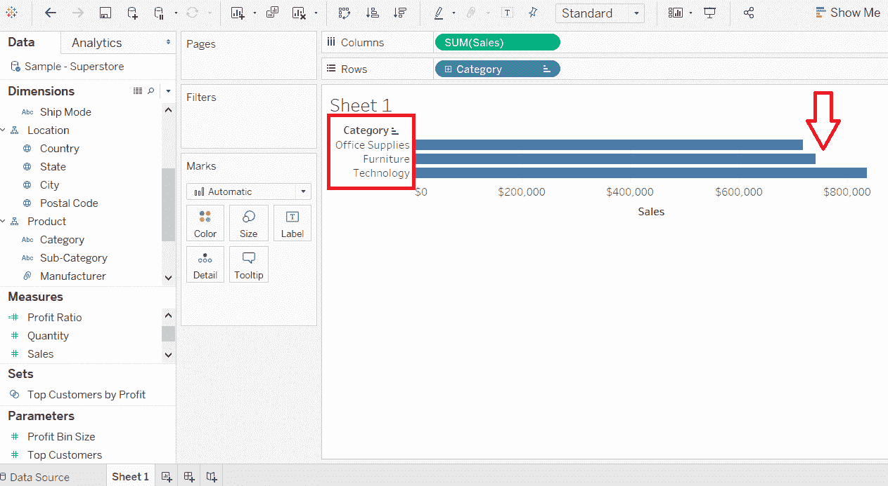

# 排序资料表格

> 哎哎哎:1230【https://www . javatppoint . com/table-sort-data】

工作表中的数据可以根据需求进行排序。它可以根据数据源对数据进行排序，如升序、降序或取决于任何测量值。

分类数据的步骤如下，一步一步:

**例如**，考虑一个数据源，如**样本-超级商场**，您想要对维度和度量字段进行如下排序。

**步骤 1:** 用 Tableau 添加**样本-超级商场**数据源，并将**订单**表格拖动到如下截图所示的窗格中。

**步骤 2:** 转到工作表，将维度**类别**拖动到行货架，将度量**销售额**拖动到列货架。

它会创建一个水平条形图。**类别**字段以可视顺序出现，默认情况下根据数据源排序。我们可以按照以下步骤更改排序顺序。

**步骤 3:** 右键点击**类别**字段，选择**排序**选项。

之后，它会打开“排序”窗口。排序窗口中的所有选项如下所示:

## 排序次序

*   **升序:**对所选维度和度量的顺序进行升序排序。
*   **降序:**对所选维度和度量的顺序进行降序排序。

## 排序方式

该字段可以用不同类型的方法进行排序，如下所述。

*   **数据源顺序:**根据数据源顺序对字段进行排序。
*   **字母:**按字母顺序对尺寸和度量进行排序。
*   **字段:**根据其他度量或维度值对字段进行排序。
*   **手动:**可以手动排序数据。

**例如**，假设**类别**字段基于另一个字段排序，如“**销售**”。

**步骤 1:** 点击**字段**单选按钮。

**步骤 2:** 选择要过滤**类别**的字段。

**步骤 3:** 选择聚合类型。

**步骤 4:** 点击**清除**按钮。

在上面的例子中，它根据销售额的总和以升序过滤**类别**字段。它对数据进行排序，如下图所示。

* * *