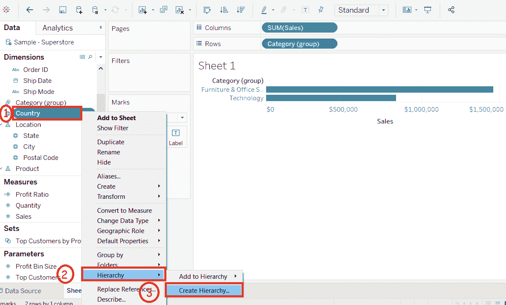
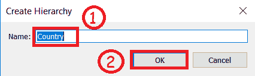
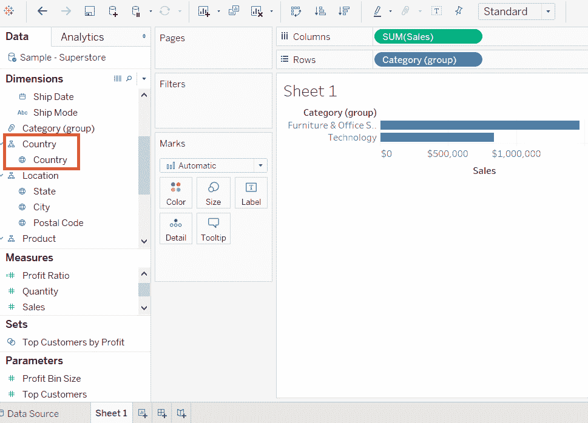
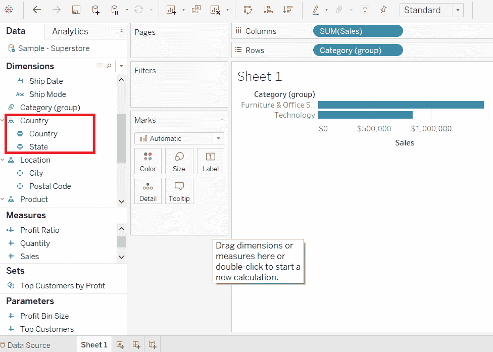
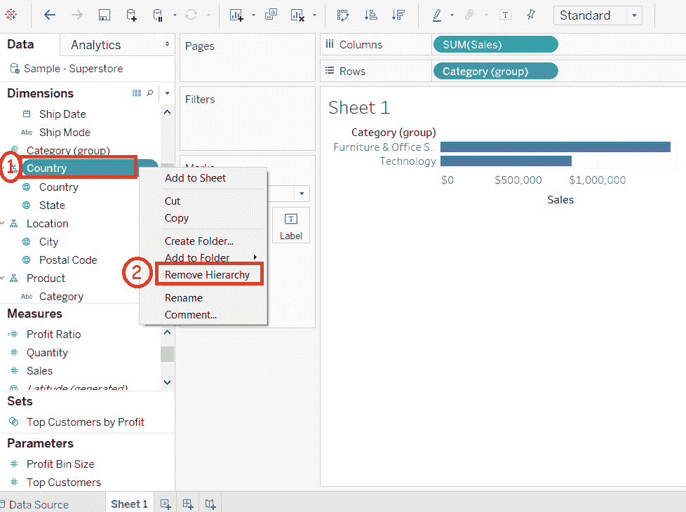

# 表构建层次结构

> 原文：<https://www.javatpoint.com/tableau-build-hierarchy>

在 Tableau 中，可以构建层次结构来可视化数据。它可以通过以下步骤在 Tableau 中创建:

**例如**，考虑**样本-超市**等数据源及其维度和度量。

**步骤 1:** 首先转到工作表。然后，

1.  选择一个维度，然后右键单击该维度以创建层次结构。
2.  转到“**层次结构**”选项。
3.  并且，点击如下截图所示的“**创建层次结构**”选项。

**步骤 2:** 打开“**创建层级？**“窗口。然后，

1.  输入层次结构的名称。
2.  点击**确定**按钮。

它创建了一个层次结构，如下图所示。

此外，您可以在层次结构中添加另一个字段。例如，**州**被插入到**国家**层级中。然后，

1.将一个字段直接拖放到层次结构中另一个字段的顶部。

它将**州**字段插入到如下截图所示的**国家**层级中。

## 要删除层次结构

从数据窗格中，您还可以删除内置的层次结构。以下是删除层次结构的步骤。

**步骤 1:** 选择要删除的层次结构。

**步骤 2:** 右键单击该层次。

**步骤 3:** 选择如下截图所示的“**移除层级**”选项。

层次结构中的字段也将从层次结构中删除，并且层次结构将从“数据”窗格中消失。

* * *