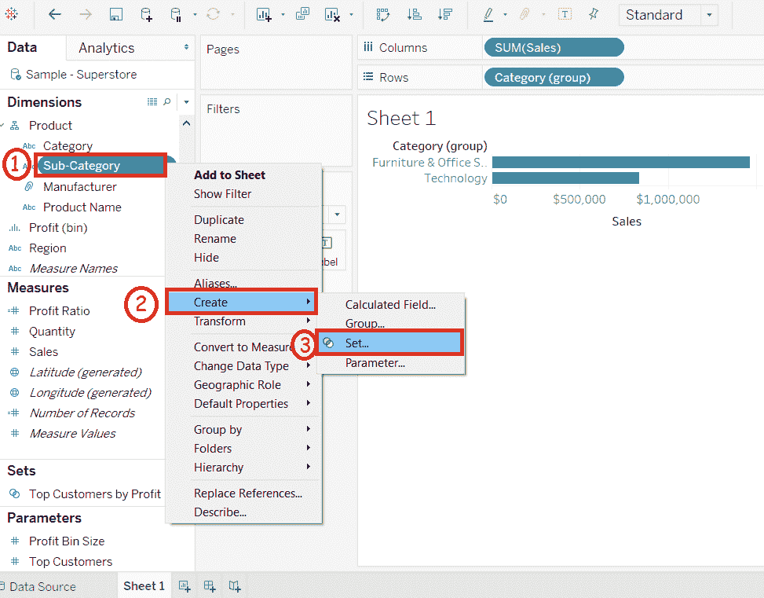
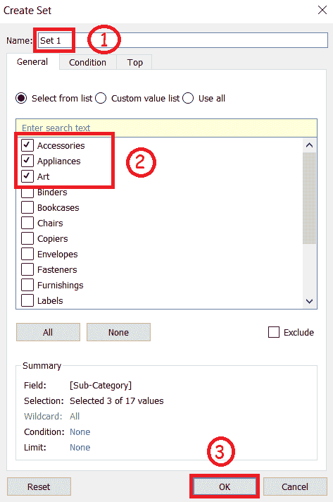
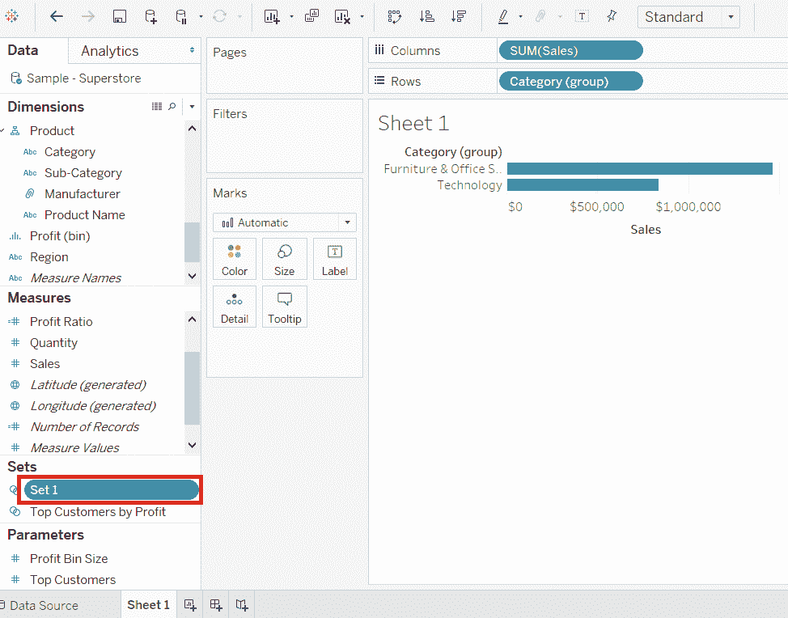
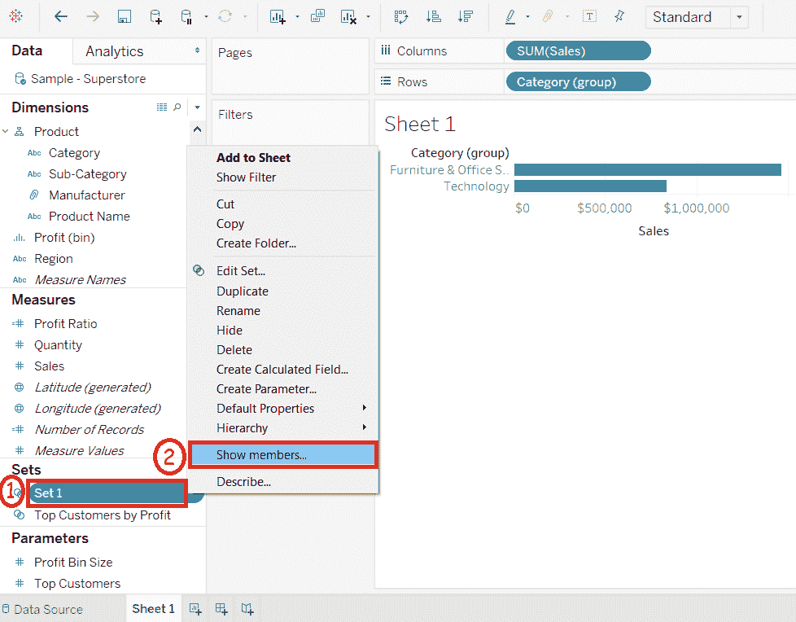
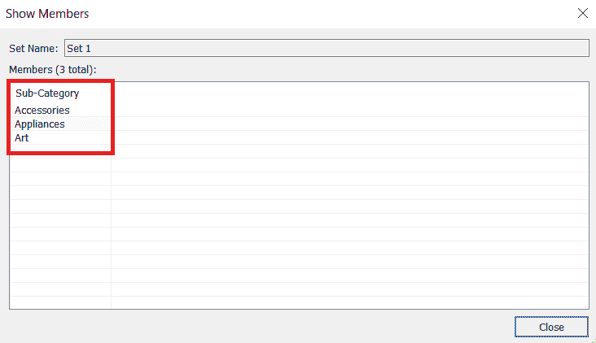
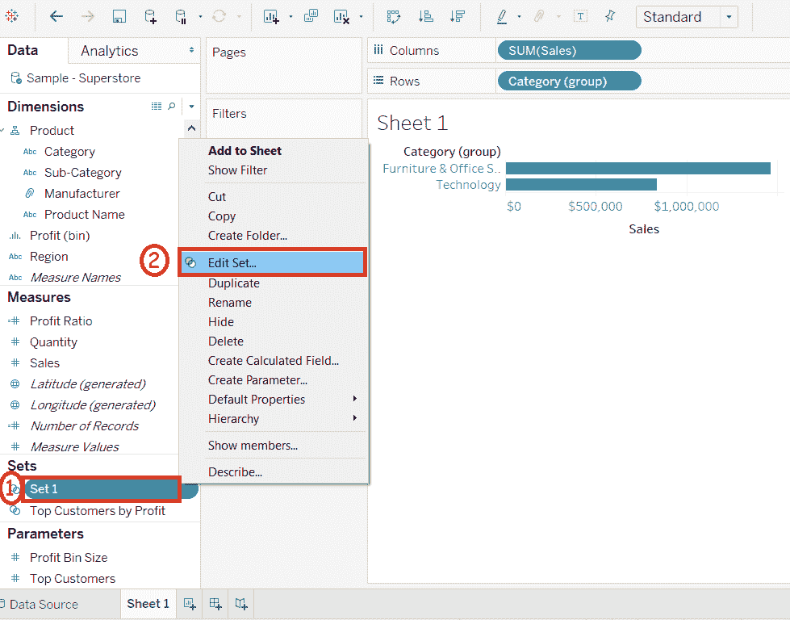
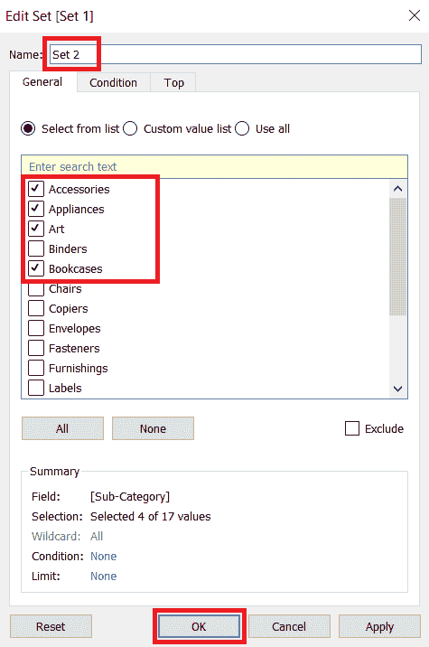

# 表构建集

> 原文：<https://www.javatpoint.com/tableau-build-sets>

集合是自定义字段，它根据某些条件定义数据子集。集合从数据集中的字段创建一组成员。

它充当一个单独的字段或维度。构建集合的过程如下所示。

**例如**，考虑**样本-超级商场**等数据源，利用其维度和度量来构建**集合**。

**步骤 1:** 转到工作表。而且，

1.  右键单击维度**子类别**。
2.  选择“**创建**”选项。
3.  然后点击如下图所示的**设置**选项。

**步骤 2:** 打开**创建设置**窗口。

1.  输入要创建的器械包名称。
2.  选择要添加到集合中的成员。
3.  点击**确定**按钮。

它创建了一组选定的成员，如下图所示。

## 显示集合中的成员

您还可以通过以下步骤查看创建或内置集合后的选定成员:

**步骤 1:** 右键单击集合。

**步骤 2:** 点击“**展示会员**”选项。

点击**显示成员**选项后，会显示下图截图所示集合中的所有成员。

## 编辑集合

您也可以通过以下步骤在创建或内置后编辑集合:

**步骤 1:** 右键单击集合。

**步骤 2:** 点击“**编辑设置**选项。

点击**编辑设置**选项后，将打开**编辑设置**窗口，显示设置名称。现在，您可以编辑下面截图中显示的集合

* * *