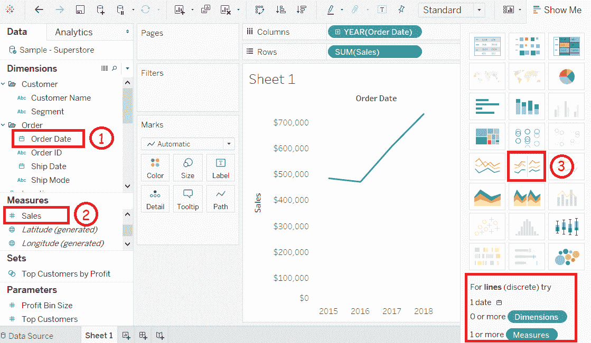
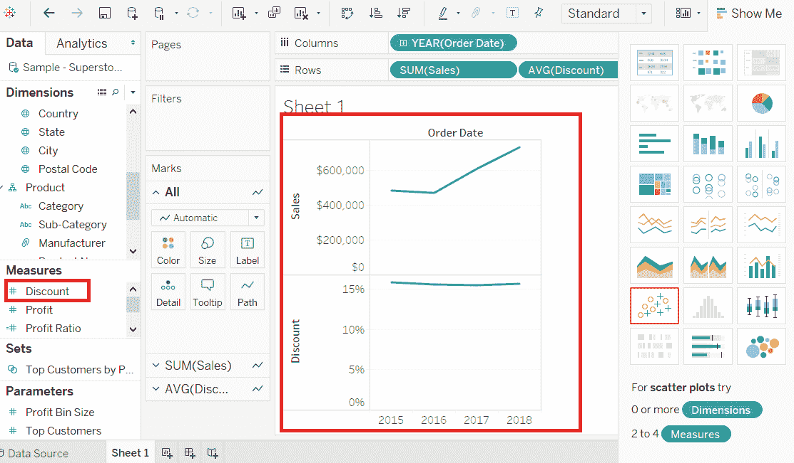
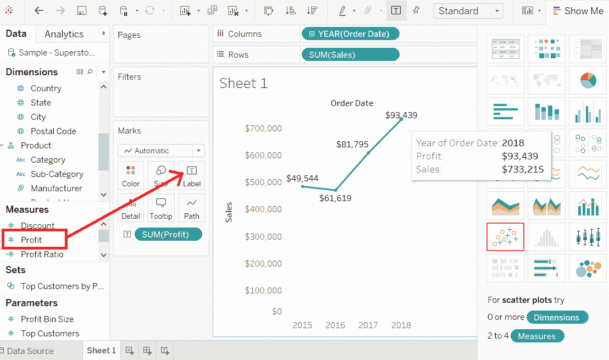

# 表格折线图

> 原文：<https://www.javatpoint.com/tableau-line-chart>

折线图可以比较不同时期的数据。一系列的点构成了一个折线图。这些点代表每个时期的测量值。

度量和尺寸取自折线图中图表区域的两个轴。每个观察值的值对成为一个点。将所有这些点连接起来后，就会变成一条线，显示尺寸和度量之间的差异。

创建折线图的过程如下所示。

**例如**，考虑**样本-超级商场**等数据源及其维度和度量。

**步骤 1:** 选择一个维度和一个度量，创建一个简单的折线图。

1)将尺寸**订单日期**拖动到柱架中。

2)将**销售**放入成排货架。

3)默认创建折线图或从“**按钮选择折线图。**

 **您将看到下面的折线图，该图显示了不同的**订单日期**的**销售额**的变化，如下图所示。

* * *

## 多重测量折线图

您可以在一个折线图中使用带有两个或更多度量的一维。它在一个窗格中生成各种折线图。每个窗格代表维度和度量值之间的差异。

**步骤 1:** 将尺寸**订单日期**拖动到柱架中。

**第二步:**将措施**销售**和**折扣**拖到 row 货架上。

* * *

## 带标签的折线图

创建折线图的每个点都被标记，以使度量值可见。

**步骤 1:** 将另一个度量**利润**比率放入“**标签**”窗格中的“**标记**”卡片中。

**步骤 2:** 选择平均值作为聚合，您将看到下面显示标签的图表。

* * ***