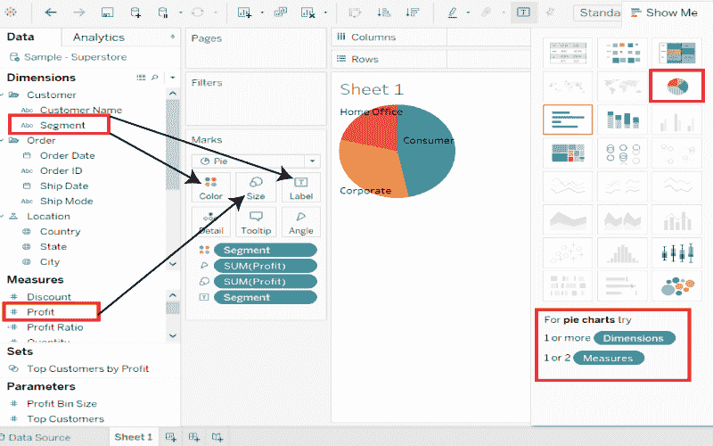
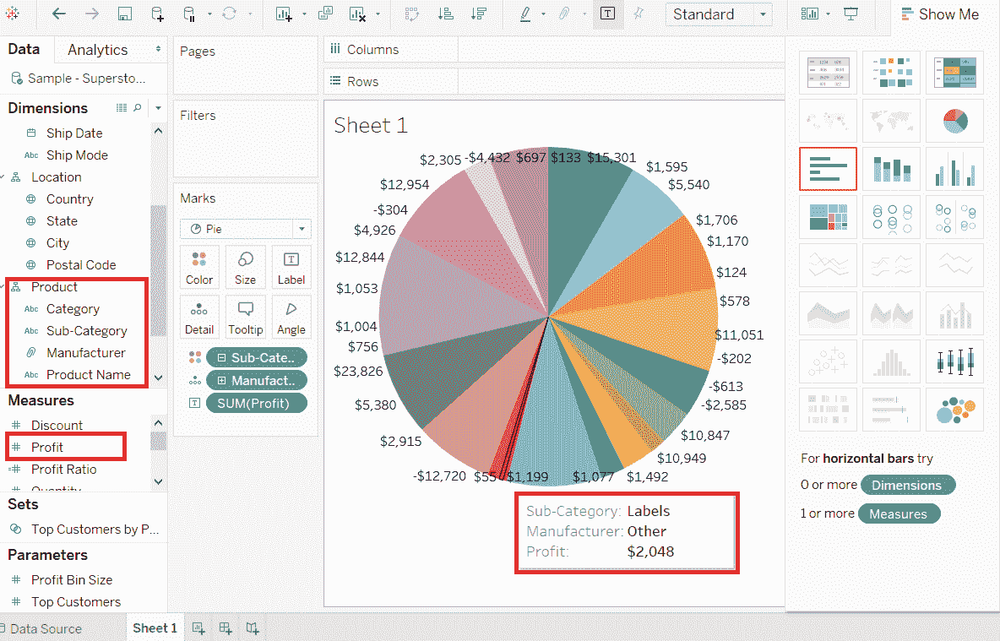
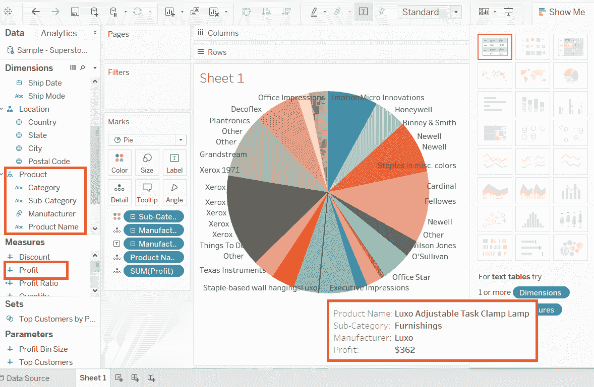

# Pie Chart(页脚图表)

> 原文：<https://www.javatpoint.com/tableau-pie-chart>

饼图显示了分段数据。它可以显示维度中不同成员上的度量的贡献。饼图的角度决定了测量值。可以为饼图分配不同的颜色来表示维度中的成员。

饼图以不同大小和颜色的圆形切片的形式表示数据。这些切片被标记，并且对应于每个切片的数字也在图表中表示。

您可以从“显示给我看”窗格中选择饼图选项来创建饼图。

**例如**，考虑一个数据源，如**样本-超级商场**，选择一个维度和一个度量来创建一个简单的饼图。

**步骤 1:** 转到工作表。

**步骤 2:** 拖动尺寸**线段**并放到**颜色**和**标签**窗格中。

**步骤 3:** 拖动测量的**利润**并放入**尺寸**窗格。

**步骤 4:** 从“**展示给我看**”窗格中选择图表类型。

将出现以下图表，用不同的颜色和标签显示三个部分。

* * *

## 向下钻取饼图

您可以选择具有层次结构的维度，也可以深入层次结构。图表更改反映了所选维度的级别。

**以**为例，考虑**样本-超市**这样的数据源，然后取维度**产品**，再有**品类、子品类、厂商**、**产品名称**四个级别。

将测量的**利润**拖放到**标签**面板。出现以下饼图，显示每个切片的值。

这里是这个层次结构的另一个层次，我们得到了制造商作为标签，如下图所示。

* * *