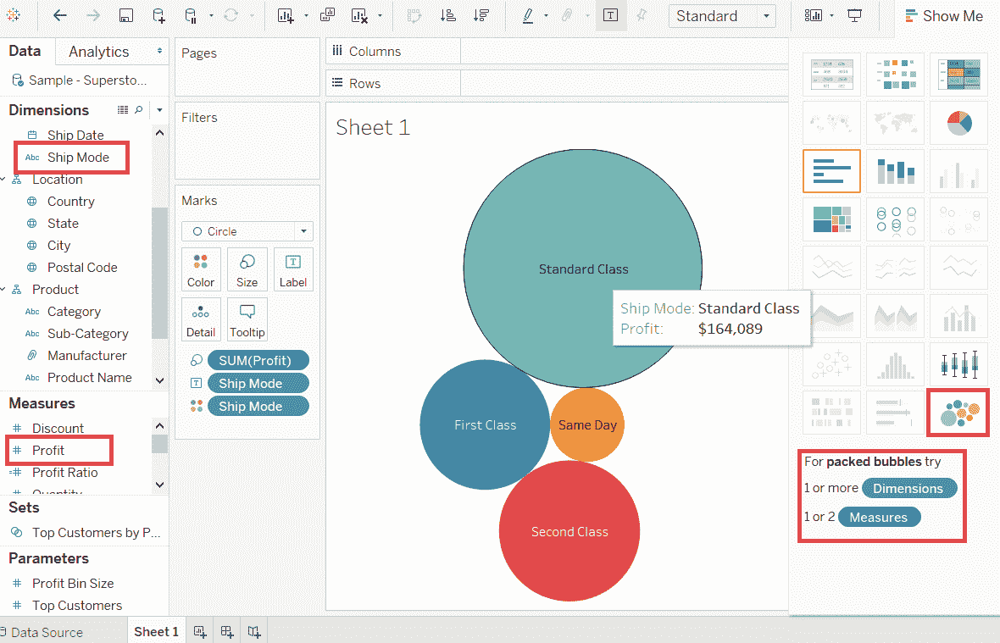
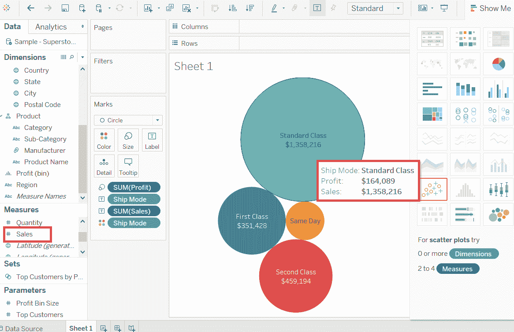
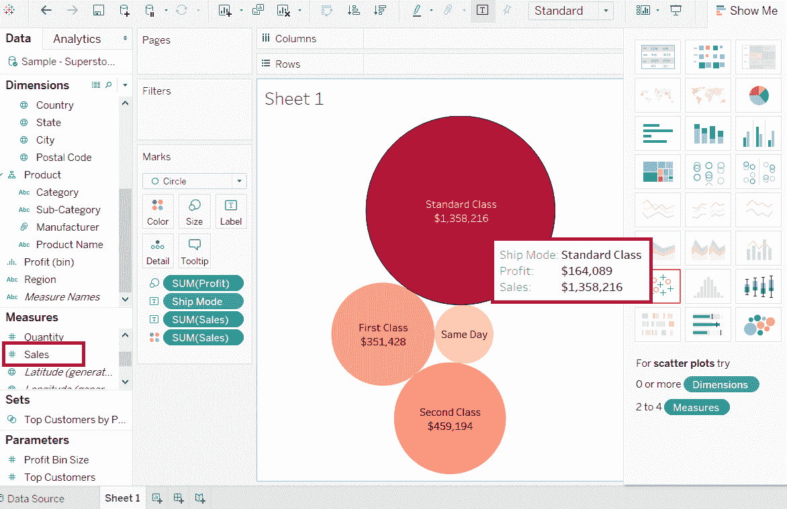

# 表格气泡图

> 原文：<https://www.javatpoint.com/tableau-bubble-chart>

气泡图是以气泡的形式可视化度量和维度。

泡泡图是一组圆圈。维度字段的每个值代表圆，度量值代表这些圆的大小。

气泡的颜色设置为区分维度中的成员。下面是创建气泡图的步骤，如下所示。

**比如**，考虑一个**样本-超级商场**这样的数据源，如果想找到不同**出货模式**的**利润**。然后，

**第一步:**拖动**利润**的测量值，放入**尺寸**窗格。

**步骤 2:** 拖动尺寸**船舶模式**并放入**标签**窗格。

**步骤 3:** 同时将维度**船模**拖动到**【标记】**卡片下的**【颜色窗格】**中。

* * *

## 带有测量值的气泡图

此外，您还可以显示决定圆圈大小的度量字段的值。

首先，将测量**销售额**拖动到**“标签”**窗格中。显示以下截图。

* * *

## 带有测量颜色的气泡图

您也可以对所有不同大小的圆使用不同色调的相同颜色。

为此，将测量**销售额**拖动到**“颜色”**窗格中。最深的颜色表示圆形的最大尺寸，较浅的颜色表示圆形的最小尺寸，如下图所示。

* * *