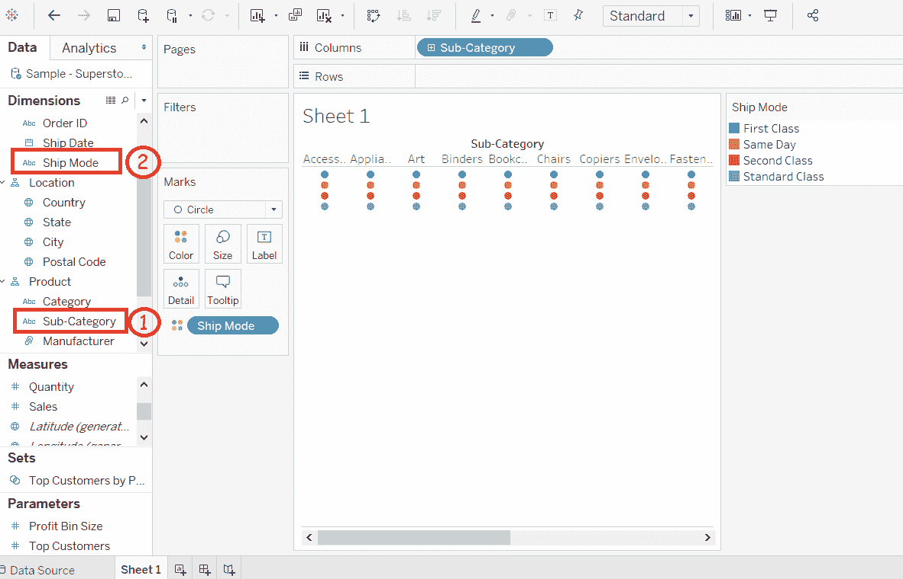
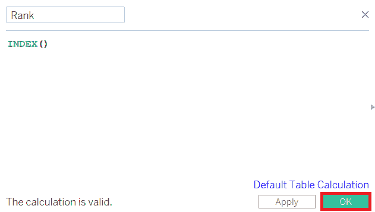
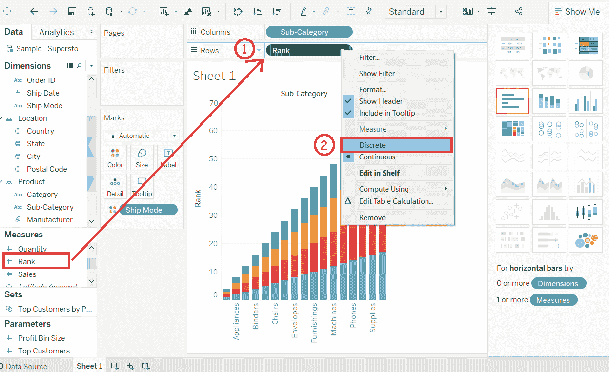
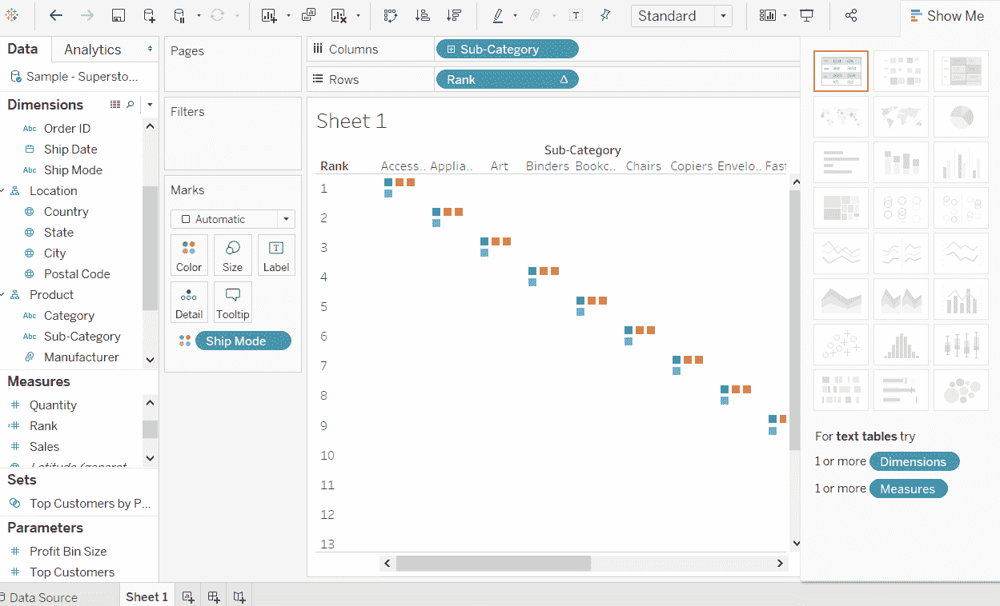
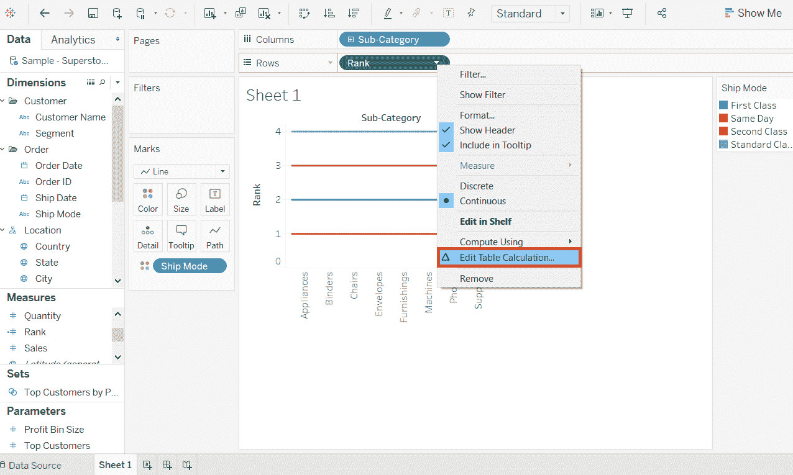
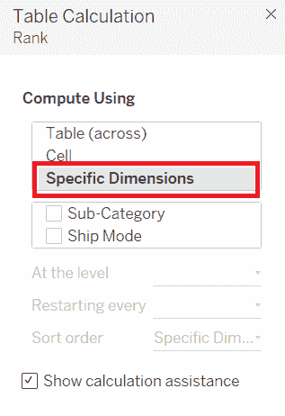
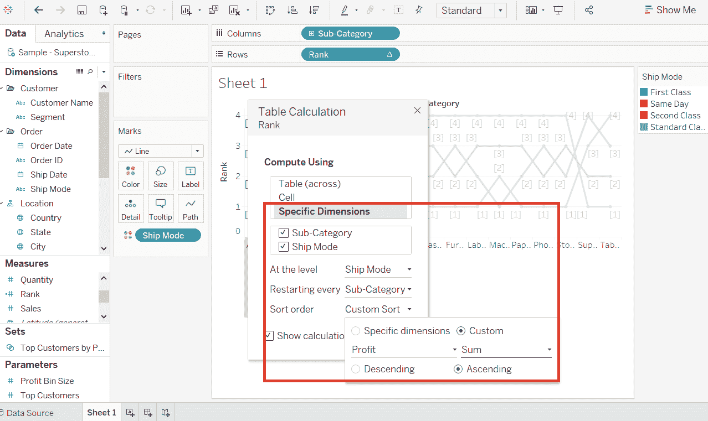
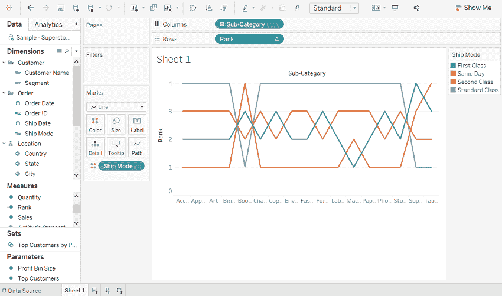

# 表格凹凸图

> 原文：<https://www.javatpoint.com/tableau-bump-chart>

凹凸图用于使用一个测量值来比较两个维度。它探索了价值等级在时间维度、地点维度或任何其他相关维度上的变化。

凹凸图可以采用零个或多个度量的二维。

**例如**，如果你想找到产品的**发货模式**和**子类别**之间的差异，考虑一个数据源，例如**样本-超市**。

**步骤 1:** 将尺寸**子类别**拖动到柱架上。

**步骤 2:** 将尺寸**发货模式**拖到颜色架上。

默认情况下，它会创建图表的以下视图。

**步骤 3:** 创建计算字段。

1)转到**分析**并创建一个计算字段。

2)给计算字段起一个字段名，如**排名**。

3)在计算字段计算区写表达式**“Index()”**。它为分区中的当前行创建一个索引。

4)点击**确定**按钮。

5)新的计算字段**等级**将在**测量**部分可见。

6)将**等级**字段拖至行货架。

7)右键点击**等级**字段，转换为**“离散”**。

之后，出现如下视图，显示了每个**船舶模式**的尺寸**子类别**。

**步骤 5:** 使用度量**利润**对计算字段**排名**进行更多计算。

1)右击测量**等级**。和

2)选择“**编辑表格计算**选项。

3)打开**表格计算**窗口。

4)然后，选择“**具体尺寸**选项。

5)选择**子类**字段和**船舶模式**字段。

6)然后，通过**子类**使用分区选择利润字段排序，并通过**发货模式**进行寻址。

下面的截图将显示以下视图。

完成上述所有步骤后，您将获得如下截图所示的凹凸图。它显示了不同子类别中每个**船舶模式**的**利润**的变化。

* * *