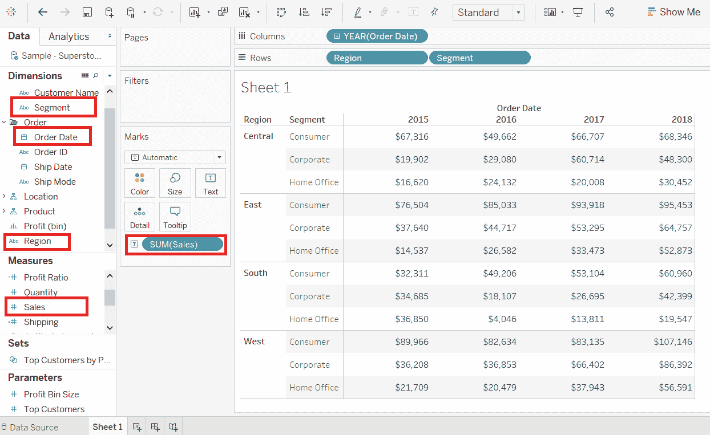
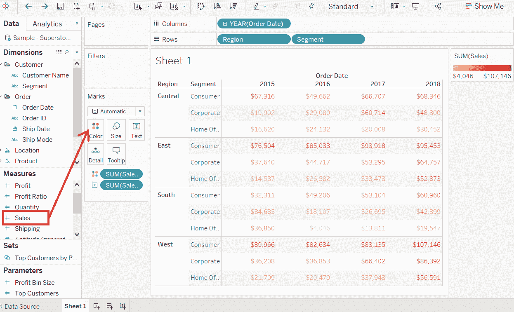
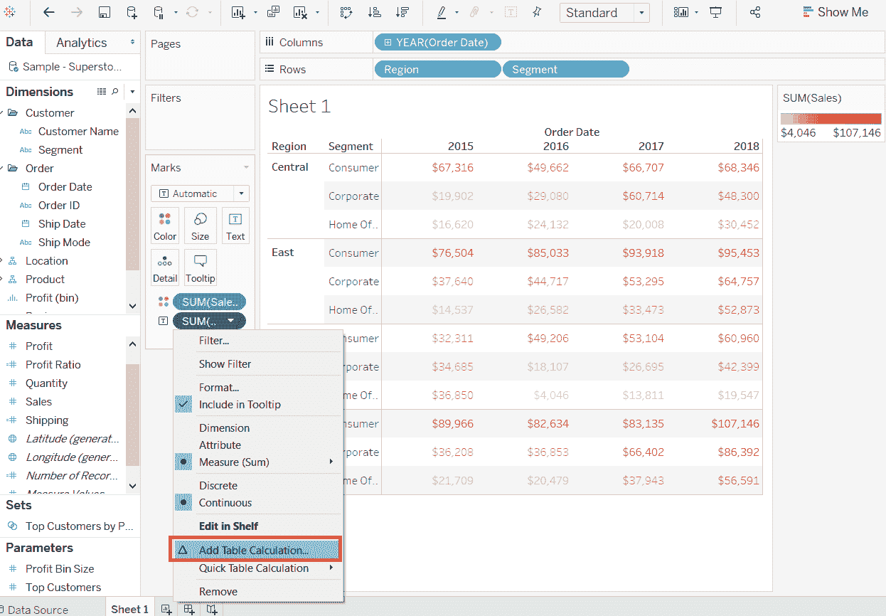
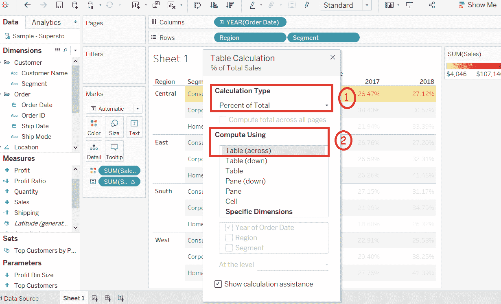
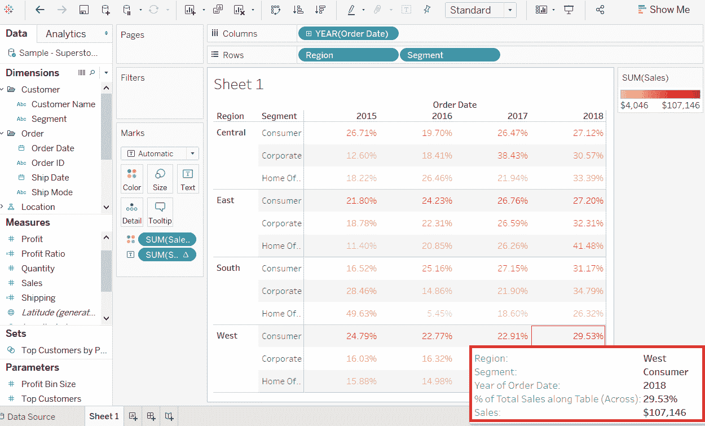

# 表格交叉表

> 原文：<https://www.javatpoint.com/tableau-crosstab-chart>

交叉表也称为文本表，它以文本形式显示数据。

交叉表采用一个或多个维度和一个或多个度量。此图表还可以显示对度量字段值的不同计算，如合计百分比、累计总额等。

**比如**，考虑一个**样本-超市**这样的数据源，如果你想找到每个**区域**中每个**细分**的**销售**的数量。要使用可用的**订单日期**显示每年的数据，以下是创建交叉表的一些步骤。

**步骤 1:** 将尺寸**订单日期**拖到柱架中。

**步骤 2:** 同样，将尺寸**区域**和**分段**拖到行货架中。

**步骤 3:** 将测量**销售**拖到**标记**窗格下的**标签**货架上。

下面的截图显示了交叉表。

在交叉表中，您可以通过将 **Sales** 字段拖放到 **Color** 框中来获得颜色编码的值。

颜色编码根据度量值显示颜色的强度。最高值的颜色较深，较小值的颜色较浅，如下图所示。

此外，除了颜色编码，您还可以对度量值进行计算。

**例如**，可以应用计算找到每行**销售额**的百分比合计，而不是只找到“销售额”字段。

**1。**右键单击**标记**货架中的**销售**字段。

**2。**并选择**添加表格计算**选项。

**3。**打开**表格计算**窗口。

**4。**然后，选择“**合计百分比**选项作为计算类型，选择“**表格(跨)**选项作为**使用**计算。

完成上述步骤后，您将获得用百分比值创建的交叉表，如下图所示。

* * *