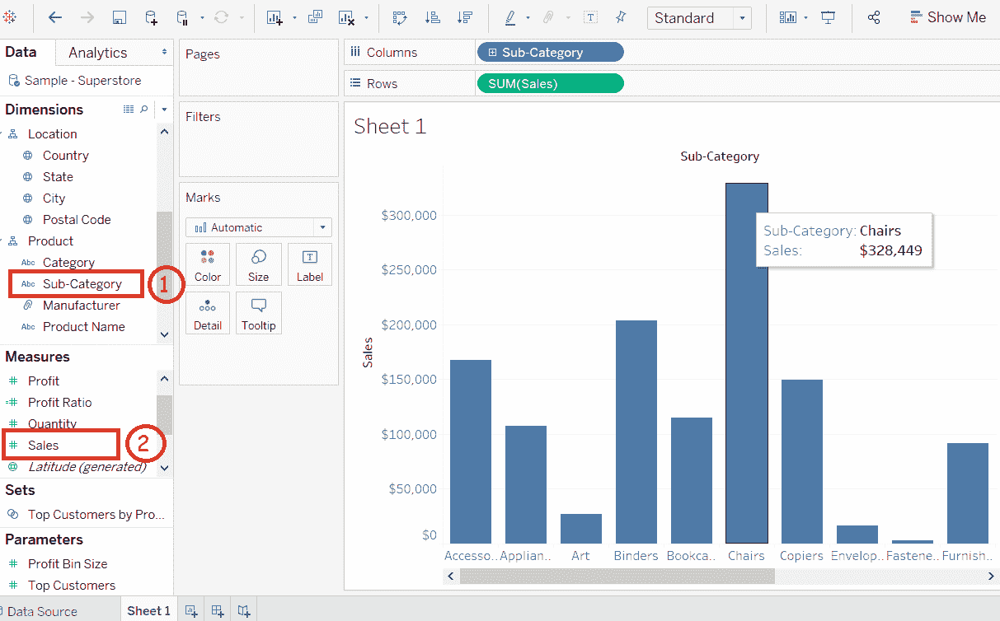
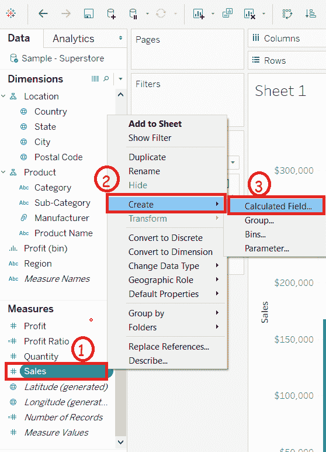
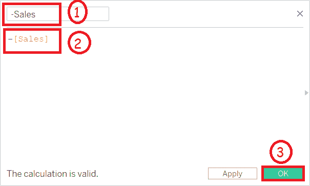
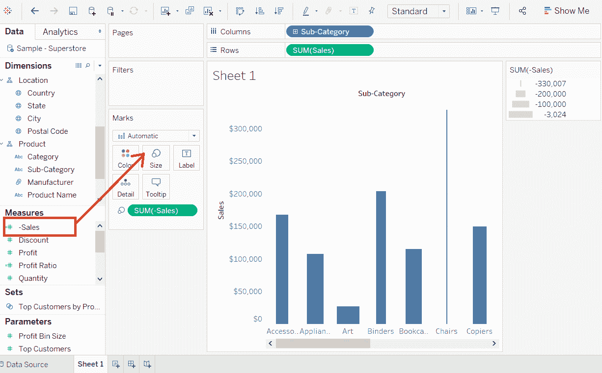
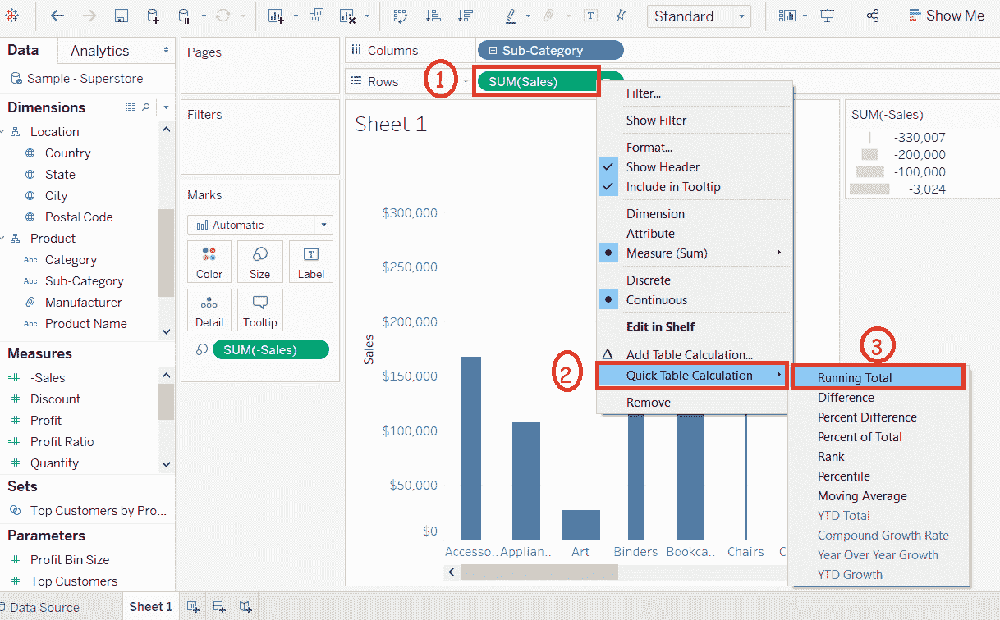
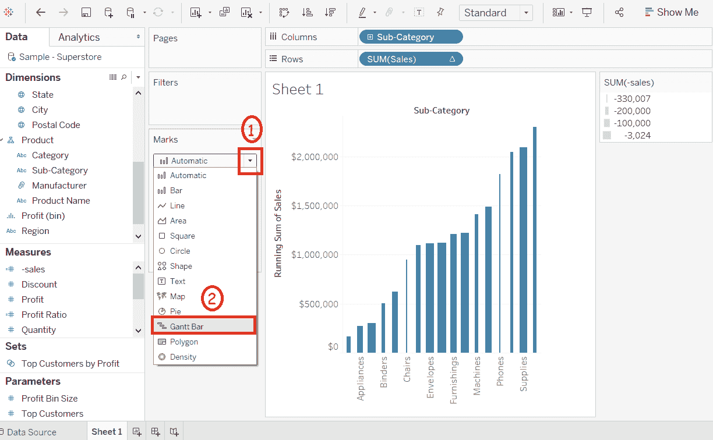
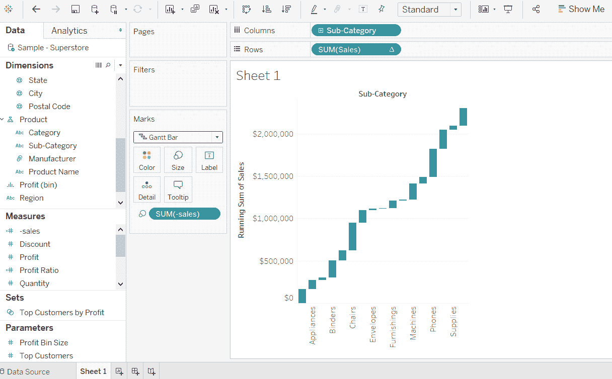

# Tableau 瀑布图

> 原文：<https://www.javatpoint.com/tableau-waterfall-chart>

瀑布图是在维度上可视化度量的累积效果。它还可以在维度上显示每个成员对增长和下降的贡献。

此外，瀑布图显示了连续正值和负值的累积效应。它显示了一个量的起点、终点以及如何递增到达那里。因此，我们可以看到连续数据点之间变化的大小和值的差异。

Tableau 只需要一个维度和一个度量来创建瀑布图。

**例如****样本-超级商场**等数据源现在使用瀑布图看到每个**子类**对**销售**的贡献。

在 Tableau 中，瀑布图将按照给定的步骤进行设计。

**步骤 1:** 转到工作表。

1.  将尺寸**子类别**拖动到柱架中。
2.  将测量**销售**拖到行货架中。

**步骤 2:** 右键单击措施栏中的**销售**字段。

**步骤 3:** 从列表中选择**【创建】**选项。

**步骤 4:** 然后选择**“计算字段”**选项。

**步骤 5:** 打开**计算字段**窗口。然后，

1.  输入计算字段的名称，如**-销售**。
2.  在下图截图所示的计算区写下表达式**-【销售】-**。
3.  点击**确定**按钮。

**步骤 6:** 将新创建的计算字段**-【销售】**拖动到**标记**窗格下的**尺寸**货架中。

**步骤 7:** 右键单击成排货架中的 **SUM(销售)**。

**步骤 8:** 从列表中选择**快速表格计算**。

**第九步:**然后点击**跑步总数**选项。

**步骤 10:** 点击标记窗格中的**下拉菜单**选项。

**步骤 11:** 从列表中选择**甘特图**选项。

完成以上所有步骤后，它会创建如下截图所示的瀑布图。

* * *