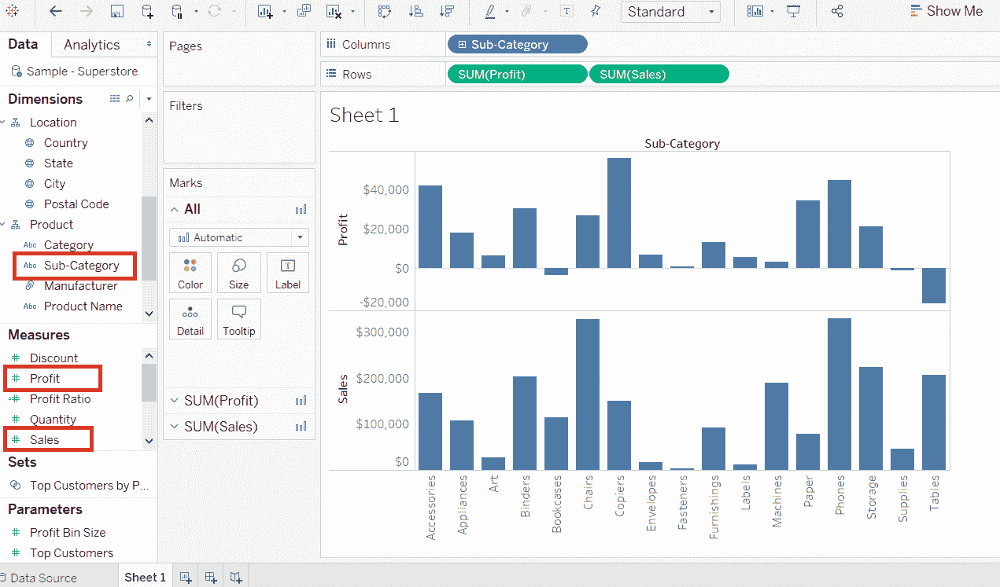
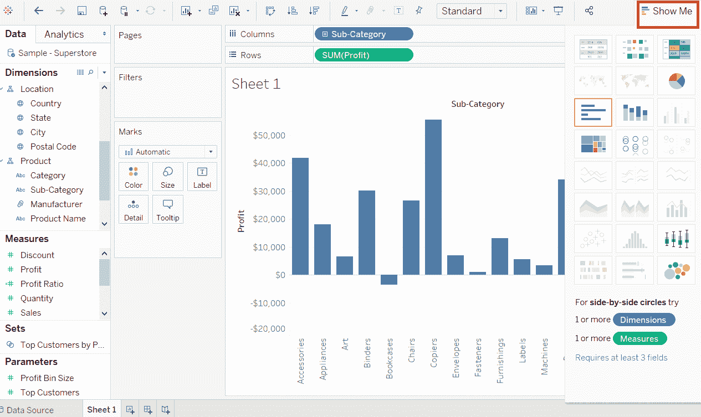
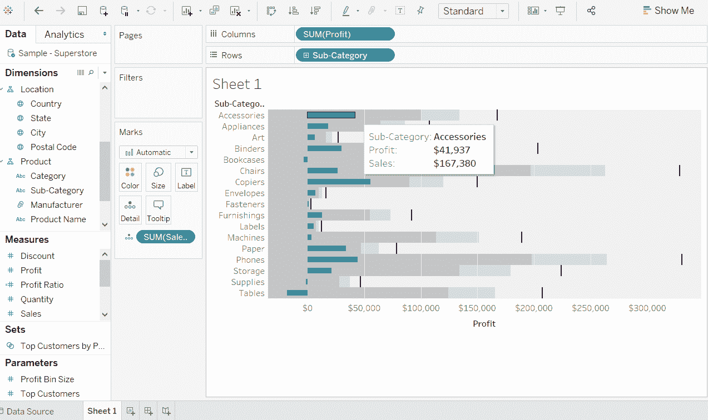

# 表格项目符号图

> 原文：<https://www.javatpoint.com/tableau-bullet-chart>

项目符号图用作衡量或指示来显示度量的性能。它可以使用项目符号图将这两种度量相互比较。

项目符号图也是条形图的变体。在项目符号图中，我们将一个度量值与另一个度量值进行比较，以找出第一个度量值和第二个度量值之间的差异。

这就像两个条互相画在一起，表示它们在图中相同位置的值。它可以用来将两个图形组合成一个图形，以便于查看比较结果。

**比如**，考虑**样本-超市**等数据源，你要对比**预估利润**和**实际利润**。然后，您可以使用项目符号表轻松地比较它们。

创建项目符号图的过程如下。

**第一步:**将维度**子类别**拖入柱架。

**第二步:**将措施**利润**和**销售**拖至成排货架。

下图显示了作为条形图的两个独立类别的两个度量，每个度量代表**子类别**的值。

**第 3 步:**再次，将测量**销售额**拖动到行货架的**详细信息**标记窗格中。

**第 4 步:**转到位于下图工作表右上角的**演示**选项:

**第五步:**然后，从**显示**图形选项中选择**项目符号图形**选项，出现项目符号图形，如下图所示。

* * *