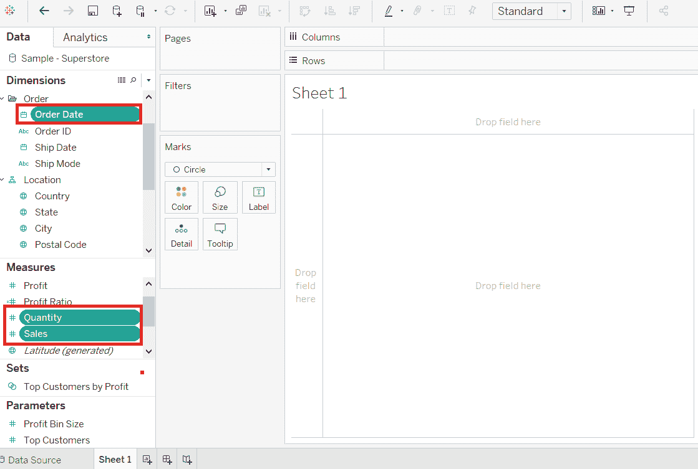
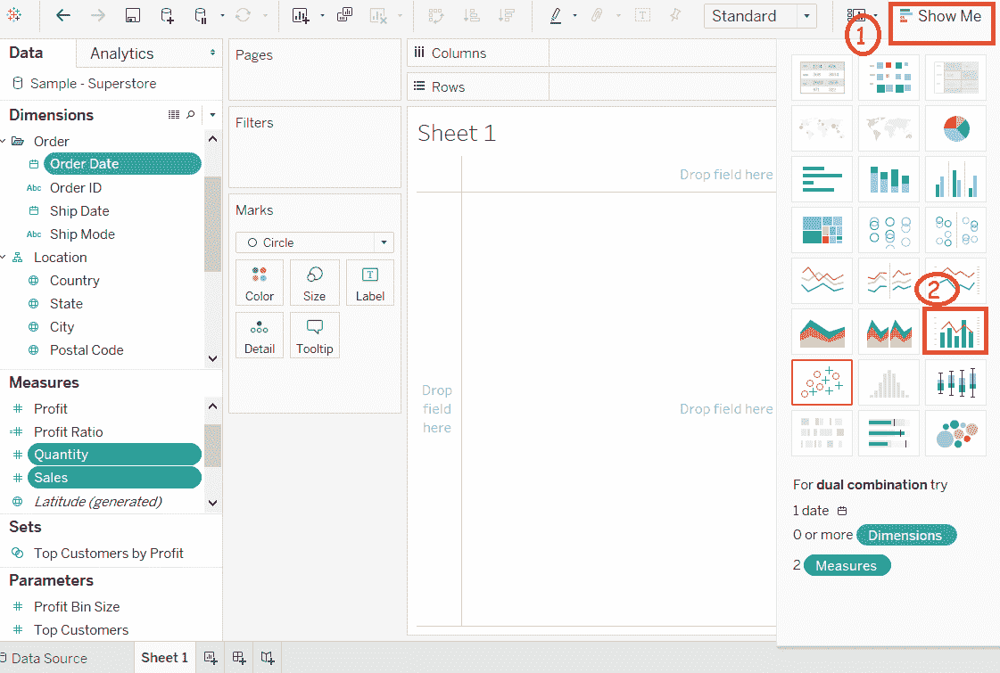
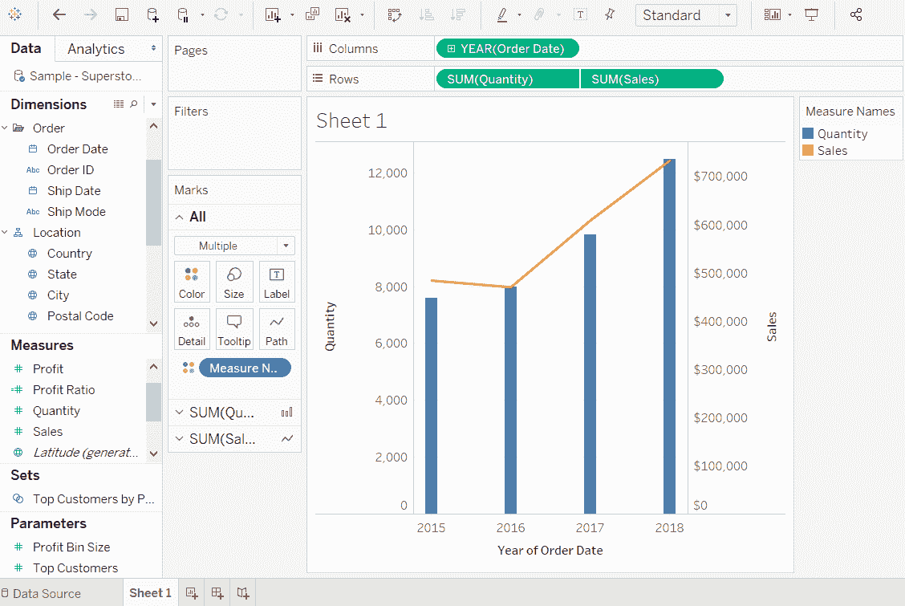

# 表格双轴图表

> 原文：<https://www.javatpoint.com/tableau-dual-axis-chart>

双轴图表用于可视化两种不同图表类型中的两种不同度量。构建双轴图表需要一个日期列和两个度量。

图表中使用了不同的刻度，有助于用户理解这两种度量。创建双轴图表的步骤如下所示。

**例如**，考虑一个数据源，如**样本-超级商场**及其度量和维度。

**第 1 步:**转到工作表。

**第二步:**按住键盘上的 **Ctrl** 键。

**第三步:**选择维度**订单日期**，测量**销售额**和**数量**，如下图截图所示。

**第四步:**点击位于工作表右上角的“**展示给我看**”选项。

**第五步:**选择“**双组合**图标，如下图截图所示。

完成上述所有步骤后，它会创建如下图所示的双轴图表。

* * *