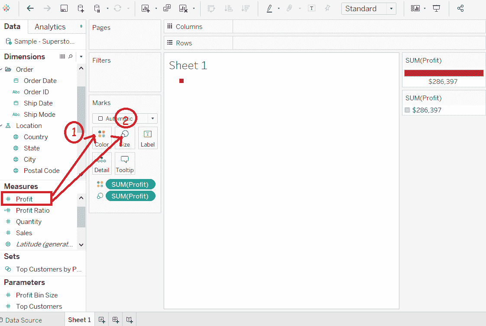
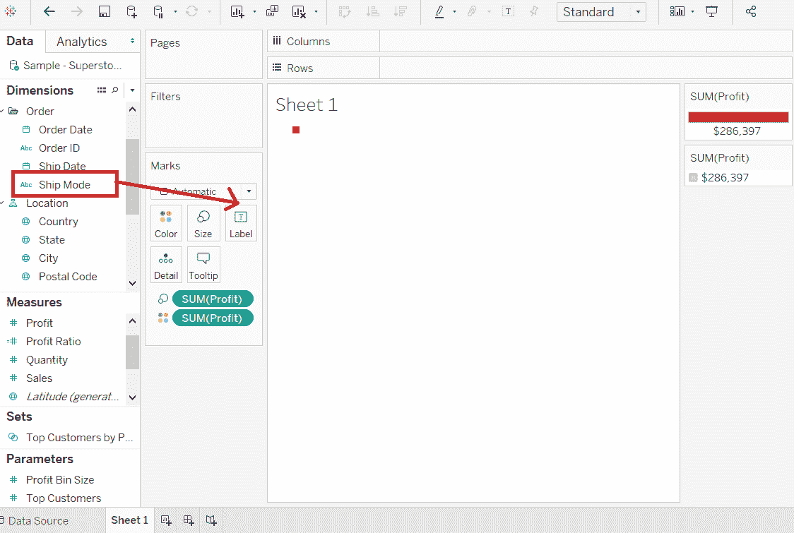
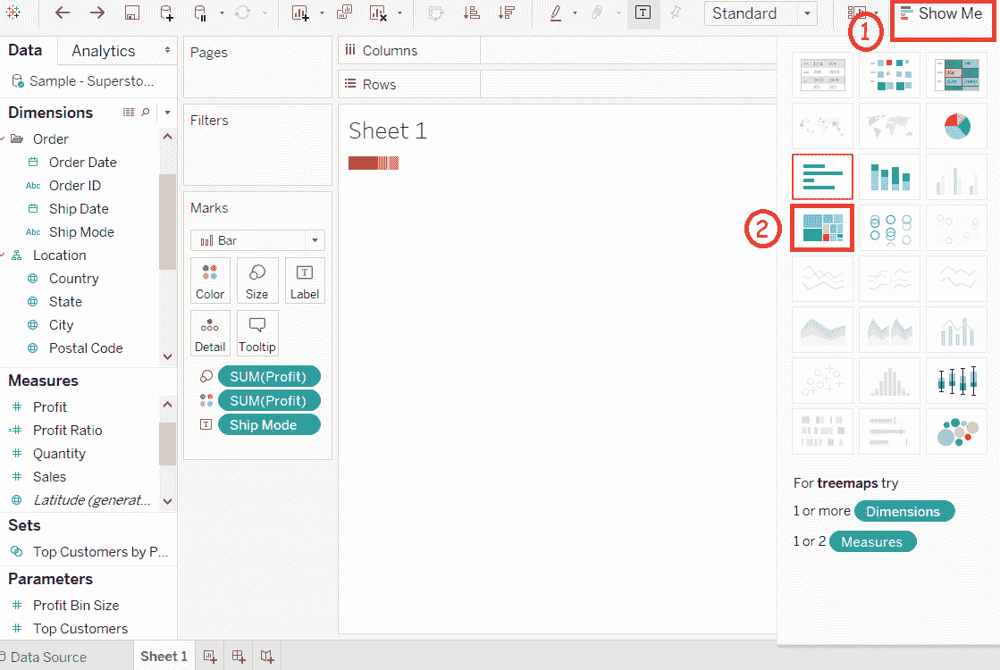
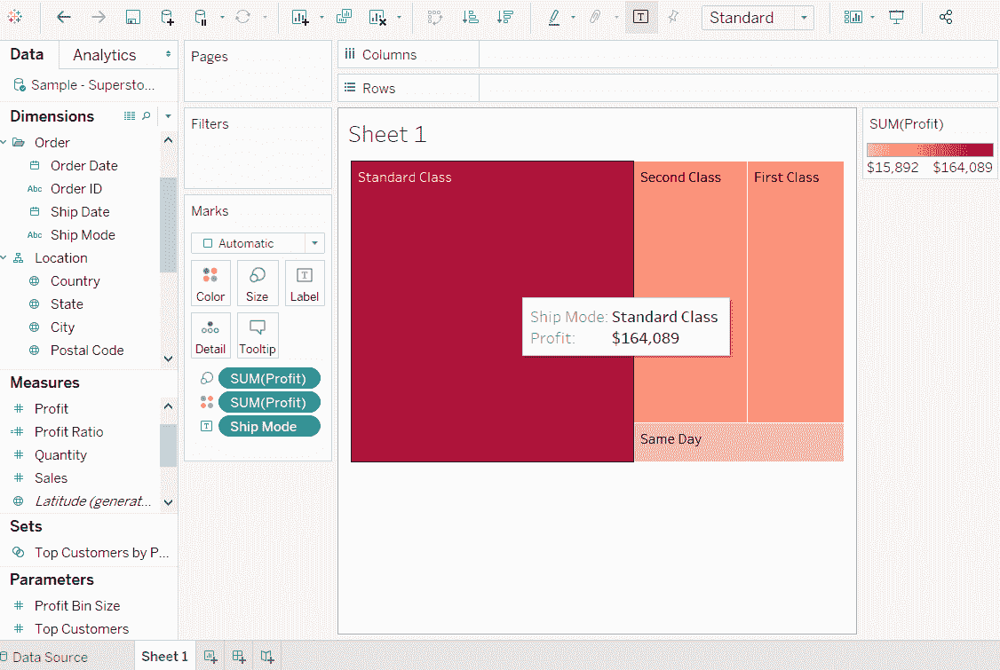

# 表格树图

> 原文：<https://www.javatpoint.com/tableau-tree-map>

树形图以嵌套的矩形显示数据。维度定义了树形图的结构，度量决定了单个正方形的颜色或大小。

正方形很容易被可视化，因为正方形颜色的大小和阴影反映了度量的值。

树图是使用一个或多个维度和一个或两个度量值创建的。

**例如**，考虑**样本-超级商场**等数据源，如果要为每个 **ShipMode** 值找到**利润**的大小。以下是创建树图的步骤。

**第一步:**拖动测量**利润**并放到**标记**窗格下的颜色架中。

**第二步:**再次拖动**盈利**的措施，放到**大小**的货架上。

**第三步:**拖动尺寸**出货模式**并放入**标签**货架。

**第四步:**从“**给我看**中选择树形图选项。

完成以上所有步骤后，它会创建如下截图所示的树图。

* * *