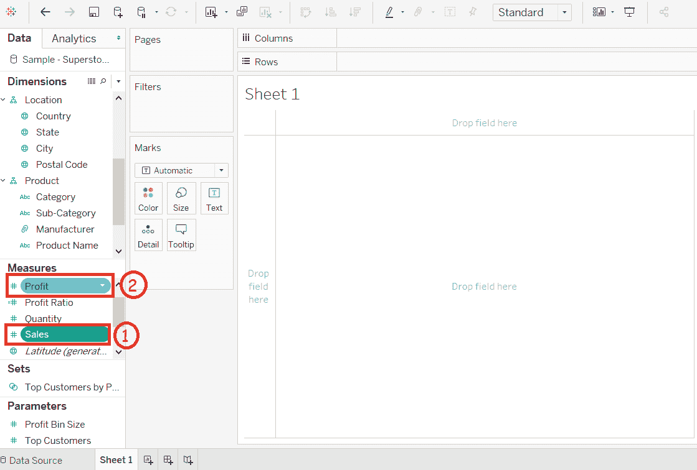
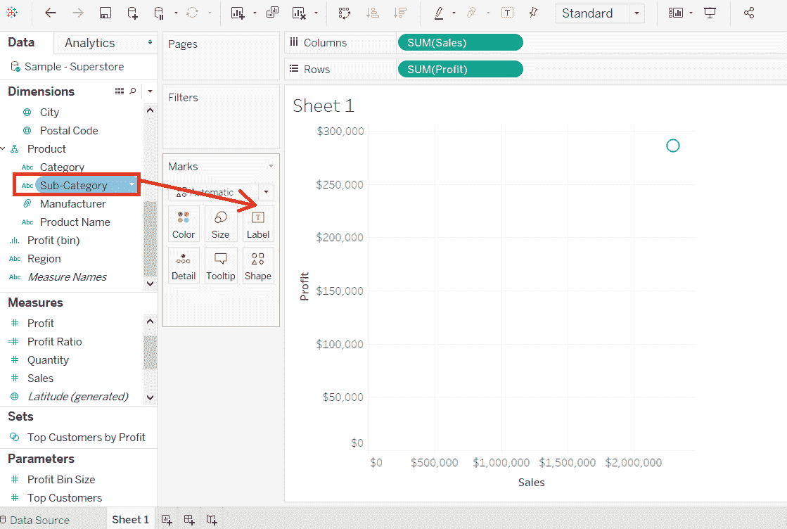
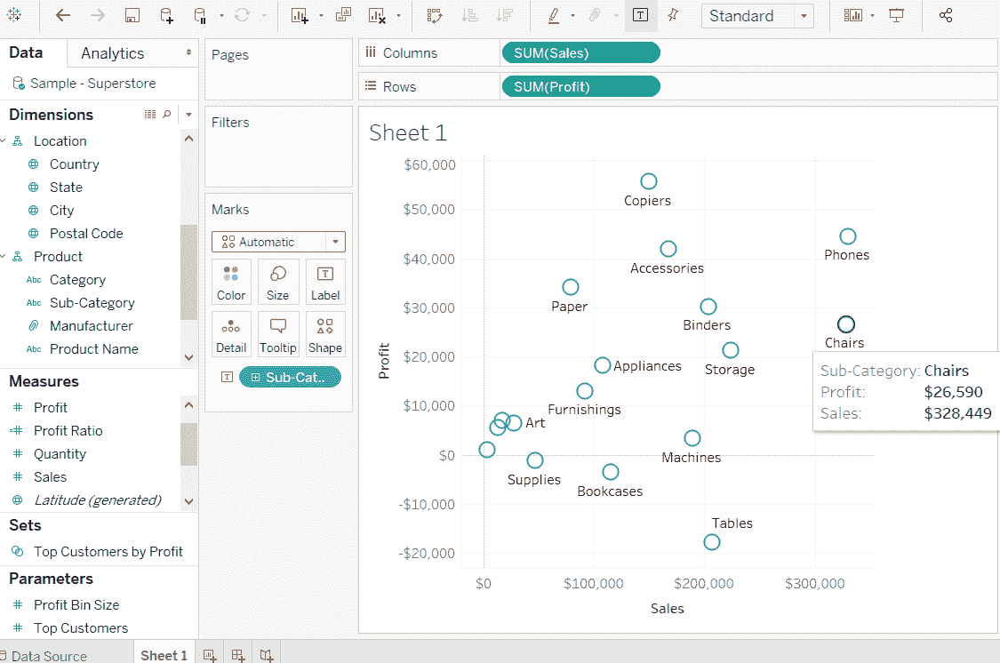
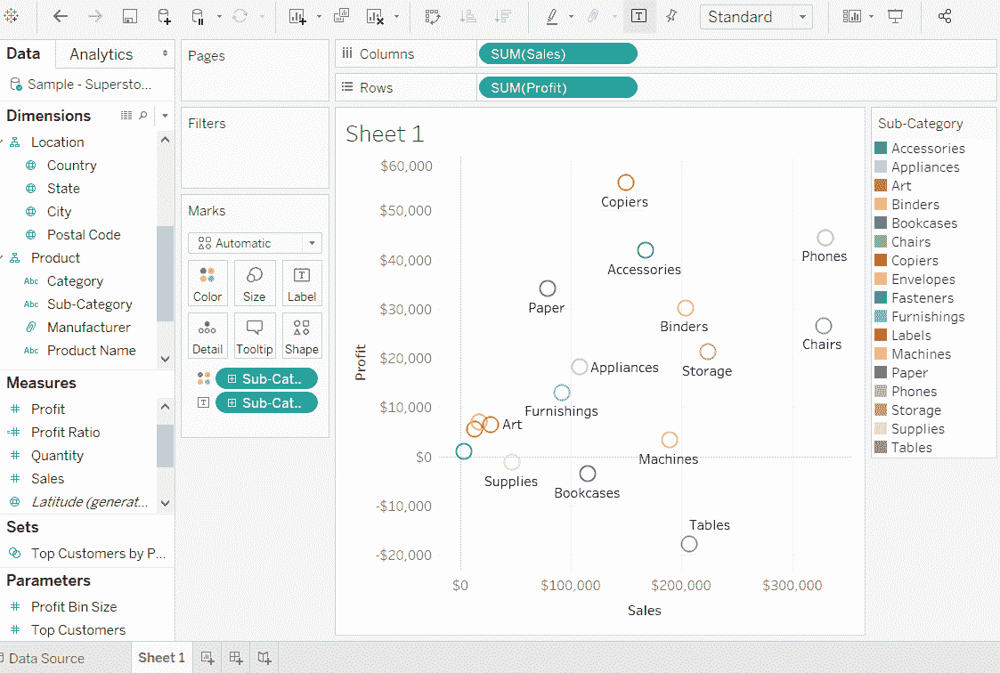
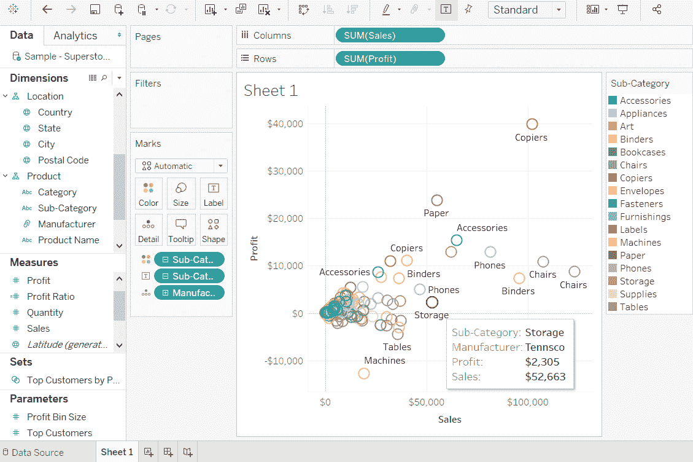

# 表格散点图

> 原文：<https://www.javatpoint.com/tableau-scatter-plot>

散点图用于可视化两种度量之间的关系。它是通过在 x 轴和 y 轴上增加测量值来设计的。这可以显示所选度量之间的趋势或关系。

要创建散点图，在行架中应该至少有一个度量，在列架中应该有一个度量。但是，您可以将尺寸字段添加到散点图中，该散点图对散点图中已经存在的点起到不同的颜色效果。

**例如**，考虑**样本-超级商场**等数据源，如果要找到**销售**字段和**利润**字段的变化，因为笛卡尔平面的两个轴是按照它们的**子类**字段分布的。

要创建散点图，有以下步骤，例如:

**第一步:**拖动测量**销售**并放入柱架。

**第二步:**拖动测量**利润**并放入行货架。

**第三步:**拖动尺寸**子类别**并放入**标记**窗格下的**标签**货架。

之后，创建散点图，显示**利润**字段和**销售**字段如何分布在产品的维度**子类别**上。

**第 4 步:**将**子类别**字段拖动到颜色框中，也可以获得颜色编码的值。

下面的图表显示每个点具有不同颜色的分散点。

当您选择具有层次的维度时，相同的散点图可以显示不同的值。

**例如**，展开维度**子类**以显示**制造商**字段的散点图值。

* * *