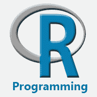
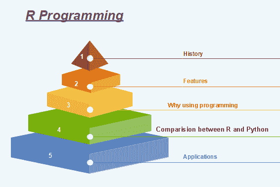
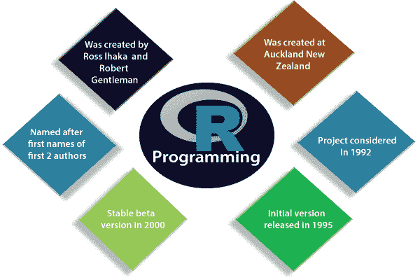

# r 编程教程

> 原文：<https://www.javatpoint.com/r-tutorial>

r 编程教程是为初学者和专业人士设计的。我们的教程提供了数据分析和可视化的所有基本和高级概念。

r 是用于分析统计信息和图形表示的软件环境。r 允许我们使用函数进行模块化编程。

我们的 R 教程包括 R 的所有主题，如介绍、特性、安装、rstudio ide、变量、数据类型、运算符、if 语句、向量、数据处理、图形、统计建模等。这种编程语言被命名为 R，基于两位作者(罗伯特·绅士和罗斯·伊哈卡)的名字字母。

## 什么是 R 编程

**“R 是一种解释型计算机编程语言，由新西兰奥克兰大学的罗斯·伊哈卡和罗伯特·绅士创建。”**目前研发 R 的 ***R 开发核心团队*** ，也是用于分析**统计信息**、**图形表示**、**报表**、**数据建模**的软件环境。r 是 **S 编程**语言的实现，结合**词法范围语义**。

r 不仅允许我们进行分支和循环，还允许使用函数进行模块化编程。r 允许与用 C、C++编写的程序集成。Net、Python 和 FORTRAN 语言来提高效率。

在当今时代，R 是研究人员、数据分析师、统计学家和营销人员用来检索、清理、分析、可视化和呈现数据的最重要工具之一。

## R 编程的历史

R 的历史可以追溯到大约 20-30 年前。R 是由新西兰奥克兰大学的 Ross lhaka 和 Robert 绅士开发的，目前 R 开发核心团队正在开发。这个编程语言的名字取自两个开发者的名字。第一个项目是在 1992 年考虑的。最初的版本发布于 1995 年，2000 年，一个稳定的测试版发布了。

下表显示了 R 语言的发布日期、版本和描述:

| 版本-发布 | 日期 | 描述 |
| Zero point four nine | 1997-04-23 | 第一次发布 R 的源码，启动了 CRAN(综合 R 档案网)。 |
| Zero point six | 1997-12-05 | r 正式获得 GNU 许可证。 |
| 0.65.1 | 1999-10-07 | update.packages 和 install.packages 都包括在内。 |
| One | 2000-02-29 | 第一个生产就绪版本已经发布。 |
| One point four | 2001-12-19 | 苹果操作系统的第一个版本已经推出。 |
| Two | 2004-10-04 | 苹果操作系统的第一个版本已经推出。 |
| Two point one | 2005-04-18 | 增加对 UTF-8 编码、国际化、本地化等的支持。 |
| Two point one one | 2010-04-22 | 添加对 Windows 64 位系统的支持。 |
| Two point one three | 2011-04-14 | 增加了将代码快速转换为字节码的功能。 |
| Two point one four | 2011-10-31 | 添加了一些新包。 |
| Two point one five | 2012-03-30 | 改进了长向量的序列化速度。 |
| Three | 2013-04-03 | 64 位系统支持更大的数值。 |
| Three point four | 2017-04-21 | 默认情况下，实时编译是启用的。 |
| Three point five | 2018-04-23 | 增加了新功能，如整数序列的紧凑内部表示、序列化格式等。 |

## R 程序设计的特点

r 是一种特定领域的编程语言，旨在进行数据分析。它有一些独特的功能，使它非常强大。最重要的可以说是向量的符号。这些向量允许我们在单个命令中对一组值执行复杂的操作。R 编程有以下特点:

1.  它是一种简单而有效的编程语言，已经得到了很好的发展。
2.  它是数据分析软件。
3.  它是一种设计良好、简单有效的语言，具有用户定义、循环、条件和各种输入/输出工具的概念。
4.  它有一套用于数据分析的一致且整合的工具。
5.  对于数组、列表和向量的不同计算类型，R 包含一组运算符。
6.  它提供了有效的数据处理和存储设施。
7.  它是一个开源的、强大的、高度可扩展的软件。
8.  它提供了高度可扩展的图形技术。
9.  它允许我们使用向量进行多重计算。
10.  r 是一种解释语言。

## 为什么使用 R 编程？

市场上有几种工具可以进行数据分析。学习新语言是需要时间的。数据科学家可以使用两种优秀的工具，即 R 和 Python。当我们开始学习数据科学时，我们可能没有时间去学习它们。学习统计建模和算法比学习一门编程语言更重要。一种编程语言被用来计算和交流我们的发现。

数据科学的重要任务是我们处理数据的方式:清理、特征工程、特征选择和导入。这应该是我们的首要关注点。数据科学家的工作是理解数据，操纵数据，并揭示最佳方法。对于机器学习来说，最好的算法可以用 R. **Keras** 和 **TensorFlow** 来实现，让我们可以创建高端的机器学习技术。r 有一个包来执行 **Xgboost** 。Xgboost 是 **Kaggle 比赛**的最佳算法之一。

与其他语言交流，可能调用 Python、Java、C++。大数据世界对 R 也是可访问的。我们可以将 R 与不同的数据库连接起来，如 **Spark** 或 **Hadoop** 。

简而言之，R 是调查和探索数据的一个很好的工具。诸如聚类、相关和数据简化等精细分析都是用 r

## R 与 Python 的比较

数据科学处理从数据源中识别、提取和表示有意义的信息。r、Python、SAS、SQL、Tableau、MATLAB 等。是数据科学最有用的工具。r 和 Python 是最常用的。但是，在两者中选择更好的还是最合适的，R 和 Python，这就变得令人困惑了。

| 比较指数 | 稀有 | 计算机编程语言 |
| **概述** | R 是一种解释型计算机编程语言，由新西兰奥克兰大学的罗斯·伊哈卡和罗伯特·绅士创建 R 开发核心团队目前开发的 R. R 也是一个软件环境，用于分析统计信息、图形表示、报告和数据建模。 | Python 是一种用于通用编程的解释高级编程语言。圭多·范·罗瑟姆创作了它，并于 1991 年首次发行。Python 有一个非常简单干净的代码语法。它强调代码的可读性，在 Python 中调试也很简单容易。 |
| **数据科学专业** | r 包具有对统计工作非常有用的先进技术。许多有用的 R 包提供了 CRAN 文本视图。这些包涵盖了从心理测量到遗传学到金融的一切。 | 对于发现数据集中的异常值，R 和 Python 都同样有效。但是对于开发一个允许人们上传数据集和发现异常值的网络服务来说，Python 更好。 |
| **功能** | 对于数据分析，R 具有内置的功能 | 大多数数据分析功能都不是内置的。它们可以通过像 Numpy 和 Pandas 这样的包装获得 |
| **关键应用领域** | 数据可视化是分析的一个关键方面。r 包，如 ggplot2、ggvis、点阵等。使数据可视化更容易。 | Python 更适合深度学习，因为有 Caffe、Keras、OpenNN 等 Python 包。允许以非常简单的方式发展深层神经网络。 |
| **包装的可用性** | 有数百个包和方法来完成必要的数据科学任务。 | Python 有几个主要的包，比如分别用于机器学习数据分析的 viz、Sccikit learn 和 Pandas。 |

## R 的应用

有几个实时可用的应用程序。一些流行的应用如下:

*   脸谱网
*   谷歌
*   推特
*   HRDAG
*   阳光基金会
*   真实气候
*   恩达
*   XBOX ONE
*   澳新银行
*   食品及药物管理局

## 先决条件

r 编程用于统计信息和数据表示。所以要求我们要有数学上的统计理论知识。理解数据表示的不同类型的图形，最重要的是我们应该有任何编程的先验知识。

## 观众

本教程对那些有兴趣了解数据分析项目如何实施的学生很有帮助。本教程涵盖了 R 的所有基础知识以及如何使用 R 进行数据分析

## 问题

我们向您保证，您不会发现这个 R 编程教程有任何问题。但是如果有任何错误，请在联系表格中发布问题。

* * *