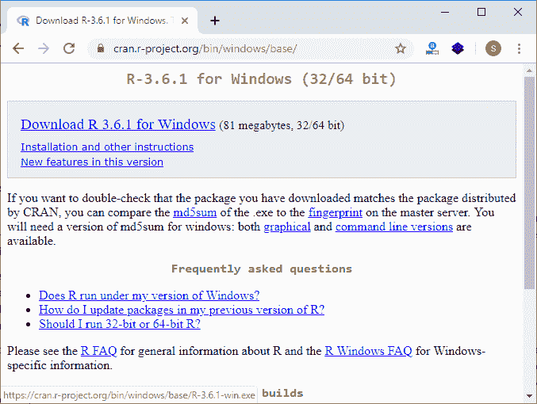
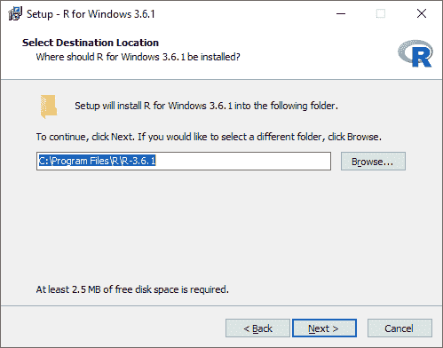
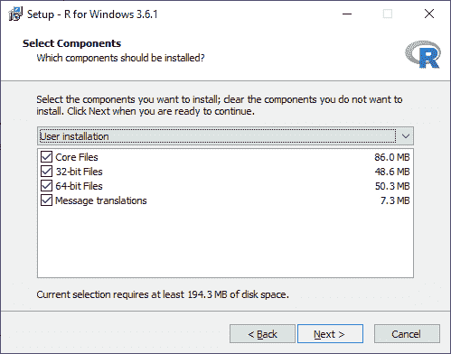
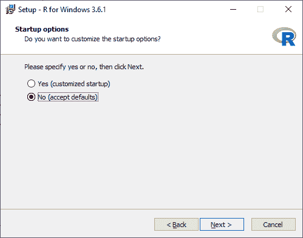
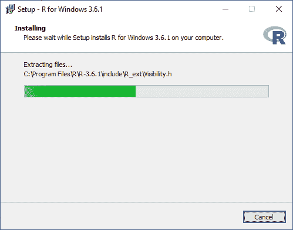
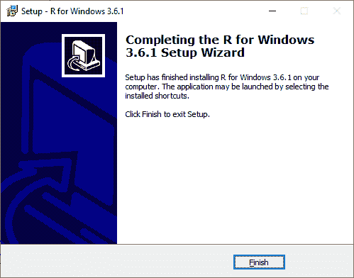
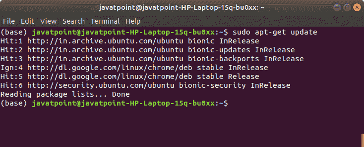
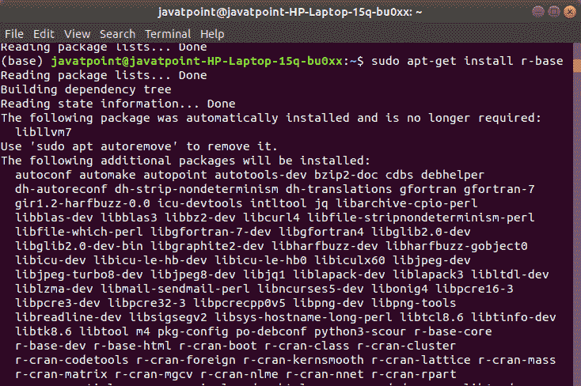
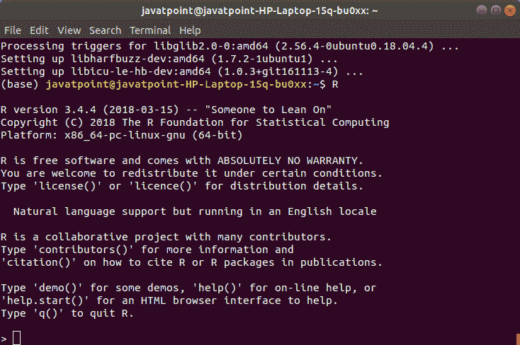

# R 的安装

> 原文：<https://www.javatpoint.com/r-installation>

**R 编程**是一种非常流行的语言，要在这上面下功夫，我们必须安装两个东西，即 R 和 RStudio。r 和 RStudio 合作在 r 上创建一个项目

将 R 安装到本地计算机非常容易。首先，我们必须知道我们使用的是哪个操作系统，这样我们才能相应地下载它。

官方网站[https://cloud.r-project.org](https://cloud.r-project.org)为包括 Windows、Linux 和 Mac OS 在内的主要操作系统提供二进制文件。在一些 Linux 发行版中，默认安装了 R，我们可以通过输入 R 从控制台进行验证。

要安装 R，要么我们可以从网站[https://cloud.r-project.org](https://cloud.r-project.org)获取，要么可以使用终端的命令。

### 在 Windows 中安装 R

在 Windows 中安装 R 有以下步骤:

**第一步:**

首先，我们要从[https://cloud.r-project.org/bin/windows/base/](https://cloud.r-project.org/bin/windows/base/)下载 R 设置。

**第二步:**

当我们点击**下载 windows 的 R 3.6.1 for】时，我们的下载将从 R 设置开始。下载完成后，我们必须按照以下方式运行 R 的设置:**

1)选择我们要下载 R 的路径，然后继续下一步。

2)选择我们要安装的所有组件，然后我们将进入**下一步**。

3)在下一步中，我们必须选择定制启动或接受默认启动，然后进入**下一步**。

4)当我们继续下一步时，我们将开始在系统中安装 R:

5)最后，我们将点击完成，在我们的系统中成功安装 R。

### 在 Linux 中安装 R

在 Linux 中安装 R 只有三个步骤

**第一步:**

在第一步中，我们必须使用 **sudo apt-get update** 命令更新系统中所有需要的文件，如下所示:

**第二步:**

第二步，我们将在 **sudo apt-get install r-base** 的帮助下在我们的系统中安装 R 文件，如下所示:

**第三步:**

在最后一步中，我们键入 R 并按回车键来操作 R 编辑器。

* * *