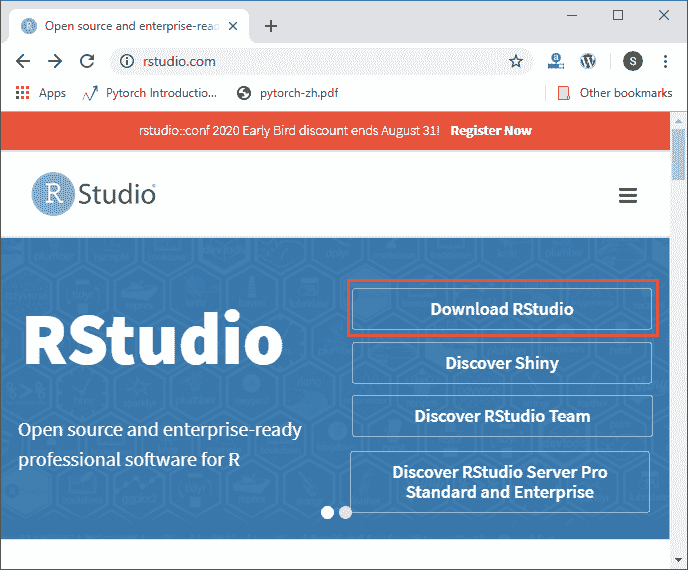
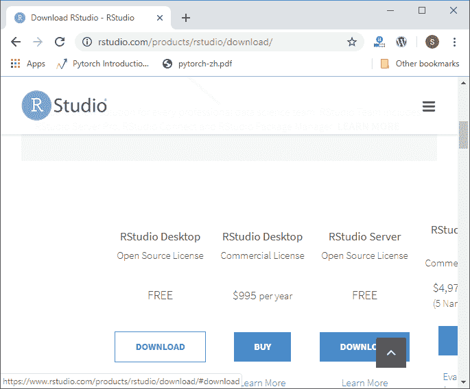
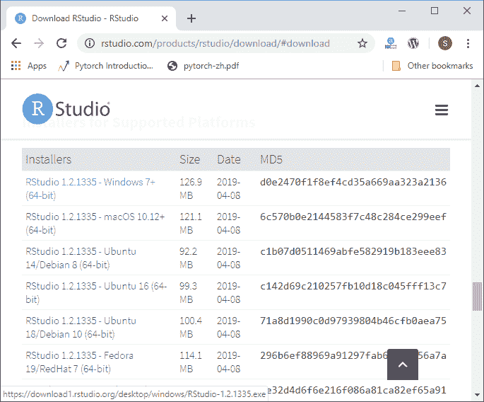
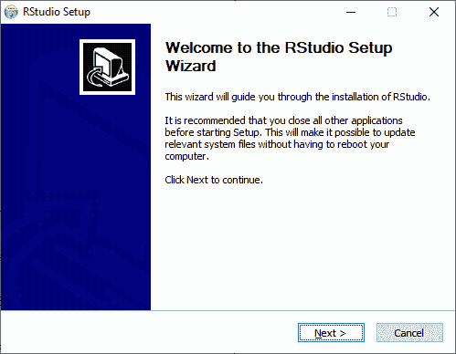
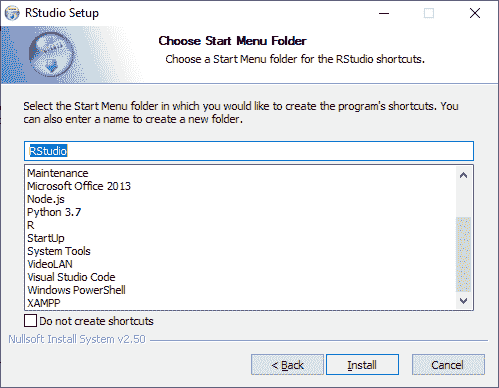
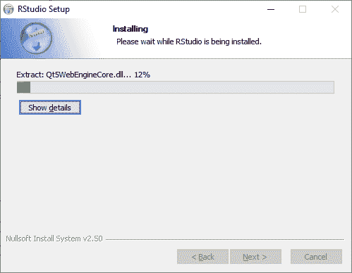
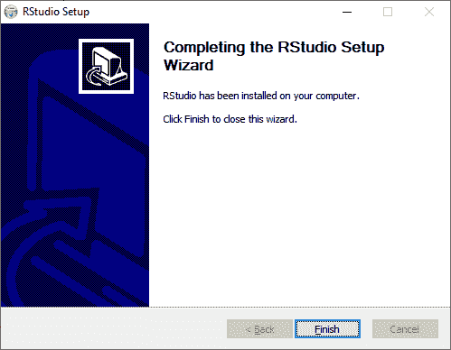
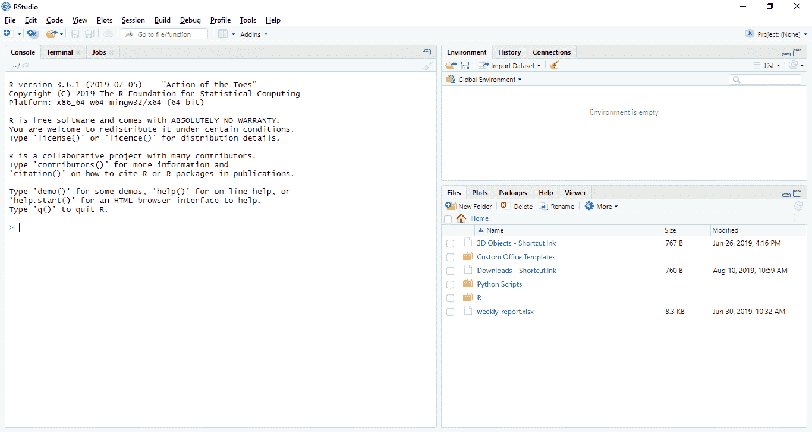

# RStudio IDE

> 哎哎哎:# t0]https://www . javatppoint . com/rstudio-ide

RStudio 是一个集成的开发环境，它允许我们更容易地与 R 交互。RStudio 类似于标准的 RGui，但被认为更加用户友好。这个 IDE 有各种下拉菜单，有多个选项卡的窗口，还有这么多的定制过程。第一次打开 RStudio，会看到三个窗口。默认情况下，第四个窗口将被隐藏。我们可以通过点击**文件**下拉菜单，然后**新文件**然后 **R 脚本**来打开这个隐藏窗口。

| windows/tab rstudio | 位置 | 描述 |
| 控制台窗口 | 左下角 | 输入和打印命令的位置。 |
| 源选项卡 | 左上角 | 内置测试编辑器 |
| 环境选项卡 | 左上角 | 加载的 R 对象的交互列表。 |
| 历史选项卡 | 左上角 | 输入控制台的击键列表。 |
| 文件选项卡 | 右下角 | 文件资源管理器导航 c 盘文件夹。 |
| 绘图选项卡 | 右下角 | 地块的输出位置。 |
| “包”选项卡 | 右下角 | 已安装软件包的列表。 |
| 帮助选项卡 | 右下角 | 帮助命令和帮助搜索窗口的输出位置。 |
| 查看器选项卡 | 右下角 | 本地网站内容的高级选项卡。 |

## RStudio 迪奥的安装

**RStudio 桌面**同时适用于 Windows 和 Linux。开源的 RStudio Desktop 安装在这两种操作系统上都非常容易安装。RStudio 的授权版本比开源版本有更多的特性。在安装 RStudio 之前，让我们看看 RStudio 的许可证版本中还有哪些附加功能。

| 因素 | 开源的 | 商业许可证 |
| **概述** | 1)本地访问 RStudio | 开源的所有特性都包含在
中 1)不能使用 AGPL 软件的组织有商业许可。
2)提供优先支持。 |
| 2)代码完成、语法突出显示和智能缩进 |
| 3)可以直接从源代码编辑器执行 R 代码 |
| 4)快速跳转到函数定义。 |
| 5)使用项目轻松管理多个工作目录。 |
| 6)集成的帮助和文档。 |
| 7)提供交互式调试器，快速诊断和修复错误。 |
| 8)广泛的包部署工具。 |
| **支持** | 它只支持社区论坛。 | 1)支持优先邮件。
2)支持营业时间 8 小时响应。 |
| **牌照** | AGPL v3 标准 | RStudio 许可协议 |
| **定价** | 自由的 | 995 美元/年 |

### 在 Windows/Linux 上安装

在 Windows 和 Linux 上，安装 RStudio 相当简单。在两个操作系统中安装 RStudio 的过程是相同的。在我们的 Windows/Linux 中安装 RStudio 有以下步骤:

**第一步:**

第一步，我们访问 RStudio 官方网站，点击**下载 RStudio** 。

**第二步:**

在下一步中，我们将选择 RStudio 桌面进行开源许可，并点击下载。

**第三步:**

在下一步中，我们将选择合适的安装程序。当我们选择安装程序时，我们将开始下载 RStudion 安装程序。

**第四步:**

在下一步中，我们将以下列方式运行我们的设置:

1)单击下一步。

2)单击安装。

3)点击完成。

4) RStudio 准备工作。

* * *