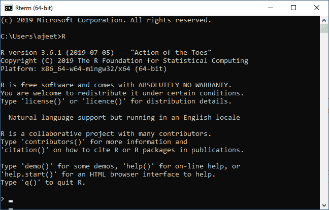
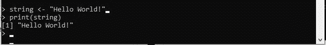
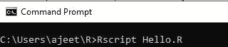
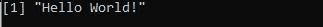
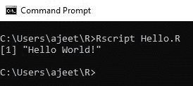

# R 程序设计的语法

> 原文：<https://www.javatpoint.com/basic-syntax-of-r>

R Programming 是一种非常流行的编程语言，广泛用于数据分析。我们定义其代码的方式非常简单。《你好世界》是所有语言的基础程序，现在我们就用“Hello world”程序来了解 R 编程的语法。我们可以在命令提示符下编写代码，也可以使用 R 脚本文件。

## 命令提示符

要求我们已经安装了系统中设置的 R 环境，以便在 R 命令提示符下工作。安装完 R 环境设置后，我们可以通过在 Windows 命令提示符下键入 R 来轻松启动 R 命令提示符。当我们输入 R 后按回车键，它会启动解释器，我们会得到一个提示，我们可以在上面编码我们的程序。



**“你好，世界！”程序**

《你好世界》的代码在 R 编程中可以写成:



在上面的代码中，第一条语句定义了一个**字符串变量**字符串，在这里我们分配了一个字符串“Hello World！”。下一条语句 print()用于打印存储在变量字符串中的值。

## 脚本文件

R 脚本文件是我们编写程序的另一种方式，然后我们在我们的命令提示符下，在称为**rsscript**的 R 解释器的帮助下执行这些脚本。我们制作一个文本文件并编写以下代码。我们将使用保存此文件。r 扩展为:

**演示。R**

```

string 
```

要在 Windows 和其他操作系统中执行此文件，过程将保持如下所述。



当我们按回车键时，它会给出如下输出:



## 评论

在 R 编程中，注释是 R 程序源代码中程序员可读的解释。添加这些注释的目的是使源代码更容易理解。这些注释通常被编译器和解释器忽略。

在 R 编程中，只有单行注释。r 不支持多行注释。但是如果我们想要执行多行注释，那么我们可以在一个假块中添加我们的代码。

**单行评论**

```

#My First program in R programming
string 
```

**多行评论的诀窍**

```

#Trick for multi-line comment
if(FALSE) {
   "R is an interpreted computer programming language which was created by
   Ross Ihaka and Robert Gentleman at the University of Auckland, New Zealand "
}
#My First program in R programming
string 
```



* * *