# R 程序设计中的关键词

> 原文：<https://www.javatpoint.com/r-keywords>

在程序设计中，关键字是由程序保留的词，因为它有特殊的含义。关键字可以是命令或参数。就像在 C，C++，Java 里面，r 里面也有一组关键字，一个关键字不能作为变量名。关键字也被称为“保留名称”

按照**有以下关键词？保留**或**帮助(保留)**命令:

| 如果 | 其他 | 重复 |
| 正在… | 功能 | 为 |
| 然后 | 破裂 | 真实的 |
| 错误的 | 空 | 中程核力量 |
| 圆盘烤饼 | 钠 | NA _ 整数 _ |
| NA_real_ | 钠络合物 | 钠字符 |

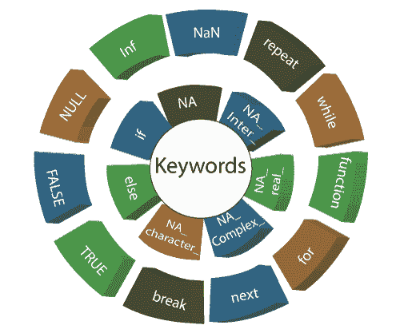

### 1)如果

if 语句由一个布尔表达式组成，后跟一个或多个语句。在 R 语言中，if 语句是最简单的条件语句，用来决定一个语句块是否被执行。

**示例:**

```

a
```

**输出:**

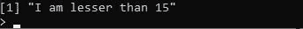

### 2)其他

R else 语句与 if 语句关联。当 if 语句的条件为假时，将只执行 else 块。让我们看一个例子来说明这一点:

**示例:**

```

a
```

**输出:**

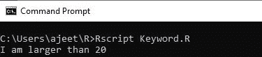

### 3)重复

repeat 关键字用于多次迭代一个代码块。在 R 中，repeat 是一个循环，在这个循环语句中，没有退出循环的条件。为了退出循环，我们将使用 break 语句。

**示例:**

```

x 
```

**输出:**

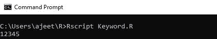

### 4)当

while 关键字用作循环。执行 while 循环，直到给定条件为真。这也用来做一个无限循环。

**示例:**

```

a 
```

**输出:**

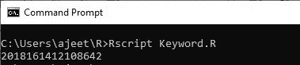

### 5)功能

函数是 R 编程中的一个对象。关键字函数用于在 R 中创建用户定义的函数。R 也有一些预定义的函数，如 seq、mean 和 sum。

**示例:**

```

new.function
```

**输出:**

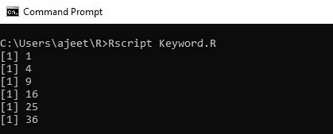

### 6)对于

的**是用于循环或迭代序列(字典、字符串、列表、集合或元组)的关键字。**

我们可以为迭代器中的每个项目(列表、集合、元组等)执行一组语句。)借助 for 循环。

**示例:**

```

v 
```

**输出:**

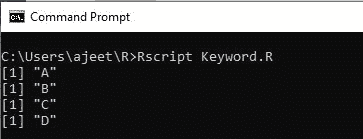

### 7)接下来

下一个关键字跳过循环的当前迭代而不终止它。当 R 解析器找到下一个时，它跳过进一步的评估，开始循环的新迭代。

**示例:**

```

v 
```

**输出:**

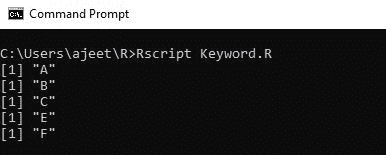

### 8)休息

如果条件为真，则使用 **break** 关键字终止循环。程序的控制权首先传递给外部语句，然后传递给 break 语句的主体。

**示例:**

```

n
```

**输出:**

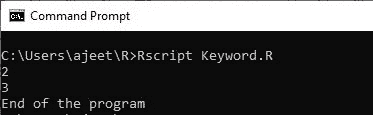

### 9)真/假

真和假关键字用于表示布尔真和布尔假。如果给定的语句为真，那么解释器返回真，否则解释器返回假。

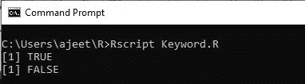

### 10)空

在 R 中，null 表示 NULL 对象。空值用于表示缺失和未定义的值。空是既不是真也不是假的语句的逻辑表示。

**示例:**

```

as.null(list(a = 1, b = "c"))

```

**输出:**

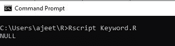

### 11) Inf 和 NaN

is .有限和 is .无限函数返回一个相同长度的向量，指示哪些元素是有限的或无限的。

Inf 和-Inf 是正无穷大和负无穷大。NaN 代表“不是数字”NaN 适用于数值和复数值的实部和虚部，但不适用于整数向量的值。

用法

```

is.finite(x)
is.infinite(x)
is.nan(x)

Inf
NaN

```

### 12)北美

NA 是长度为 1 的逻辑常数，包含一个缺失值指示符。它可以被强制为除 raw 之外的任何其他向量类型。还有其他类型的常数，如整数、实数、复数和字符。这些常数属于支持缺失值的其他原子向量类型。

用法

```

NA
is.na(x)
anyNA(x, recursive = FALSE)

## S3 method for class 'data.frame'
is.na(x)

is.na(x) 
```

* * *