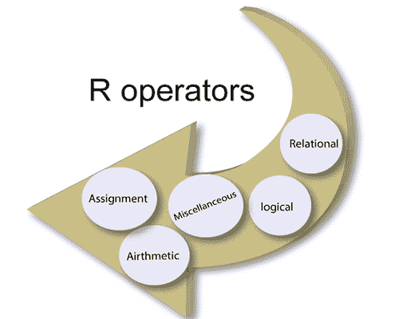

# R 中的运算符

> 原文：<https://www.javatpoint.com/r-operators>

在**计算机编程**中，操作符是代表一个动作的符号。运算符是一个符号，它告诉编译器执行特定的**逻辑**或**数学**操作。r 编程在内置运算符方面非常丰富。

在 **R 编程**中，有不同类型的操作员，每个操作员执行不同的任务。对于数据操作，还有一些高级操作符，如模型公式和列表索引。

**R 中使用的运算符有以下几种:**



1.  [算术运算符](#Arithmetic)
2.  [关系运算符](#Relational)
3.  [逻辑运算符](#Logical)
4.  [分配操作员](#Assignment)
5.  [其他操作员](#Miscellaneous)

* * *

## 算术运算符

算术运算符是用来表示算术数学运算的符号。运算符作用于向量的每一个元素。r 支持各种算术运算符。

| 南不 | 操作员 | 描述 | 例子 |
| **1。** | + | 这个运算符用于在 R.a .中添加两个向量 | 

```
	b 
It will give us the following output:

```
	[1]  13.0  8.3  5.0

```

```

 |
| **2。** | - | 这个运算符用来将一个向量与另一个向量相除 | 

```
	b 
It will give us the following output:

```
	[1]  -9.0  -1.7  3.0

```

```

 |
| **3。** | * | 这个运算符用于将两个向量相乘 | 

```
	b <- c(11, 5, 3)
	print(a*b)

```

**它会给我们以下输出:**

```
	[1]  22.0  16.5  4.0

```

 |
| **4。** | / | 这个算子把向量和另一个分开 | 

```
	b <- c(11, 5, 3)
	print(a/b)
```

**它会给我们以下输出:**

```
	[1]  0.1818182  0.6600000  4.0000000

```

 |
| **5。** | %% | 这个运算符用来求第一个向量与第二个向量的余数 | 

```
	b 
It will give us the following output:

```
	[1]  2.0  3.3  0

```

```

 |
| **6。** | %/% | 这个运算符用来求第一个向量与第二个向量(商)的除。 | 

```
	a 
It will give us the following output:

```
	[1]  0  0  4

```

```

 |
| **7。** | ^ | 这个运算符将第一个向量提升到第二个向量的指数 | 

```
	b 
It will give us the following output:

```
	[1]  0248.0000  391.3539  4.0000

```

```

 |

* * *

## 关系运算符

关系运算符是定义两个实体之间某种关系的符号。这些包括数字等式和不等式。关系运算符将第一向量的每个元素与第二向量的相应元素进行比较。比较的结果将是一个布尔值。R 支持以下关系运算符:

| 南不 | 操作员 | 描述 | 例子 |
| **1。** | > | 当第一个向量中的每个元素都大于第二个向量的对应元素时，该运算符将返回真。 | 

```
	a b)

```

**它会给我们以下输出:**

```
	[1]  FALSE  FALSE  FALSE

```

 |
| **2。** | < | 当第一个向量中的每个元素都少于第二个向量的对应元素时，该运算符将返回真。 | 

```
	a 
It will give us the following output:

```
	[1]  FALSE  TRUE  FALSE

```

```

 |
| **3。** | <= | 当第一个向量中的每个元素都小于或等于另一个向量的对应元素时，该运算符将返回真。 | 

```
	a 
It will give us the following output:

```
	[1]  TRUE  TRUE  TRUE

```

```

 |
| **4。** | >= | 当第一个向量中的每个元素都大于或等于另一个向量的对应元素时，该运算符将返回真。 | 

```
	a =b)

```

**它会给我们以下输出:**

```
	[1]  FALSE  TRUE  FALSE

```

 |
| **5。** | == | 当第一个向量中的每个元素都等于第二个向量的对应元素时，该运算符将返回真。 | 

```
	a 
It will give us the following output:

```
[1]  FALSE  TRUE  FALSE

```

```

 |
| **6。** | ！= | 当第一个向量中的每个元素不等于第二个向量的对应元素时，该运算符将返回真。 | 

```
	a =b)

```

**它会给我们以下输出:**

```
	[1]  TRUE  FALSE  TRUE

```

 |

* * *

## 逻辑运算符

逻辑运算符允许程序在多个条件的基础上做出决定。在程序中，每个操作数都被认为是一个条件，可以被评估为假值或真值。条件值用于确定 op1 **操作符** op2 的整体值。逻辑运算符适用于类型为逻辑、数字或复数的向量。

逻辑运算符将第一个向量的每个元素与第二个向量的相应元素进行比较。

There are the following types of operators which are supported by R:

| 南不 | 操作员 | 描述 | 例子 |
| **1。** | & | 该运算符称为逻辑与运算符。该运算符获取两个向量的第一个元素，如果两个元素都为真，则返回真。 | 

```
	a 
It will give us the following output:

```
	[1]  TRUE  FALSE TRUE  TRUE

```

```

 |
| **2。** | &#124; | 这个运算符称为逻辑或运算符。该运算符获取两个向量的第一个元素，如果其中一个为真，则返回真。 | 

```
	a 
It will give us the following output:

```
	[1]  TRUE  TRUE TRUE  TRUE

```

```

 |
| **3。** | ！ | 该运算符称为逻辑非运算符。这个运算符取向量的第一个元素，并给出相反的逻辑值作为结果。 | 

```
	a 
It will give us the following output:

```
	[1]  FALSE  TRUE  FALSE  FALSE

```

```

 |
| **4。** | && | 该运算符获取两个向量的第一个元素，并给出“真”作为结果，前提是两者都为“真”。 | 

```
	a 
It will give us the following output:

```
	[1]  TRUE

```

```

 |
| **5。** | &#124;&#124; | 这个运算符取两个向量的第一个元素，如果其中一个为真，则给出结果为真。 | 

```
	a 
It will give us the following output:

```
	[1]  TRUE

```

```

 |

* * *

## 赋值运算符

赋值运算符用于为变量赋值。在 R 中，这些运算符用于给向量赋值。分配有以下几种类型

| 南不 | 操作员 | 描述 | 例子 |
| **1。** |  | 这些运算符称为左赋值运算符。 | 

```
	a 
It will give us the following output:

```
	[1]  3+0i  0+0i  1+0i  2+2i
	[1]  2+0i  4+0i  1+0i  2+3i
	[1]  1+0i  2+0i  1+0i  2+3i

```

```

 |
| **2。** | ->或--> | 这些运算符称为权利分配运算符。 | 

```
	c(3, 0, TRUE, 2+2i) -> a
	c(2, 4, TRUE, 2+3i) ->> b
	print(a)
	print(b)

```

**它会给我们以下输出:**

```
	[1]  3+0i  0+0i  1+0i  2+2i
	[1]  2+0i  4+0i  1+0i  2+3i

```

 |

R 支持的运算符:

* * *

## 杂项操作员

杂项运算符用于特殊目的。这些运算符不用于一般的数学或逻辑计算。R 中支持以下各种运算符

| 南不 | 操作员 | 描述 | 例子 |
| **1。** | ： | 冒号运算符用于为向量按顺序创建一系列数字。 | 

```
	v 
It will give us the following output:

```
	[1]  1  2  3  4  5  6  7  8

```

```

 |
| **2。** | %in% | 当我们想要识别一个元素是否属于一个向量时，就要用到它。 | 

```
	a1 
It will give us the following output:

```
	[1]  FALSE
	[1]  FALSE

```

```

 |
| **3。** | %*% | 它用于将矩阵与其转置相乘。 | 

```
	M=matrix(c(1,2,3,4,5,6), nrow=2, ncol=3, byrow=TRUE)
	T=m%*%T(m)
	print(T)

```

**它会给我们以下输出:**

```
	14    32
	32    77

```

 |

* * *