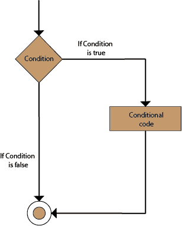
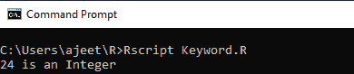
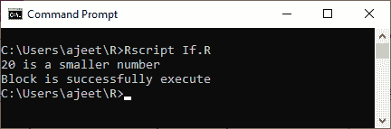
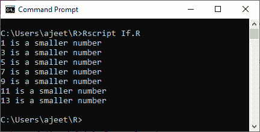
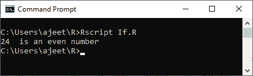
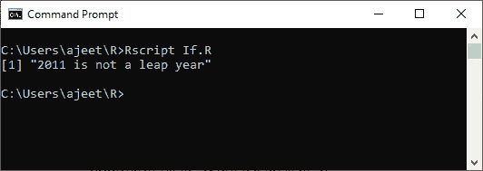

# 如果陈述

> 原文：<https://www.javatpoint.com/r-if-statement>

if 语句由后跟一个或多个语句的布尔表达式组成。if 语句是最简单的决策语句，它帮助我们根据条件做出决定。

if 语句是一个条件编程语句，它执行函数，并在被证明为真时显示信息。

if 语句中的代码块只有在布尔表达式计算为真时才会执行。如果语句的计算结果为 false，那么在条件之后提到的代码将会运行。

R 中 if 语句的语法如下:

```

if(boolean_expression) {
   // If the boolean expression is true, then statement(s) will be executed. 
}

```

**流程图**



让我们看一些例子来理解 if 语句是如何在 r 中工作和执行某项任务的。

### 例 1

```

x 
```

**输出:**



### 例 2

```

x 
```

**输出:**



### 例 3

```

x 
```

**输出:**



### 例 4

```

x 
```

**输出:**



### 例 5

```

year
1 = 2011
if(year1 %% 4 == 0) {
 if(year1 %% 100 == 0) { 
	 if(year1 %% 400 == 0) { 
		 cat(year,"is a leap year") 
		} else {
		 cat(year,"is not a leap year") 
		}
	} else {
	 cat(year,"is a leap year") 
	}
} else {
 cat(year,"is not a leap year") 
}

```

**输出:**



* * *