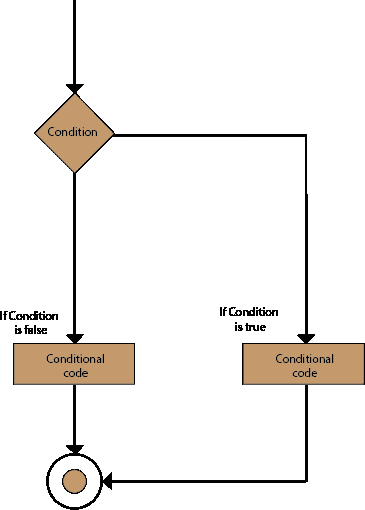
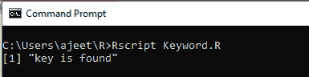
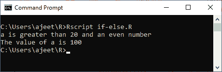
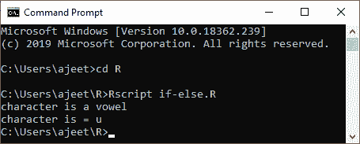

# If-else 语句

> 原文：<https://www.javatpoint.com/r-if-else-statement>

在 if 语句中，当条件为真时，执行内部代码。当 if 条件为 false 时，将执行 if 块之外的代码。

还有另一种类型的决策陈述，称为假设陈述。if-else 语句是后跟 else 语句的 if 语句。当布尔表达式为 false 时，将执行 if-else 语句。简单地说，如果布尔表达式将具有真值，那么 If 块将被执行，否则 else 块将被执行。

r 编程将任何非零和非空值视为真，如果该值为零或空，则将它们视为假。

If-else 语句的基本语法如下:

```

if(boolean_expression) {
   // statement(s) will be executed if the boolean expression is true.
} else {
   // statement(s) will be executed if the boolean expression is false.
}

```

**流程图**



### 例 1

```

# local variable definition
a
```

**输出:**


### 例 2

```

x 
```

**输出:**



### 例 3

```

a
```

**输出:**



### 例 4

```

a
```

**输出:**


### 例 5

```

a
```

**输出:**



* * *