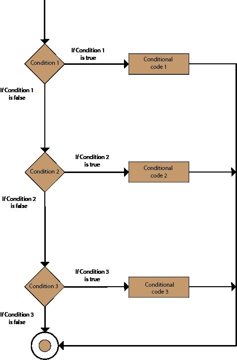
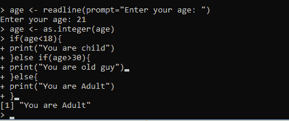
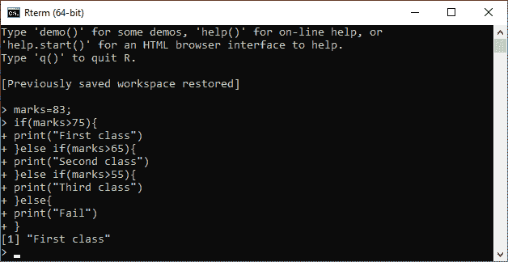
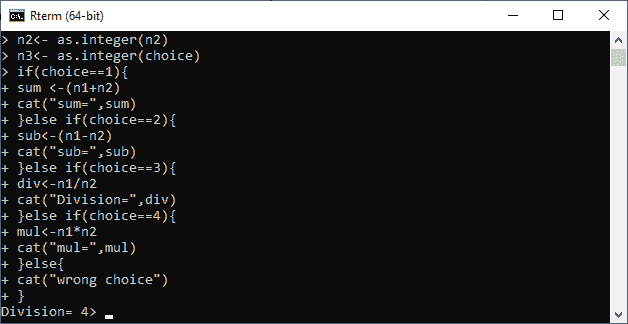
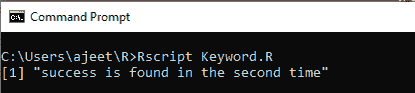
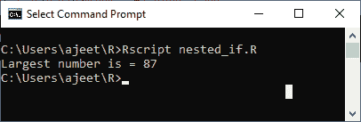

# R else if 语句

> 原文：<https://www.javatpoint.com/r-else-if-statement>

该语句也称为嵌套 if-else 语句。if 语句后面是可选的 else if.....else 语句。此语句用于测试单个 if 中的各种条件......否则如果陈述。当我们使用 if 时，有一些关键点需要记住.....否则如果.....else 语句。这些要点如下:

1.  **if** 语句可以有零个或一个 **else** 语句，并且它必须在任何 **else if 的**语句之后。
2.  **if** 语句可以有许多 **else if 的**语句，它们出现在 else 语句之前。
3.  一旦 **else if** 语句成功，剩下的 **else if 的**或 **else 的**都不会被测试。

If-else 语句的基本语法如下:

```

if(boolean_expression 1) {
   // This block executes when the boolean expression 1 is true.
} else if( boolean_expression 2) {
   // This block executes when the boolean expression 2 is true.
} else if( boolean_expression 3) {
   // This block executes when the boolean expression 3 is true.
} else {
   // This block executes when none of the above condition is true. 
}

```

**流程图**



### 例 1

```

age 30)
	print("You are old guy")
else
	print("You are adult")

```

**输出:**



### 例 2

```

marks=83;
if(marks>75){
	print("First class")
}else if(marks>65){
	print("Second class")
}else if(marks>55){
	print("Third class")
}else{
	print("Fail")
}

```

**输出:**



### 例 3

```

cat("1) For Addition\n")
cat("2) For Subtraction\n")
cat("3) For Division\n")
cat("4) For multiplication\n")
n1
```

**输出:**



### 例 4

```

x 
```

**输出:**



### 例 5

```

n1=4
n2=87
n3=43
n4=74
if(n1>n2){
	if(n1>n3&&n1>n4){
		largest=n1
	}
}else if(n2>n3){
	if(n2>n1&&n2>n4){
		largest=n2
	}
}else if(n3>n4){
	if(n3>n1&&n3>n2){
		largest=n3
	}
}else{
	largest=n4
}
cat("Largest number is =",largest)

```

**输出:**



* * *