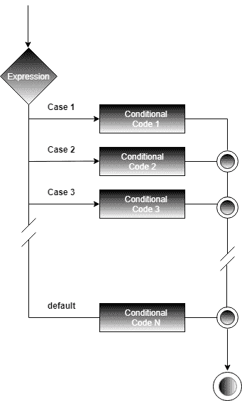
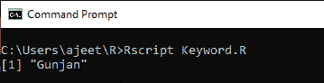
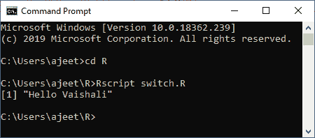
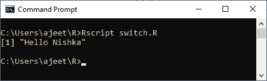
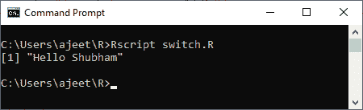
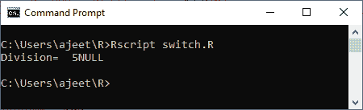

# r 开关语句

> 原文：<https://www.javatpoint.com/r-switch-statement>

switch 语句是一种选择控制机制，它允许表达式的值通过映射和搜索来改变程序执行的控制流。

switch 语句用来代替长 if 语句，长 if 语句将一个变量与几个整数值进行比较。这是一个多路分支语句，它提供了一种为代码的不同部分分派执行的简单方法。这段代码基于表达式的值。

此语句允许根据值列表测试变量的相等性。switch 语句有点复杂。要理解它，我们有以下几个要点:

*   如果表达式类型是字符串，则该字符串与列出的大小写匹配。
*   如果有多个匹配，则使用第一个匹配元素。
*   没有可用的默认案例。
*   如果没有匹配的案例，则使用未命名的案例。

基本上有两种方法可以选择其中一种情况:

### 1)基于指数

如果大小写是像字符向量这样的值，并且表达式的计算结果是一个数字，则表达式的结果将用作选择大小写的索引。

### 2)基于匹配值

当案例具有像["case_1"="value1"]这样的案例值和输出值时，表达式值将与案例值相匹配。如果与案例匹配，则输出相应的值。

If-else 语句的基本语法如下:

```

switch(expression, case1, case2, case3....)

```

**流程图**



### 例 1

```

x 
```

**输出:**



### 例 2

```

ax= 1
bx = 2
y = switch(
    ax+bx,
    "Hello, Shubham",
    "Hello Arpita",
    "Hello Vaishali",
    "Hello Nishka"
)
print (y)

```

**输出:**



### 例 3

```

y = "18"
x = switch(
    y,
    "9"="Hello Arpita",
    "12"="Hello Vaishali",
    "18"="Hello Nishka",
    "21"="Hello Shubham"
)

print (x)

```

**输出:**



### 例 4

```

x= "2"
y="1"
a = switch(
    paste(x,y,sep=""),
    "9"="Hello Arpita",
    "12"="Hello Vaishali",
    "18"="Hello Nishka",
    "21"="Hello Shubham"
)

print (a)

```

**输出:**



### 例 5

```

y = "18"
a=10
b=2
x = switch(
    y,
    "9"=cat("Addition=",a+b),
    "12"=cat("Subtraction =",a-b),
    "18"=cat("Division= ",a/b),
    "21"=cat("multiplication =",a*b)
)

print (x)

```

**输出:**



* * *