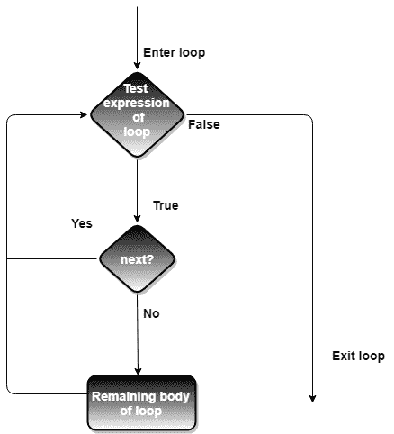
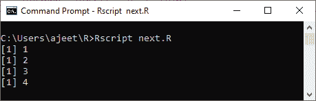
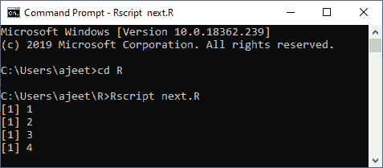
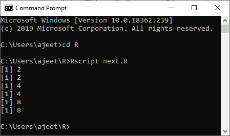
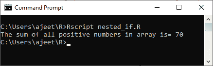
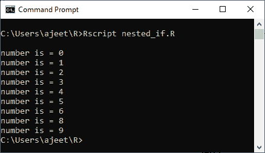

# 下一个声明

> 原文：<https://www.javatpoint.com/r-next-statement>

下一条语句用于跳过循环中的任何剩余语句并继续执行。简单地说，下一条语句是跳过循环的当前迭代而不终止循环的语句。当遇到下一条语句时，R 解析器会跳过进一步的计算，并开始循环的下一次迭代。

该语句主要用于 for 循环和 while 循环。

#### 注意:在 if-else 语句的 else 分支中，也可以使用下一条语句。

### 句法

下面是在 R 中创建下一条语句的语法

```

next

```

**流程图**



### 示例 1:重复循环中的下一步

```

a 
```

**输出:**



### 示例 while 循环中的下一步

```

a
```

**输出:**



### 示例 for 循环中的下一步

```

x 
```

**输出:**



### 例 4

```

a1
```

**输出:**



### 例 5

```

j
```

**输出:**



* * *