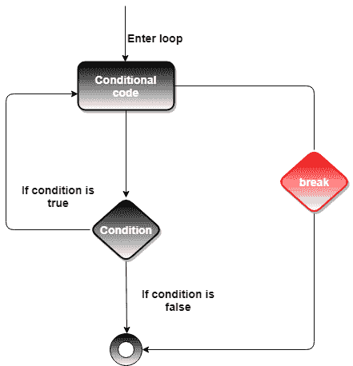
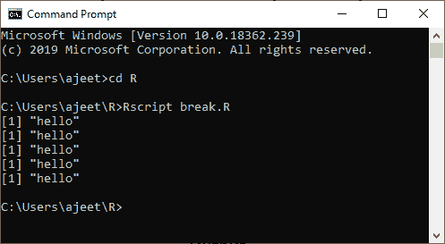
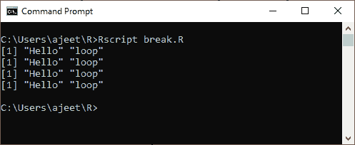
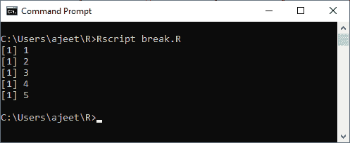
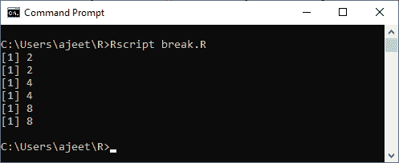
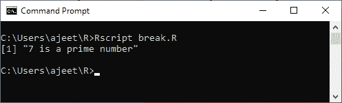

# 休息声明

> 原文：<https://www.javatpoint.com/r-break-statement>

在 R 语言中，break 语句用于中断执行并立即退出循环。在嵌套循环中，中断仅从最里面的循环退出，控制转移到外部循环。

管理和控制程序执行流程非常有用。我们可以用它来做各种循环，比如:for，repeat 等。

break 语句基本上有以下两种用法:

1.  当 break 语句在循环内时，循环立即终止，程序控制在循环后的下一条语句上恢复。
2.  它也用于终止 switch 语句中的案例。

#### 注意:我们也可以在`if...else`语句的`else`分支里面使用 break 语句。

### 句法

以下是在 R 中创建 break 语句的语法

```

break

```

**流程图**



### 示例 1:在重复循环中中断

```

a = 5)    
    break       
  a
```

**输出:**



### 例 2

```

v  5) {
      break
   }
}

```

**输出:**



### 示例 3:循环时插入

```

a
```

**输出:**



### 示例 4:插入循环

```

for (i in c(2,4,6,8)) {  
  for (j in c(1,3)) {  
      if (i==6)  
        break  
     print(i)  
  }  
}  

```

**输出:**



### 例 5

```

num=7
flag = 0
if(num> 1) {
	flag = 1
	for(i in 2:(num-1)) {
		if ((num %% i) == 0) {
			flag = 0
			break
		}
	}
} 
if(num == 2)    flag = 1
if(flag == 1) {
	print(paste(num,"is a prime number"))
} else {
	print(paste(num,"is not a prime number"))
}

```

**输出:**



* * *