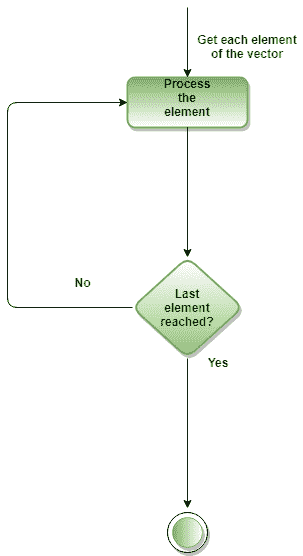
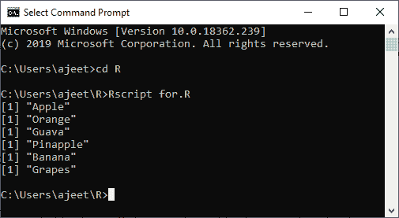
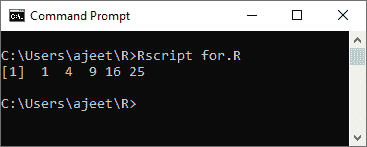
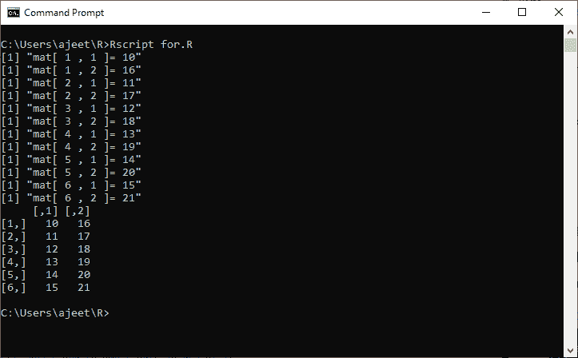
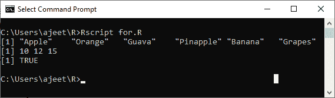
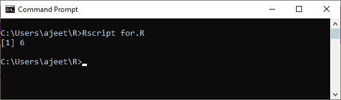

# 用于循环

> 原文：<https://www.javatpoint.com/r-for-loop>

for 循环是最流行的控制流语句。for 循环用于迭代向量。它类似于 while 循环。for 和 while 之间只有一个区别，即在 while 循环中，条件是在主体执行之前检查的，但在 for 循环中，条件是在主体执行之后检查的。

C/C++中的 For 循环有以下语法:

```

for (initialization_Statement; test_Expression; update_Statement)
{
    // statements inside the body of the loop 
}

```

## For 循环在 C/C++中是如何工作的？

C 和 C++中的 for 循环以下列方式执行:

*   for 循环的初始化语句只执行一次。
*   在初始化过程之后，评估测试表达式。当测试表达式计算为 false 时，for 循环终止。
*   for 循环体中的语句将被执行，如果测试表达式被评估为 true，表达式将被更新。
*   再次计算测试表达式。
*   该过程一直持续到测试表达式为假。当测试表达式为假时，循环终止。

## R 编程中的 For 循环

在 R 语言中，for 循环是在一定条件下重复一系列指令的一种方式。它允许我们自动化代码中需要重复的部分。简单地说，for 循环是一种重复控制结构。它允许我们高效地编写需要执行一定次数的循环。

在 R 中，for 循环定义为:

1.  它以 C 或 C++这样的关键字开头。
2.  我们不是初始化和声明循环计数器变量，而是声明一个与向量、矩阵等的基类型相同的变量。，后跟一个冒号，然后是数组或矩阵名称。
3.  在循环体中，使用循环变量，而不是使用索引数组元素。
4.  R 中的 for 循环有以下语法:

```

for (value in vector) {
   statements
}

```

**流程图**



**例 1:** 我们迭代一个向量的所有元素，并打印当前值。

```

# Create fruit vector
fruit <- c('Apple', 'Orange',"Guava", 'Pinapple', 'Banana','Grapes')
# Create the for statement
for ( i in fruit){ 
	print(i)
}

```

**输出**



**示例 2:** 借助 1 到 5 之间的 x 的多项式创建一个非线性函数，并将其存储在列表中。

```

# Creating an empty list
list <- c()
# Creating a for statement to populate the list
for (i in seq(1, 5, by=1)) {
  list[[i]] <- i*i
}
print(list)

```

**输出**



**示例 3:** 对于矩阵上的循环

```

# Creating a matrix
mat <- matrix(data = seq(10, 21, by=1), nrow = 6, ncol =2)
# Creating the loop with r and c to iterate over the matrix
for (r in 1:nrow(mat))   
    for (c in 1:ncol(mat))  
         print(paste("mat[", r, ",",c, "]=", mat[r,c])) 
print(mat)

```

**输出**



**示例 4:** 用于在列表上循环

```

# Create a list with three vectors
fruit <- list(Basket = c('Apple', 'Orange',"Guava", 'Pinapple', 'Banana','Grapes'), 
Money = c(10, 12, 15), purchase = TRUE)
for (p  in fruit) 
{ 
	print(p)
}

```

**输出**



**例 5:** 计算向量中偶数的个数。#用三个向量创建一个列表。

```

x <- c(2,5,3,9,8,11,6,44,43,47,67,95,33,65,12,45,12)
count <- 0
for (val in x) {
if(val %% 2 == 0)  count = count+1
}
print(count)

```

**输出**



* * *