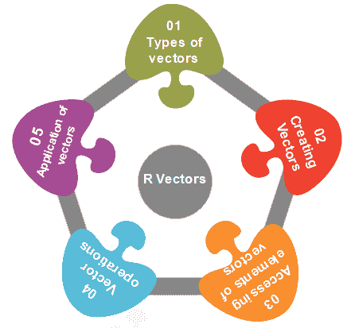
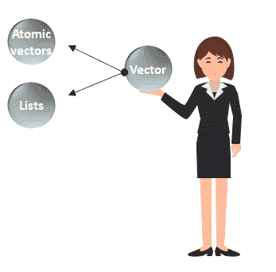
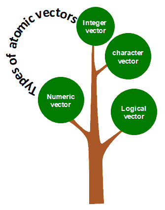
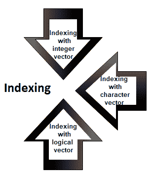
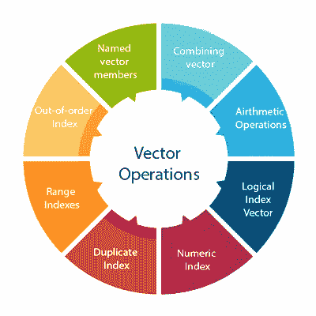

# 向量

> 原文：<https://www.javatpoint.com/r-vector>

A **向量**是一个基本的数据结构，在 R 编程中起着重要的作用。

在 R 语言中，共享相同数据类型的元素序列称为向量。向量支持逻辑、整数、双精度、字符、复杂或原始数据类型。向量中包含的元素称为向量的**分量**。我们可以借助 **typeof()** 函数来检查向量的类型。



长度是向量的一个重要性质。向量长度基本上是向量中元素的数量，它是借助 length()函数计算的。

向量分为两部分，即**原子向量**和**列表**。它们有三个共同的属性，即**函数类型、**函数长度、**属性函数**。



原子向量和列表只有一个区别。在原子向量中，所有的元素都属于相同的类型，但是在列表中，元素属于不同的数据类型。在这一节中，我们将只讨论原子向量。我们将在下一个主题中简要讨论列表。

## 如何在 R 中创建向量？

在 R 中，我们使用 c()函数创建一个向量。该函数返回一维数组或简单的向量。c()函数是一个结合了它的参数的泛型函数。所有参数都受一个公共数据类型的限制，即返回值的类型。在 R 中创建向量还有各种其他方法，如下所示:

### 1)使用冒号(:)运算符

我们可以在冒号运算符的帮助下创建一个向量。使用冒号运算符有以下语法:

```

z<-x:y 

```

这个操作符创建了一个包含从 x 到 y 的元素的向量，并将其赋给 z。

**示例:**

```

a<-4:-10
a

```

**输出**

```
[1]   4   3   2   1   0   -1   -2   -3   -4   -5   -6   -7   -8   -9   -10

```

### 2)使用 seq()函数

在 R 中，我们可以借助 seq()函数创建一个向量。序列函数创建一个元素序列作为向量。seq()函数有两种用法，即通过用？参数或使用“length.out”特性指定向量的长度。

**示例:**

```

seq_vec<-seq(1,4,by=0.5)
seq_vec
class(seq_vec)

```

**输出**

```
[1]   1.0   1.5   2.0   2.5   3.0   3.5   4.0

```

**示例:**

```

seq_vec<-seq(1,4,length.out=6)
seq_vec
class(seq_vec)

```

**输出**

```
[1]   1.0   1.6   2.2   2.8   3.4   4.0
[1]   "numeric"

```

## R 中的原子向量

在 R 中，有四种类型的原子向量。原子向量在数据科学中起着重要的作用。借助 **c()** 函数创建原子向量。这些原子向量如下:



### 数字向量

十进制值在 r 中被称为数字数据类型。如果我们给任何变量 d 分配一个十进制值，那么这个变量 d 将成为数字类型。包含数值元素的向量称为数值向量。

**示例:**

```

d<-45.5
num_vec<-c(10.1, 10.2, 33.2)
d
num_vec
class(d)
class(num_vec)

```

**输出**

```
[1]   45.5
[1]   10.1   10.2   33.2
[1]   "numeric"
[1]   "numeric"

```

### 整型向量

非分数数值称为整数数据。该整数数据由“Int”表示整数大小为 2 字节，长整数大小为 4 字节。有两种方法可以将整数值赋给变量，即使用 as.integer()函数并将 L 附加到该值上。

包含整数元素的向量称为整数向量。

**示例:**

```

d<-as.integer(5)
e<-5L
int_vec<-c(1,2,3,4,5)
int_vec<-as.integer(int_vec)
int_vec1<-c(1L,2L,3L,4L,5L)
class(d)
class(e)
class(int_vec)
class(int_vec1)

```

**输出**

```
[1]   "integer"
[1]   "integer"
[1]   "integer"
[1]   "integer"

```

### 字符向量

一个字符在内存中保存为一个字节的整数。在 R 中，有两种不同的方法来创建字符数据类型值，即使用 as.character()函数和在双引号("")或单引号(')之间键入字符串。

包含字符元素的向量称为整数向量。

**示例:**

```

d<-'shubham'
e<-"Arpita"
f<-65
f<-as.character(f)
d
e
f
char_vec<-c(1,2,3,4,5)
char_vec<-as.character(char_vec)
char_vec1<-c("shubham","arpita","nishka","vaishali")
char_vec
class(d)
class(e)
class(f)
class(char_vec)
class(char_vec1)

```

**输出**

```
[1]   "shubham"
[1]   "Arpita"
[1]   "65"
[1]   "1"   "2"   "3"   "4"   "5"
[1]   "shubham"   "arpita"   "nishka"   "vaishali"
[1]   "character"
[1]   "character"
[1]   "character"
[1]   "character"
[1]   "character"

```

### 逻辑向量

逻辑数据类型只有两个值，即真或假。这些值基于满足哪个条件。包含布尔值的向量称为逻辑向量。

**示例:**

```

d<-as.integer(5)
e<-as.integer(6)
f<-as.integer(7)
g<-d>e
h<-e<f
g
h
log_vec<-c(d<e, d<f, e<d,e<f,f<d,f<e)
log_vec
class(g)
class(h)
class(log_vec)

```

**输出**

```
[1]   FALSE
[1]   TRUE
[1]   TRUE   TRUE   FALSE   TRUE   FALSE   FALSE
[1]   "logical"
[1]   "logical"
[1]   "logical"

```

## 访问向量的元素

我们可以借助向量索引来访问向量的元素。索引表示向量中值的存储位置。索引将在整数、字符或逻辑的帮助下执行。



### 1)用整数向量索引

在整数向量上，索引的执行方式与我们在 C、C++和 java 中应用的方式相同。只有一个区别，即在 C、C++和 java 中，索引从 0 开始，但在 R 中，索引从 1 开始。像其他编程语言一样，我们通过在向量旁边的方括号[]中指定一个整数值来执行索引。

**示例:**

```

seq_vec<-seq(1,4,length.out=6)
seq_vec
seq_vec[2]

```

**输出**

```
[1] 1.0 1.6 2.2 2.8 3.4 4.0
[1] 1.6

```

### 2)用字符向量索引

在字符向量索引中，我们为向量的每个元素分配一个唯一的键。这些键被唯一地定义为每个元素，并且可以非常容易地访问。让我们看一个例子来理解它是如何执行的。

**示例:**

```

char_vec<-c("shubham"=22,"arpita"=23,"vaishali"=25)
char_vec
char_vec["arpita"]

```

**输出**

```
shubham   arpita vaishali
   22      23     25
arpita
      23

```

### 3)用逻辑向量索引

在逻辑索引中，它返回那些相应位置具有逻辑向量“真”的位置的值。让我们看一个例子来理解它是如何在向量上执行的。

**示例:**

```

a<-c(1,2,3,4,5,6)
a[c(TRUE,FALSE,TRUE,TRUE,FALSE,TRUE)]

```

**输出**

```
[1] 1 3 4 6

```

## 向量运算

在 R 中，有各种对向量执行的操作。我们可以相互加、减、乘或除两个或多个向量。在数据科学中，R 起着重要的作用，数据操作需要操作。对向量执行以下类型的运算。



### 1)组合向量

c()函数不仅用于创建向量，还用于组合两个向量。通过组合一个或多个向量，它形成一个包含每个向量的所有元素的新向量。让我们看一个例子，看看 c()函数是如何组合向量的。

**示例:**

```

p<-c(1,2,4,5,7,8)
q<-c("shubham","arpita","nishka","gunjan","vaishali","sumit")
r<-c(p,q)

```

**输出**

```
[1] "1"        "2"        "4"        "5"        "7"        "8"
[7] "shubham"  "arpita"   "nishka"   "gunjan"   "vaishali" "sumit"

```

### 2)算术运算

我们可以对向量进行所有的算术运算。算术运算是对向量逐个成员地执行的。我们可以加、减、乘或除两个向量。让我们看一个例子来理解算术运算是如何在向量上执行的。

**示例:**

```

a<-c(1,3,5,7)
b<-c(2,4,6,8)
a+b
a-b
a/b
a%%b

```

**输出**

```
[1]  3  7 11 15 
[1] -1 -1 -1 -1
[1]  2 12 30 56
[1] 0.5000000 0.7500000 0.8333333 0.8750000
[1] 1 3 5 7

```

### 3)逻辑索引向量

借助 R 中的逻辑索引向量，我们可以从一个给定的向量形成一个新的向量。这个向量与原始向量的长度相同。只有当原始向量的相应成员包含在切片中时，向量成员才为真；否则，它将是假的。让我们看一个例子来理解一个新的向量是如何借助逻辑索引向量形成的。

**示例:**

```

a<-c("Shubham","Arpita","Nishka","Vaishali","Sumit","Gunjan")
b<-c(TRUE,FALSE,TRUE,TRUE,FALSE,FALSE)
a[b]

```

**输出**

```
[1] "Shubham"  "Nishka"   "Vaishali"

```

### 4)数字索引

在 R 中，我们指定方括号[ ]之间的索引来索引数值。如果我们的索引为负，它将返回除我们指定的索引之外的所有值。例如，指定[-3]将提示 R 将-3 转换为其绝对值，然后搜索占据该索引的值。

**示例:**

```

q<-c("shubham","arpita","nishka","gunjan","vaishali","sumit")
q[2]
q[-4]
q[15]

```

**输出**

```
[1] "arpita"
[1] "shubham"  "arpita"   "nishka"   "vaishali" "sumit"
[1] NA

```

### 5)重复索引

索引向量允许重复值，这意味着我们可以在一次操作中访问一个元素两次。让我们看一个例子来理解重复索引是如何工作的。

**示例:**

```

q<-c("shubham","arpita","nishka","gunjan","vaishali","sumit")
q[c(2,4,4,3)]  

```

**输出**

```
[1] "arpita" "gunjan" "gunjan" "nishka"

```

### 6)范围指数

范围索引用于对我们的向量进行切片以形成新的向量。对于切片，我们使用了冒号(:)运算符。范围索引对于涉及大型运算符的情况非常有用。让我们看一个例子来理解切片是如何在冒号运算符的帮助下形成一个新向量的。

**示例:**

```

q<-c("shubham","arpita","nishka","gunjan","vaishali","sumit")
b<-q[2:5]
b

```

**输出**

```
[1] "arpita"   "nishka"   "gunjan"   "vaishali"

```

### 7)无序索引

在 R 中，索引向量可以是无序的。下面是一个例子，其中第一个和第二个值的顺序相反的矢量切片。

**示例:**

```

q<-c("shubham","arpita","nishka","gunjan","vaishali","sumit")b<-q[2:5]
q[c(2,1,3,4,5,6)]

```

**输出**

```
[1] "arpita"   "shubham"  "nishka"   "gunjan"   "vaishali" "sumit"

```

### 8)命名向量成员

我们首先将字符向量创建为:

```

z=c("TensorFlow","PyTorch")
z

```

**输出**

```
[1] "TensorFlow" "PyTorch"

```

一旦创建了字符向量，我们将第一个向量成员命名为“开始”，将第二个成员命名为“结束”，如下所示:

```

names(z)=c("Start","End")
z

```

**输出**

```
Start              End
"TensorFlow"    "PyTorch"

```

我们按名称检索第一个成员，如下所示:

```

z["Start"]

```

**输出**

```
Start
"TensorFlow"

```

我们可以在字符串索引向量的帮助下颠倒顺序。

```

z[c("Second","First")]

```

**输出**

```
     Second        First
"PyTorch"    "TensorFlow"

```

## 向量的应用

1.  在机器学习中，使用主成分分析向量。它们被扩展为特征值和特征向量，然后用于在向量空间中执行分解。
2.  提供给深度学习模型的输入是向量的形式。这些向量由提供给神经网络输入层的标准化数据组成。
3.  在支持向量机算法的发展中，向量被使用。
4.  向量运算在神经网络中用于各种操作，如图像识别和文本处理。

* * *